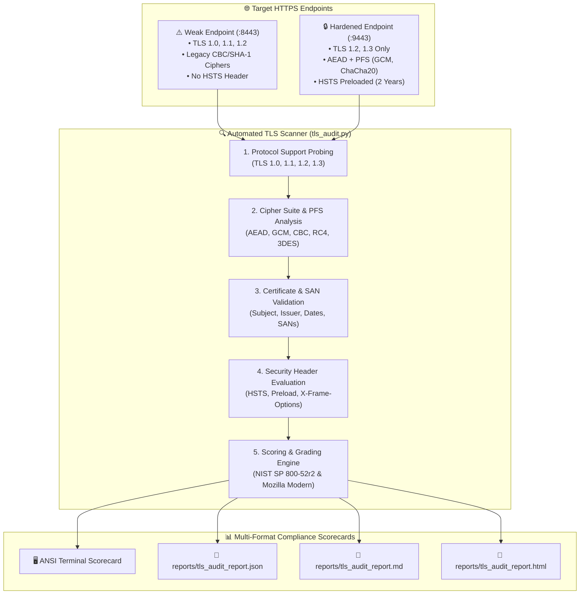

<!-- markdownlint-disable MD013 MD033 MD051 MD060 -->
# 09 - Automated SSL/TLS Cipher Hardening Audit

> An enterprise-grade **DevSecOps & SRE Security Audit** project demonstrating automated cryptographic analysis, protocol auditing, cipher suite evaluation, certificate validation, and security header scanning across HTTPS endpoints following **NIST SP 800-52r2** and **Mozilla Modern SSL** guidelines.

---

## 📋 Table of Contents

1. [Architectural Overview & TLS Audit Pipeline](#-architectural-overview--tls-audit-pipeline)
   - [The TLS Probing & Evaluation Pipeline](#the-tls-probing--evaluation-pipeline)
   - [Mock Infrastructure Topology](#mock-infrastructure-topology)
2. [Theoretical Deep-Dive for Beginners](#-theoretical-deep-dive-for-beginners)
   - [Fundamentals of Transport Layer Security (TLS)](#fundamentals-of-transport-layer-security-tls)
   - [TLS 1.2 vs. TLS 1.3: Architectural Evolution & 1-RTT Handshake](#tls-12-vs-tls-13-architectural-evolution--1-rtt-handshake)
   - [Anatomy of a Cipher Suite](#anatomy-of-a-cipher-suite)
   - [Perfect Forward Secrecy (PFS) & Ephemeral Key Exchange](#perfect-forward-secrecy-pfs--ephemeral-key-exchange)
   - [Historic Cryptographic Vulnerabilities (POODLE, BEAST, Sweet32)](#historic-cryptographic-vulnerabilities-poodle-beast-sweet32)
   - [HTTP Strict Transport Security (HSTS) & Preloading](#http-strict-transport-security-hsts--preloading)
   - [Industry Standards Alignment (NIST SP 800-52r2 & Mozilla Modern)](#industry-standards-alignment-nist-sp-800-52r2--mozilla-modern)
3. [Repository & Directory Structure](#-repository--directory-structure)
4. [Prerequisites & System Setup](#-prerequisites--system-setup)
5. [Quickstart Guide](#-quickstart-guide)
6. [Step-by-Step Hands-On Guide](#-step-by-step-hands-on-guide)
   - [Step 1: Generate Local PKI & Server Certificates](#step-1-generate-local-pki--server-certificates)
   - [Step 2: Inspect Weak vs. Hardened Nginx Configurations](#step-2-inspect-weak-vs-hardened-nginx-configurations)
   - [Step 3: Launch the Mock HTTPS Sandbox](#step-3-launch-the-mock-https-sandbox)
   - [Step 4: Execute the Automated TLS Scanner & Auditor](#step-4-execute-the-automated-tls-scanner--auditor)
   - [Step 5: Inspect Audit Reports (Terminal, JSON, Markdown, HTML)](#step-5-inspect-audit-reports-terminal-json-markdown-html)
   - [Step 6: Run the Full Automated Test Suite](#step-6-run-the-full-automated-test-suite)
7. [Enterprise Production Best Practices](#-enterprise-production-best-practices)
8. [Troubleshooting & Common Gotchas](#-troubleshooting--common-gotchas)
9. [Resource Teardown & Complete Cleanup](#-resource-teardown--complete-cleanup)

---

## 🏛️ Architectural Overview & TLS Audit Pipeline

### The TLS Probing & Evaluation Pipeline

The automated scanner (`tls_audit.py` / `tls_audit.sh`) evaluates target HTTPS endpoints through a sequential cryptographic probing matrix:



### Mock Infrastructure Topology

```text
┌───────────────────────────────────────────────────────────────────────────┐
│              AUTOMATED SSL/TLS CIPHER HARDENING SANDBOX                   │
├───────────────────────────────────────────────────────────────────────────┤
│                                                                           │
│   [ weak-tls-server ] (Port 8443)        [ hardened-tls-server ] (Port 9443)
│   • TLS 1.0 & 1.1 Enabled                • TLS 1.2 & TLS 1.3 Only        │
│   • CBC Mode & SHA-1 Ciphers             • AEAD Ciphers (GCM / ChaCha20) │
│   • Missing HSTS Headers                 • Full HSTS (max-age=63072000)  │
│   • Expected Grade: [ F / FAIL ]         • Expected Grade: [ A+ / PASS ] │
│            │                                      │                       │
│            └───────────────────┬──────────────────┘                       │
│                                │                                          │
│                                ▼                                          │
│                  [ tls_audit.py / tls_audit.sh ]                          │
│                                │                                          │
│            ┌───────────────────┼──────────────────┐                       │
│            ▼                   ▼                  ▼                       │
│      [ JSON Report ]    [ Markdown Report ]  [ HTML Dashboard ]           │
│                                                                           │
└───────────────────────────────────────────────────────────────────────────┘
```

---

## 🧠 Theoretical Deep-Dive for Beginners

### Fundamentals of Transport Layer Security (TLS)

Transport Layer Security (TLS) provides **Confidentiality** (encryption), **Integrity** (tamper prevention), and **Authentication** (identity verification) for communications over computer networks.

TLS combines:

- **Asymmetric Cryptography** (e.g., RSA, ECDSA, ECDH): Used during the initial handshake to authenticate the server and securely exchange session keys.
- **Symmetric Cryptography** (e.g., AES-GCM, ChaCha20): Used after key exchange to encrypt bulk payload data with high computational efficiency.

### TLS 1.2 vs. TLS 1.3: Architectural Evolution & 1-RTT Handshake

TLS 1.3 (RFC 8446) overhauled the protocol:

```text
┌─────────────────────────────────────────────────────────────────────────┐
│                    TLS 1.2 vs. TLS 1.3 HANDSHAKE                        │
├─────────────────────────────────────────────────────────────────────────┤
│                                                                         │
│  TLS 1.2 Handshake (2 Round-Trip Times - 2-RTT):                        │
│  Client ──(ClientHello)──────────────────────────▶ Server               │
│  Client ◀─(ServerHello + Certificate + KeyExchange)─ Server             │
│  Client ──(ClientKeyExchange + ChangeCipherSpec)─▶ Server               │
│  Client ◀─(Finished)───────────────────────────── Server               │
│  [Encrypted Application Data Flow Begins]                               │
│                                                                         │
│  TLS 1.3 Handshake (1 Round-Trip Time - 1-RTT):                         │
│  Client ──(ClientHello + KeyShares)──────────────▶ Server               │
│  Client ◀─(ServerHello + Certificate + Finished)─ Server               │
│  [Encrypted Application Data Flow Begins Immediately]                   │
│                                                                         │
└─────────────────────────────────────────────────────────────────────────┘
```

Key improvements in TLS 1.3:

1. **Faster Connections (1-RTT)**: Reduces handshake latency by half.
2. **Removed Deprecated Primitives**: Stripped out RSA static key exchange, CBC mode ciphers, RC4, MD5, and SHA-1.
3. **Mandatory Forward Secrecy**: Ephemeral Diffie-Hellman key exchange is required for all connections.

### Anatomy of a Cipher Suite

A cipher suite name explicitly defines the four algorithms used to secure the connection:

```text
       ┌──────────────── Key Exchange Algorithm (ECDHE = Elliptic Curve Diffie-Hellman)
       │       ┌──────── Authentication Algorithm (RSA / ECDSA)
       │       │       ┌─ Symmetric Bulk Encryption (AES with 256-bit key)
       │       │       │    ┌─ Block Cipher Mode (GCM = Galois/Counter Mode AEAD)
       │       │       │    │    ┌─ Message Authentication Hash (SHA-384)
       ▼       ▼       ▼    ▼    ▼
    ECDHE -   RSA -   AES256-GCM-SHA384
```

In modern **TLS 1.3**, the key exchange and authentication mechanisms are separated, simplifying cipher names:

- `TLS_AES_256_GCM_SHA384`
- `TLS_CHACHA20_POLY1305_SHA256`
- `TLS_AES_128_GCM_SHA256`

### Perfect Forward Secrecy (PFS) & Ephemeral Key Exchange

Without **Perfect Forward Secrecy (PFS)**, if an attacker records encrypted network traffic today and compromises the server's private RSA key years later, they can **retroactively decrypt all historical recorded sessions**.

With **PFS (ECDHE / DHE)**:

- A unique, temporary (ephemeral) session key is generated for every individual connection.
- Even if the server's master private key is leaked in the future, past encrypted sessions remain mathematically impossible to decrypt.

### Historic Cryptographic Vulnerabilities (POODLE, BEAST, Sweet32)

| Attack Name | Affected Protocols / Ciphers | Attack Mechanism & Risk |
| :--- | :--- | :--- |
| **POODLE** (CVE-2014-3566) | SSLv3 & TLS 1.0 (CBC mode) | Padding oracle attack allowing attackers to decrypt session cookies in plaintext. |
| **BEAST** (CVE-2011-3389) | TLS 1.0 (CBC mode) | Chosen-plaintext attack exploiting predictable Initialization Vectors (IVs). |
| **Sweet32** (CVE-2016-2183) | 64-bit block ciphers (3DES, Blowfish) | Birthday attack on 64-bit block ciphers causing ciphertext collision after ~32GB of data transfer. |
| **RC4 Insecurity** (RFC 7465) | RC4 stream cipher | Statistical biases in the pseudo-random stream allow plaintext recovery. |

### HTTP Strict Transport Security (HSTS) & Preloading

HTTP Strict Transport Security (RFC 6797) instructs web browsers that the website must **only** be accessed using HTTPS, protecting users against SSL-Stripping and downgrade Man-in-the-Middle (MitM) attacks:

```http
Strict-Transport-Security: max-age=63072000; includeSubDomains; preload
```

- `max-age=63072000`: Enforces HTTPS for 2 years (63,072,000 seconds).
- `includeSubDomains`: Applies HTTPS enforcement to all subdomains.
- `preload`: Qualifies the domain for inclusion in browser preloaded HSTS lists (Google Chrome, Firefox, Safari).

### Industry Standards Alignment (NIST SP 800-52r2 & Mozilla Modern)

| Standard | Required Protocols | Allowed Cipher Suites | HSTS Requirement |
| :--- | :--- | :--- | :--- |
| **Mozilla Modern** | **TLS 1.3** (TLS 1.2 optional) | AEAD only (`AES-GCM`, `CHACHA20-POLY1305`) | Mandatory (`max-age >= 180 days`) |
| **NIST SP 800-52r2** | **TLS 1.2 & TLS 1.3** | PFS ciphers, RSA >= 2048-bit, ECC >= 256-bit | Recommended |
| **PCI-DSS v4.0** | **TLS 1.2 & TLS 1.3** (Strict ban on TLS 1.0/1.1) | Strong ciphers (No 3DES, RC4, or CBC) | Mandatory for payment flows |

---

## 📁 Repository & Directory Structure

```text
11-security-devsecops/09-automated-ssl-tls-hardening-audit/
├── .gitignore                          # Excludes generated keys, certs, and reports
├── .markdownlint.json                  # Markdown linter rules
├── Dockerfile.hardened                 # Container image for hardened Nginx server
├── Dockerfile.weak                     # Container image for legacy/weak Nginx server
├── README.md                           # Comprehensive educational documentation
├── cleanup.sh                          # Automated resource teardown and image purge script
├── docker-compose.yml                  # Sandbox defining weak (:8443) and hardened (:9443) services
├── generate_certificates.sh            # Local PKI CA & SAN server certificate generator
├── test_tls_audit_pipeline.sh          # End-to-end automated test runner (11 checks)
├── tls_audit.py                        # Python TLS socket & cryptographic audit scanner
├── tls_audit.sh                        # CLI orchestrator & multi-target runner
└── nginx/
    ├── hardened.conf                   # Hardened Nginx TLS 1.2/1.3 + AEAD + HSTS config
    └── weak.conf                       # Vulnerable Nginx TLS 1.0/1.1 + CBC config
```

---

## 🔧 Prerequisites & System Setup

Ensure the following tools are installed:

- **Docker Engine** (or OrbStack) & **Docker Compose**: For running mock HTTPS test endpoints.
- **OpenSSL**: For local PKI generation and low-level protocol handshake tests.
- **Python 3.10+**: For executing the `tls_audit.py` evaluation engine.

Verify your environment:

```bash
docker --version
docker compose version
openssl version
python3 --version
```

---

## ⚡ Quickstart Guide

Run the certificate generator, launch mock servers, and execute the automated audit test suite:

```bash
# 1. Navigate to the project directory
cd 11-security-devsecops/09-automated-ssl-tls-hardening-audit

# 2. Run the complete automated test pipeline
./test_tls_audit_pipeline.sh

# 3. Clean up all resources when finished
./cleanup.sh --all
```

---

## 🚀 Step-by-Step Hands-On Guide

### Step 1: Generate Local PKI & Server Certificates

Execute `generate_certificates.sh` to produce a local Root CA and SAN-enabled server certificate:

```bash
./generate_certificates.sh
```

*Output:*

```text
======================================================================
  🔐 GENERATING LOCAL PKI & TLS SERVER CERTIFICATES
======================================================================
▶ [1/3] Generating local Root Certificate Authority (CA)...
  [OK] Root CA created: certs/ca.crt

▶ [2/3] Generating Server Private Key and CSR with SANs...
  [OK] Server CSR created: certs/server.csr

▶ [3/3] Signing Server Certificate with Root CA...
  [OK] Server Certificate issued: certs/server.crt

======================================================================
  ✅ PKI & CERTIFICATES SUCCESSFULLY GENERATED
======================================================================
```

### Step 2: Inspect Weak vs. Hardened Nginx Configurations

Inspect the vulnerable configuration in `nginx/weak.conf`:

```bash
cat nginx/weak.conf
```

*Key vulnerabilities present:*

- `ssl_protocols TLSv1 TLSv1.1 TLSv1.2;` (Enables obsolete protocols).
- `ssl_ciphers '...DES-CBC3-SHA:RC4-SHA...';` (Enables weak ciphers).
- Missing `Strict-Transport-Security` header.

Inspect the hardened configuration in `nginx/hardened.conf`:

```bash
cat nginx/hardened.conf
```

*Hardening controls implemented:*

- `ssl_protocols TLSv1.2 TLSv1.3;` (Strictly disables TLS 1.0 & 1.1).
- `ssl_ciphers 'ECDHE-ECDSA-AES256-GCM-SHA384:...';` (Enforces modern AEAD & PFS).
- `add_header Strict-Transport-Security "max-age=63072000; includeSubDomains; preload" always;`

### Step 3: Launch the Mock HTTPS Sandbox

Start the mock Nginx servers via Docker Compose:

```bash
docker compose up -d --build
```

Verify that both endpoints are up:

```bash
docker compose ps
```

*Expected output:*

```text
NAME                  IMAGE                         STATUS         PORTS
hardened-tls-server   hardened-tls-server:latest    Up 5 seconds   0.0.0.0:8082->80/tcp, 0.0.0.0:9443->443/tcp
weak-tls-server       weak-tls-server:latest        Up 5 seconds   0.0.0.0:8081->80/tcp, 0.0.0.0:8443->443/tcp
```

### Step 4: Execute the Automated TLS Scanner & Auditor

Run `tls_audit.sh` against the active sandbox endpoints:

```bash
./tls_audit.sh
```

*Terminal output:*

```text
======================================================================
  🛡️  AUTOMATED SSL/TLS CIPHER HARDENING AUDIT SCORECARD
======================================================================

Target Endpoint   : localhost:8443
Audit Verdict     : [FAIL]
Security Grade    : [F] (Compliance Score: 25/100)
TLS Protocols     : TLSv1.0: Enabled  TLSv1.1: Enabled  TLSv1.2: Enabled  TLSv1.3: Disabled  
Negotiated Cipher : ECDHE-RSA-AES256-GCM-SHA384 (TLSv1.2, 256 bits)
HSTS Configured   : Not Configured

  Security Findings (3):
   • [HIGH  ] Deprecated TLSv1.0 is supported (Vulnerable to POODLE / BEAST attacks).
   • [MEDIUM] Deprecated TLSv1.1 is supported (RFC 8996 non-compliant).
   • [LOW   ] Strict-Transport-Security (HSTS) header is missing.
----------------------------------------------------------------------

Target Endpoint   : localhost:9443
Audit Verdict     : [PASS]
Security Grade    : [A+] (Compliance Score: 100/100)
TLS Protocols     : TLSv1.0: Disabled  TLSv1.1: Disabled  TLSv1.2: Enabled  TLSv1.3: Enabled  
Negotiated Cipher : TLS_AES_256_GCM_SHA384 (TLSv1.3, 256 bits)
HSTS Configured   : max-age=63072000; includeSubDomains; preload
  [PASSED] No security vulnerabilities or legacy ciphers detected.
----------------------------------------------------------------------
✔ Reports saved to reports/ (JSON, Markdown, HTML)
```

### Step 5: Inspect Audit Reports (Terminal, JSON, Markdown, HTML)

The scanner produces structured compliance reports in multiple formats:

1. **JSON Report** (`reports/tls_audit_report.json`): For automated CI/CD gating and metric ingest.
2. **Markdown Report** (`reports/tls_audit_report.md`): For pull request summaries and executive notes.
3. **HTML Dashboard** (`reports/tls_audit_report.html`): A visual dashboard scorecard.

Inspect the generated Markdown summary:

```bash
cat reports/tls_audit_report.md
```

### Step 6: Run the Full Automated Test Suite

Execute `test_tls_audit_pipeline.sh` to run all 11 automated verification checks:

```bash
./test_tls_audit_pipeline.sh
```

*Expected output:*

```text
======================================================================
  🧪 STARTING AUTOMATED SSL/TLS CIPHER HARDENING TEST SUITE
======================================================================
▶ [Step 1/5] Validating runtime tools & dependencies...
  [PASS] Docker CLI is installed and accessible
  [PASS] OpenSSL CLI is installed and accessible
  [PASS] Python 3 runtime is installed and accessible

▶ [Step 2/5] Generating local PKI and TLS Server Certificates...
  [PASS] Root CA and Server Certificates generated successfully

▶ [Step 3/5] Deploying mock weak & hardened Nginx endpoints...
  [PASS] Both mock HTTPS endpoints (weak on :8443, hardened on :9443) are healthy

▶ [Step 4/5] Executing automated TLS scanner and grading engine...
  [PASS] tls_audit.sh completed audit scan across endpoints
  [PASS] JSON report artifact generated at reports/tls_audit_report.json
  [PASS] Weak endpoint (:8443) correctly flagged as FAIL with Grade F
  [PASS] Hardened endpoint (:9443) verified as PASS with Grade A+

▶ [Step 5/5] Verifying Markdown and HTML report generation...
  [PASS] Markdown executive report (reports/tls_audit_report.md) is valid
  [PASS] HTML dashboard report (reports/tls_audit_report.html) is valid

======================================================================
  📊 TEST SUITE SUMMARY
======================================================================
  Tests Passed : 11
  Tests Failed : 0
  Total Tests  : 11
======================================================================

🎉 ALL SSL/TLS HARDENING AUDIT TESTS PASSED!
```

---

## 🛡️ Enterprise Production Best Practices

| Best Practice | Implementation Guideline | Security Rationale |
| :--- | :--- | :--- |
| **Automated CI/CD Gating** | Run `tls_audit.py` in staging deployment pipelines; break the build if security grade falls below **`A`**. | Prevents accidental regressions (e.g. legacy ciphers re-enabled for debugging) from reaching production. |
| **Automate Renewal via ACME** | Use `cert-manager` (Kubernetes) or `certbot` for automated 60-day certificate rotation. | Eliminates outages and security incidents caused by expired certificates. |
| **SRE Expiry Alerting** | Alert SRE on-call teams when production certificates have `< 30 days` remaining. | Ensures ample buffer time to diagnose DNS-01/HTTP-01 ACME challenge failures. |
| **Enable OCSP Stapling** | Configure `ssl_stapling on; ssl_stapling_verify on;` in Nginx/HAProxy. | Speeds up client handshakes and prevents privacy leaks to third-party Certificate Revocation Lists. |

---

## ❓ Troubleshooting & Common Gotchas

### 1. `curl: (35) error:0A00042E:SSL routines:tlsv1 alert protocol version`

- **Cause**: The client attempted to connect using a protocol (such as TLS 1.0 or 1.1) that has been disabled on the server.
- **Remedy**: Expected behavior on hardened endpoints. Verify client uses TLS 1.2 or TLS 1.3 (`curl --tlsv1.2`).

### 2. `[SSL: CERTIFICATE_VERIFY_FAILED] certificate verify failed`

- **Cause**: Target endpoint uses a self-signed or local PKI certificate not present in the system trust store.
- **Remedy**: Pass the CA certificate via `--ca-file certs/ca.crt` or test endpoints with `curl -k`.

---

## 🧹 Resource Teardown & Complete Cleanup

To stop and remove containers, networks, volumes, certificates, and reports:

```bash
# Standard cleanup: removes containers, networks, certs, and reports
./cleanup.sh
```

To perform a **complete purge** including built Docker images:

```bash
# Complete purge: removes containers, networks, certs, reports, and Docker images
./cleanup.sh --all
```

*Teardown confirmation output:*

```text
======================================================================
  🧹 Cleaning Up SSL/TLS Cipher Hardening Audit Sandbox Resources
======================================================================
▶ [1/3] Tearing down Docker Compose containers and networks...
  [OK] Containers (weak-tls-server, hardened-tls-server) removed.

▶ [2/3] Removing built Docker images...
  [OK] Docker images purged.

▶ [3/3] Cleaning generated certificates, reports, and logs...
  [OK] Generated PKI certs and local report artifacts removed.

✨ Environment is clean! Ready for subsequent projects.
```
