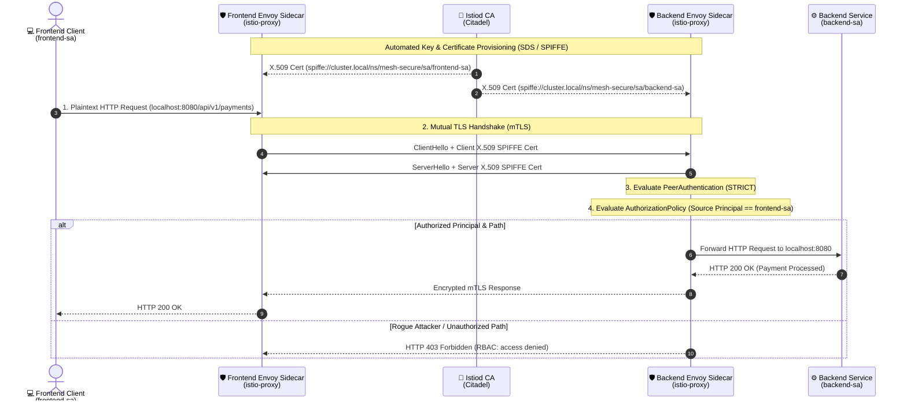

<!-- markdownlint-disable MD013 MD033 MD051 MD060 -->
# 10 - Zero-Trust Service Mesh mTLS with Istio

> An enterprise-grade **Zero-Trust Network Security & Kubernetes Service Mesh** project demonstrating automated **Mutual TLS (mTLS)** encryption, **SPIFFE** cryptographic workload identities, and fine-grained **`AuthorizationPolicy`** role-based access control (RBAC) using **Istio 1.22+** to eliminate lateral attacker movement and unauthenticated plaintext traffic.

---

## 📋 Table of Contents

1. [Architectural Overview & Zero-Trust Threat Model](#-architectural-overview--zero-trust-threat-model)
   - [The Istio Envoy Sidecar Data Plane Architecture](#the-istio-envoy-sidecar-data-plane-architecture)
   - [Zero-Trust Workload Topology](#zero-trust-workload-topology)
2. [Theoretical Deep-Dive for Beginners](#-theoretical-deep-dive-for-beginners)
   - [Why Perimeter Security Fails: The Zero-Trust Imperative](#why-perimeter-security-fails-the-zero-trust-imperative)
   - [One-Way TLS vs. Mutual TLS (mTLS)](#one-way-tls-vs-mutual-tls-mtls)
   - [What is SPIFFE and How Istio Embeds Cryptographic Identity](#what-is-spiffe-and-how-istio-embeds-cryptographic-identity)
   - [Istiod Certificate Authority (Citadel) & 24-Hour Automated Key Rotation](#istiod-certificate-authority-citadel--24-hour-automated-key-rotation)
   - [Anatomy of `PeerAuthentication` (`PERMISSIVE` vs. `STRICT`)](#anatomy-of-peerauthentication-permissive-vs-strict)
   - [Anatomy of `AuthorizationPolicy` (Layer 7 Principal & Path Scoping)](#anatomy-of-authorizationpolicy-layer-7-principal--path-scoping)
   - [NIST SP 800-207 Zero-Trust Architecture Alignment](#nist-sp-800-207-zero-trust-architecture-alignment)
3. [Repository & Directory Structure](#-repository--directory-structure)
4. [Prerequisites & System Setup](#-prerequisites--system-setup)
5. [Quickstart Guide](#-quickstart-guide)
6. [Step-by-Step Hands-On Guide](#-step-by-step-hands-on-guide)
   - [Step 1: Inspect Kubernetes Manifests & Zero-Trust Policies](#step-1-inspect-kubernetes-manifests--zero-trust-policies)
   - [Step 2: Provision the Local Cluster & Istio Mesh](#step-2-provision-the-local-cluster--istio-mesh)
   - [Step 3: Verify Envoy Sidecar Injection & Pod Health](#step-3-verify-envoy-sidecar-injection--pod-health)
   - [Step 4: Execute the Zero-Trust Audit Matrix](#step-4-execute-the-zero-trust-audit-matrix)
   - [Step 5: Inspect Audit Reports (Terminal, JSON, Markdown, HTML)](#step-5-inspect-audit-reports-terminal-json-markdown-html)
   - [Step 6: Run the Full Automated Test Suite](#step-6-run-the-full-automated-test-suite)
7. [Enterprise Production Best Practices](#-enterprise-production-best-practices)
8. [Troubleshooting & Common Gotchas](#-troubleshooting--common-gotchas)
9. [Resource Teardown & Complete Cleanup](#-resource-teardown--complete-cleanup)

---

## 🏛️ Architectural Overview & Zero-Trust Threat Model

### The Istio Envoy Sidecar Data Plane Architecture

When microservices communicate in an Istio Service Mesh, application containers never talk directly across the network. All ingress and egress traffic is intercepted by local **Envoy proxy sidecars** via iptables redirection:



### Zero-Trust Workload Topology

```text
┌───────────────────────────────────────────────────────────────────────────┐
│              ZERO-TRUST ISTIO SERVICE MESH TOPOLOGY                       │
├───────────────────────────────────────────────────────────────────────────┤
│                                                                           │
│   Namespace: mesh-secure (istio-injection: enabled)                       │
│   ┌──────────────────────────┐          ┌──────────────────────────┐      │
│   │   [ frontend-client ]    │          │     [ payment-api ]      │      │
│   │   (SA: frontend-sa)      │          │     (SA: backend-sa)     │      │
│   │            │             │          │            ▲             │      │
│   │     (localhost)          │          │       (localhost)        │      │
│   │            ▼             │          │            │             │      │
│   │   [ istio-proxy (Envoy) ]│══(mTLS)══▶[ istio-proxy (Envoy) ]│      │
│   └──────────────────────────┘          └────────────▲─────────────┘      │
│                                                      ║                    │
│                                           (REJECTS Plaintext)             │
│   Namespace: mesh-unmanaged                          ║                    │
│   ┌──────────────────────────┐                       ║                    │
│   │   [ rogue-attacker ]     │───────────────────────╝                    │
│   │   (No Mesh Sidecar)      │ (Connection Reset / Code 56)               │
│   └──────────────────────────┘                                            │
│                                                                           │
└───────────────────────────────────────────────────────────────────────────┘
```

---

## 🧠 Theoretical Deep-Dive for Beginners

### Why Perimeter Security Fails: The Zero-Trust Imperative

Traditional network architectures rely on "castle-and-moat" perimeter security: firewalls protect the outer border, but **internal East-West traffic between servers is unencrypted and trusted by default**.

If an attacker breaches a single pod (via an application vulnerability or stolen credentials), they can sniff sensitive plaintext tokens or pivot laterally across internal services.

**Zero-Trust Architecture (NIST SP 800-207)** assumes the internal network is already hostile:

> *"Never Trust, Always Verify."*

Every single service-to-service call must be **cryptographically authenticated**, **encrypted in transit**, and **explicitly authorized** based on least-privilege policies.

### One-Way TLS vs. Mutual TLS (mTLS)

| Dimension | One-Way TLS (Standard HTTPS) | Mutual TLS (mTLS) |
| :--- | :--- | :--- |
| **Server Identity** | Verified by Client (Browser checks server certificate) | Verified by Client |
| **Client Identity** | **Unverified at TLS layer** (Relies on passwords/tokens) | **Verified at TLS layer** (Client presents X.509 certificate) |
| **Tamper Protection** | Yes | Yes |
| **Impersonation Prevention** | Server only | **Both Client and Server** |
| **Mesh Use-Case** | Public ingress traffic | **East-West microservice communication** |

### What is SPIFFE and How Istio Embeds Cryptographic Identity

**SPIFFE** (Secure Production Identity Framework for Everyone) is an open standard that defines how software services identify themselves in dynamic cloud environments.

Istio issues every Kubernetes workload a unique **SPIFFE ID** encoded inside the Subject Alternative Name (SAN) of its X.509 certificate:

```text
spiffe://<trust-domain>/ns/<namespace>/sa/<serviceaccount-name>
```

*Example SPIFFE IDs generated in this project:*

- `spiffe://cluster.local/ns/mesh-secure/sa/frontend-sa`
- `spiffe://cluster.local/ns/mesh-secure/sa/backend-sa`

### Istiod Certificate Authority (Citadel) & 24-Hour Automated Key Rotation

Manually managing and distributing TLS certificates across hundreds of microservices is unsustainable. Istio automates the entire lifecycle through the **Secret Discovery Service (SDS)**:

1. When a pod starts, its Envoy sidecar generates a local private key in memory.
2. Envoy sends a Certificate Signing Request (CSR) to **Istiod** via gRPC.
3. Istiod validates the pod's Kubernetes ServiceAccount token and signs an ephemeral X.509 certificate valid for **24 hours**.
4. Certificates are refreshed continuously in the background without restarting pods or causing connection drops.

### Anatomy of `PeerAuthentication` (`PERMISSIVE` vs. `STRICT`)

`PeerAuthentication` defines the transport-level encryption rules for ingress traffic entering sidecars in a namespace:

```yaml
apiVersion: security.istio.io/v1beta1
kind: PeerAuthentication
metadata:
  name: default
  namespace: mesh-secure
spec:
  mtls:
    mode: STRICT
```

- **`PERMISSIVE` (Default)**: Accepts both plaintext HTTP and mTLS. Useful during migration, but leaves endpoints vulnerable to plaintext attacks.
- **`STRICT` (Zero-Trust Standard)**: **Plaintext traffic is rejected immediately**. Handshakes without a valid Istio mTLS client certificate fail at the TCP/TLS layer.
- **`DISABLE`**: Turns off mTLS (not recommended).

### Anatomy of `AuthorizationPolicy` (Layer 7 Principal & Path Scoping)

While `PeerAuthentication` enforces encryption, `AuthorizationPolicy` enforces **who is allowed to do what** at Layer 7:

```yaml
apiVersion: security.istio.io/v1beta1
kind: AuthorizationPolicy
metadata:
  name: backend-access-policy
  namespace: mesh-secure
spec:
  selector:
    matchLabels:
      app: backend
  action: ALLOW
  rules:
    - from:
        - source:
            principals:
              - "cluster.local/ns/mesh-secure/sa/frontend-sa"
      to:
        - operation:
            methods: ["GET"]
            paths: ["/api/v1/payments*", "/health"]
```

When an `ALLOW` policy is applied:

1. **Default Deny**: Any request that does not match an explicit rule is rejected with `HTTP 403 Forbidden` (`RBAC: access denied`).
2. **Principal Verification**: Envoy extracts the caller's SPIFFE ID directly from the validated client TLS certificate.
3. **Path Scoping**: Access is restricted to designated endpoints (`/api/v1/payments*`, `/health`). Unauthorized paths (like `/admin/vault`) are blocked.

### NIST SP 800-207 Zero-Trust Architecture Alignment

| NIST SP 800-207 Tenet | Istio Implementation in this Project |
| :--- | :--- |
| **All communication is secured** | `PeerAuthentication` mode `STRICT` enforces TLS encryption across all network hops. |
| **Access is determined by dynamic policy** | `AuthorizationPolicy` evaluates client identity, namespace, HTTP method, and URI per request. |
| **Workload identity is verifiable** | Cryptographic SPIFFE X.509 certificates tied to Kubernetes ServiceAccounts. |
| **Least privilege is applied** | Only authorized microservices (`frontend-sa`) can query specific API paths. |

---

## 📁 Repository & Directory Structure

```text
11-security-devsecops/10-zero-trust-service-mesh-istio-mtls/
├── .gitignore                          # Excludes generated logs and reports
├── .markdownlint.json                  # Markdown linter rules
├── README.md                           # Comprehensive educational documentation
├── cleanup.sh                          # Automated resource teardown and cluster purge script
├── mtls_verification_test.sh           # End-to-end automated test runner (15 checks)
├── k8s/
│   ├── 00-namespaces.yaml              # mesh-secure (injected) & mesh-unmanaged (uninjected)
│   ├── 01-serviceaccounts.yaml         # Dedicated ServiceAccounts for SPIFFE identities
│   ├── 02-backend.yaml                 # Payment API microservice and Service
│   ├── 03-frontend.yaml                # Authorized client microservice
│   ├── 04-rogue-attacker.yaml          # Unmanaged attacker pod attempting lateral movement
│   ├── 05-peer-authentication.yaml     # STRICT mTLS enforcement policy
│   └── 06-authorization-policy.yaml    # Fine-grained RBAC rule restricting backend access
└── scripts/
    ├── cluster_setup.sh                # Provisions k3d cluster and installs Istiod via Helm
    └── verify_mtls.py                  # Python Zero-Trust audit engine and scorecard generator
```

---

## 🔧 Prerequisites & System Setup

Ensure the following tools are installed:

- **Docker Engine** (or OrbStack): Container runtime.
- **k3d**: Lightweight Kubernetes cluster runner.
- **kubectl**: Kubernetes command-line tool.
- **helm**: Kubernetes package manager for installing Istio.
- **Python 3**: For running the `verify_mtls.py` audit engine.

Verify your environment:

```bash
docker --version
k3d --version
kubectl version --client
helm version
python3 --version
```

---

## ⚡ Quickstart Guide

Provision the cluster, deploy Istio and microservices, and run the automated Zero-Trust test suite:

```bash
# 1. Navigate to the project directory
cd 11-security-devsecops/10-zero-trust-service-mesh-istio-mtls

# 2. Run the complete automated test pipeline
./mtls_verification_test.sh

# 3. Clean up all resources when finished
./cleanup.sh --all
```

---

## 🚀 Step-by-Step Hands-On Guide

### Step 1: Inspect Kubernetes Manifests & Zero-Trust Policies

Inspect the declarative Zero-Trust policies:

```bash
cat k8s/05-peer-authentication.yaml
cat k8s/06-authorization-policy.yaml
```

Notice how `05-peer-authentication.yaml` enforces `mode: STRICT`, and `06-authorization-policy.yaml` restricts access to `cluster.local/ns/mesh-secure/sa/frontend-sa`.

### Step 2: Provision the Local Cluster & Istio Mesh

Run `cluster_setup.sh` to initialize the k3d cluster, deploy Istiod, and apply all workloads:

```bash
./scripts/cluster_setup.sh
```

*Expected output:*

```text
======================================================================
  🚀 PROVISIONING K3D CLUSTER & ISTIO SERVICE MESH
======================================================================
▶ [1/5] Checking CLI prerequisites...
  [OK] docker is available.
  [OK] k3d is available.
  [OK] kubectl is available.
  [OK] helm is available.

▶ [2/5] Initializing k3d cluster 'istio-mtls-cluster'...
  [OK] Cluster 'istio-mtls-cluster' created and ready.

▶ [3/5] Installing Istio Service Mesh Control Plane (istiod)...
  [OK] Istiod control plane is active.

▶ [4/5] Deploying Microservices & Zero-Trust Policies...
  [OK] Workloads, PeerAuthentication (STRICT), and AuthorizationPolicy applied.

▶ [5/5] Waiting for all microservices & Envoy sidecars to become ready...
  [OK] Frontend (2/2), Backend (2/2), and Rogue Attacker (1/1) are running.
```

### Step 3: Verify Envoy Sidecar Injection & Pod Health

Check pod statuses across namespaces:

```bash
kubectl get pods -n mesh-secure
kubectl get pods -n mesh-unmanaged
```

*Expected output:*

```text
# mesh-secure pods have 2/2 containers (App + istio-proxy):
NAME                        READY   STATUS    RESTARTS   AGE
backend-684c7b5d95-ldptm    2/2     Running   0          45s
frontend-6d77d7cc9d-gnfs8   2/2     Running   0          45s

# mesh-unmanaged pod has 1/1 container (No sidecar):
NAME                              READY   STATUS    RESTARTS   AGE
rogue-attacker-5bcf5c778f-zlc9c   1/1     Running   0          45s
```

### Step 4: Execute the Zero-Trust Audit Matrix

Run `verify_mtls.py` to evaluate all 5 security test scenarios:

```bash
python3 scripts/verify_mtls.py
```

*Terminal output:*

```text
======================================================================
  🛡️  ISTIO ZERO-TRUST SERVICE MESH mTLS & RBAC AUDIT SCORECARD
======================================================================
Audit Status      : [PASS]
Security Grade    : [A+] (Score: 100/100)
PeerAuthentication: STRICT_MTLS_ENFORCED
----------------------------------------------------------------------
Workload Identity Mapping (SPIFFE):
  • Frontend : uri: spiffe://cluster.local/ns/mesh-secure/sa/frontend-sa
  • Backend  : uri: spiffe://cluster.local/ns/mesh-secure/sa/backend-sa
  • Rogue Pod: Unmanaged (Plaintext / No Mesh Certificate)
----------------------------------------------------------------------
Zero-Trust Policy Enforcement Matrix:

  [PASS] Scenario #1: Authorized Frontend Access (Payments API)
     • Source Workload  : mesh-secure/frontend
     • Target Endpoint  : http://backend.mesh-secure.svc.cluster.local:8080/api/v1/payments
     • Expected Result  : HTTP 200 OK (Allowed by mTLS + AuthorizationPolicy)
     • Actual Response  : HTTP 200
     • Security Context : Authorized client carrying valid SPIFFE identity communicates over mTLS.

  [PASS] Scenario #2: Authorized Health Probe Access
     • Source Workload  : mesh-secure/frontend
     • Target Endpoint  : http://backend.mesh-secure.svc.cluster.local:8080/health
     • Expected Result  : HTTP 200 OK (Health check whitelisted in policy)
     • Actual Response  : HTTP 200
     • Security Context : Operational health probes allowed from authorized namespace.

  [PASS] Scenario #3: Unauthorized Path Restriction (/admin/vault)
     • Source Workload  : mesh-secure/frontend
     • Target Endpoint  : http://backend.mesh-secure.svc.cluster.local:8080/admin/vault
     • Expected Result  : HTTP 403 Forbidden (Blocked by path RBAC rule)
     • Actual Response  : HTTP 403
     • Security Context : Least-privilege URI scoping prevents authorized clients from accessing unapproved routes.

  [PASS] Scenario #4: Rogue Lateral Attacker (Payments API)
     • Source Workload  : mesh-unmanaged/rogue-attacker
     • Target Endpoint  : http://backend.mesh-secure.svc.cluster.local:8080/api/v1/payments
     • Expected Result  : Connection Reset (STRICT mTLS rejection) OR HTTP 403 Forbidden
     • Actual Response  : Connection Reset / Terminated (mTLS Rejection, Code 56)
     • Security Context : Unauthenticated lateral attacker cannot establish plaintext or forged connection.

  [PASS] Scenario #5: Rogue Lateral Attacker (Health Probe)
     • Source Workload  : mesh-unmanaged/rogue-attacker
     • Target Endpoint  : http://backend.mesh-secure.svc.cluster.local:8080/health
     • Expected Result  : Connection Reset (STRICT mTLS rejection) OR HTTP 403 Forbidden
     • Actual Response  : Connection Reset / Terminated (mTLS Rejection, Code 56)
     • Security Context : Strict mTLS prevents any plaintext connection regardless of target path.

======================================================================
```

### Step 5: Inspect Audit Reports (Terminal, JSON, Markdown, HTML)

The audit produces structured compliance reports in `reports/`:

- **JSON Report** (`reports/mtls_audit_report.json`): Machine-readable results.
- **Markdown Report** (`reports/mtls_audit_report.md`): Markdown summary.
- **HTML Dashboard** (`reports/mtls_audit_report.html`): Interactive visual scorecard.

View the Markdown report:

```bash
cat reports/mtls_audit_report.md
```

### Step 6: Run the Full Automated Test Suite

Execute `mtls_verification_test.sh` to validate the entire lifecycle in one command:

```bash
./mtls_verification_test.sh
```

*Expected output:*

```text
======================================================================
  🧪 STARTING ZERO-TRUST ISTIO SERVICE MESH mTLS TEST SUITE
======================================================================
▶ [Step 1/5] Validating runtime tools & Kubernetes CLI...
  [PASS] CLI tool 'docker' is available
  [PASS] CLI tool 'k3d' is available
  [PASS] CLI tool 'kubectl' is available
  [PASS] CLI tool 'helm' is available
  [PASS] CLI tool 'python3' is available

▶ [Step 2/5] Ensuring k3d cluster and Istio mesh are provisioned...
  [PASS] Cluster setup script completed successfully
  [PASS] Istiod control plane is active in istio-system

▶ [Step 3/5] Validating Envoy sidecar injection & Zero-Trust policies...
  [PASS] Backend deployment has active Envoy sidecar proxy (2/2 ready)
  [PASS] Frontend deployment has active Envoy sidecar proxy (2/2 ready)
  [PASS] PeerAuthentication in mesh-secure is strictly configured to STRICT
  [PASS] AuthorizationPolicy 'backend-access-policy' is active on backend

▶ [Step 4/5] Executing Zero-Trust mTLS & RBAC audit matrix...
  [PASS] verify_mtls.py verified 100% policy enforcement across all scenarios

▶ [Step 5/5] Verifying compliance report artifacts...
  [PASS] JSON audit report (reports/mtls_audit_report.json) is valid
  [PASS] Markdown compliance report (reports/mtls_audit_report.md) is valid
  [PASS] HTML dashboard report (reports/mtls_audit_report.html) is valid

======================================================================
  📊 TEST SUITE SUMMARY
======================================================================
  Tests Passed : 15
  Tests Failed : 0
  Total Tests  : 15
======================================================================

🎉 ALL ZERO-TRUST ISTIO mTLS TESTS PASSED!
```

---

## 🛡️ Enterprise Production Best Practices

| Best Practice | Implementation Guideline | Security Rationale |
| :--- | :--- | :--- |
| **Mesh-Wide STRICT mTLS** | Apply `PeerAuthentication` in the `istio-system` root namespace. | Ensures every new namespace automatically inherits `STRICT` mTLS by default. |
| **Default Deny Authorization** | Deploy a global `AuthorizationPolicy` with an empty `spec: {}`. | Enforces Zero-Trust default-deny across the entire cluster; workloads must be explicitly whitelisted. |
| **External CA Integration** | Plug Istiod into **HashiCorp Vault** or **cert-manager** using the Kubernetes CSR API. | Establishes an enterprise Root of Trust and integrates with corporate PKI infrastructure. |
| **Egress Gateway Hardening** | Route all external outbound traffic through dedicated **Istio Egress Gateways**. | Prevents compromised pods from exfiltrating data directly to unauthorized external IP addresses. |

---

## ❓ Troubleshooting & Common Gotchas

### 1. `curl: (56) Recv failure: Connection reset by peer`

- **Cause**: An unmanaged pod or plaintext client attempted to connect to a service protected by `PeerAuthentication` with `mode: STRICT`.
- **Remedy**: Expected behavior in Zero-Trust architectures. Ensure the calling pod has Istio sidecar injection enabled (`istio-injection: enabled` namespace label).

### 2. `RBAC: access denied` (HTTP 403 Forbidden)

- **Cause**: The calling pod has a valid mTLS certificate, but its SPIFFE ID is not permitted by the target service's `AuthorizationPolicy`.
- **Remedy**: Verify the calling pod's `serviceAccountName` matches the allowed `principals` list in `AuthorizationPolicy`.

---

## 🧹 Resource Teardown & Complete Cleanup

To remove application namespaces and Istio releases while preserving the k3d cluster:

```bash
# Standard cleanup: removes workloads, policies, namespaces, and Istio releases
./cleanup.sh
```

To perform a **complete purge** including deleting the k3d cluster:

```bash
# Complete purge: deletes the entire k3d cluster and local report artifacts
./cleanup.sh --all
```

*Teardown confirmation output:*

```text
======================================================================
  🧹 Cleaning Up Istio Zero-Trust Service Mesh Resources
======================================================================
▶ [1/2] Deleting k3d cluster 'istio-mtls-cluster'...
  [OK] k3d cluster 'istio-mtls-cluster' deleted.

▶ [2/2] Cleaning local report artifacts...
  [OK] Local reports and temporary logs removed.

✨ Environment is clean! Ready for subsequent projects.
```
