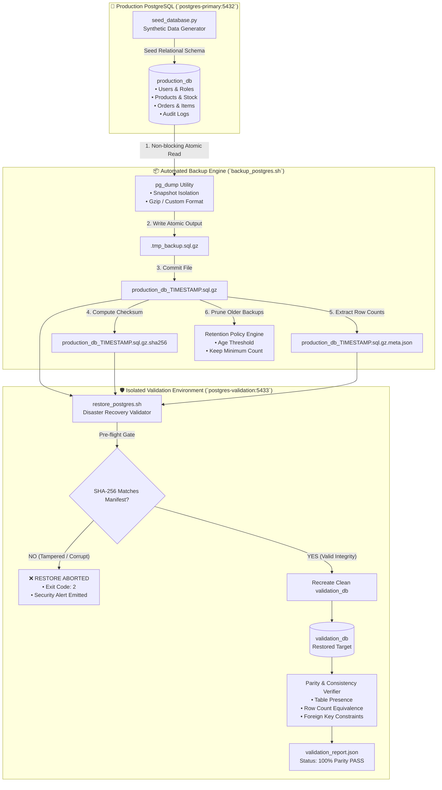

<!-- markdownlint-disable MD013 MD033 MD051 MD060 -->
# 01 - Automated PostgreSQL Backup and Restore Validation

> A production-grade **Database Operations & Resilience** engineering suite featuring automated PostgreSQL logical snapshots with `pg_dump`, gzip compression, cryptographic SHA-256 integrity manifests, time-based and count-based retention pruning, isolated test restore routines, and automated row-count and relational parity validation.

---

## 📋 Table of Contents

1. [Architectural Overview & Lifecycle](#-architectural-overview--lifecycle)
   - [End-to-End Backup & Validation Lifecycle](#end-to-end-backup--validation-lifecycle)
   - [The "Untested Backup Paradox" in SRE](#the-untested-backup-paradox-in-sre)
2. [Theoretical Deep-Dive for Beginners](#-theoretical-deep-dive-for-beginners)
   - [Logical vs. Physical Database Backups](#logical-vs-physical-database-backups)
   - [ACID Snapshot Isolation During `pg_dump`](#acid-snapshot-isolation-during-pg_dump)
   - [Backup Formats: Plain SQL Gzip vs. PostgreSQL Custom Format](#backup-formats-plain-sql-gzip-vs-postgresql-custom-format)
   - [Cryptographic Checksums & Bit-Rot Prevention](#cryptographic-checksums--bit-rot-prevention)
   - [Understanding RPO and RTO](#understanding-rpo-and-rto)
   - [Backup Retention Strategies](#backup-retention-strategies)
3. [Repository & Directory Structure](#-repository--directory-structure)
4. [Prerequisites & System Setup](#-prerequisites--system-setup)
5. [Quickstart Guide (3 Commands)](#-quickstart-guide-3-commands)
6. [Step-by-Step Hands-On Guide](#-step-by-step-hands-on-guide)
   - [Step 1: Start Isolated PostgreSQL Containers](#step-1-start-isolated-postgresql-containers)
   - [Step 2: Seed Primary Database with Relational Records](#step-2-seed-primary-database-with-relational-records)
   - [Step 3: Inspect Database Statistics and Tables](#step-3-inspect-database-statistics-and-tables)
   - [Step 4: Execute Automated Backup & Generate Manifests](#step-4-execute-automated-backup--generate-manifests)
   - [Step 5: Test Cryptographic Tamper Detection Gate](#step-5-test-cryptographic-tamper-detection-gate)
   - [Step 6: Perform Automated Restore & Parity Audit](#step-6-perform-automated-restore--parity-audit)
   - [Step 7: Test PostgreSQL Custom Format (`.dump`)](#step-7-test-postgresql-custom-format-dump)
   - [Step 8: Simulate Retention Policy & Pruning](#step-8-simulate-retention-policy--pruning)
   - [Step 9: Execute a Live Disaster Recovery Drill](#step-9-execute-a-live-disaster-recovery-drill)
   - [Step 10: Run the Complete Automated Test Suite](#step-10-run-the-complete-automated-test-suite)
7. [Troubleshooting & Common Gotchas](#-troubleshooting--common-gotchas)
8. [Resource Teardown & Complete Cleanup](#-resource-teardown--complete-cleanup)

---

## 🏛️ Architectural Overview & Lifecycle

### End-to-End Backup & Validation Lifecycle



### The "Untested Backup Paradox" in SRE

In modern Site Reliability Engineering, an untested backup is merely an **unsubstantiated assumption**. Countless real-world outages result in catastrophic data loss not because backups were not scheduled, but because:

1. **Silent Bit-Rot / Media Corruption**: Backup files were corrupted during storage or transfer.
2. **Schema Incompatibilities**: Dumps missed schema extensions, enum types, or sequences.
3. **Privilege & Permission Glitches**: Backups lacked permissions to restore specific indexes or foreign keys.
4. **Encryption Key Loss**: Files were encrypted, but the corresponding decryption key or passphrase was lost or rotated improperly.

**The Golden SRE Rule of Database Resilience**:

> *"You do not have a backup until you have successfully executed an automated restore and verified data parity."*

---

## 🧠 Theoretical Deep-Dive for Beginners

### Logical vs. Physical Database Backups

Database backups fall into two fundamental categories:

| Feature / Dimension | Logical Backup (`pg_dump`) | Physical Backup (`pg_basebackup` / WAL) |
| :--- | :--- | :--- |
| **Mechanics** | Reads SQL catalog metadata and table rows via standard queries; converts into SQL statements or archive blocks. | Directly copies raw filesystem data blocks, WAL (Write-Ahead Logs), and tablespaces byte-by-byte. |
| **Output Format** | Text SQL (`.sql`), compressed SQL (`.sql.gz`), or PostgreSQL Custom Archive (`.dump`). | Raw binary cluster data files (`base.tar.gz`, `pg_wal/`). |
| **Portability** | High: Can restore across different PostgreSQL versions, architectures, or cloud-managed RDS/Aurora instances. | Low: Must match exact PostgreSQL major version and operating system CPU architecture. |
| **Granularity** | High: Can back up individual tables, schemas, or specific databases. | Low: Must back up the entire PostgreSQL database cluster (`PGDATA`). |
| **Speed & Size** | Slower for massive multi-terabyte databases; compact for small-to-medium databases. | Very fast on large multi-terabyte databases; can achieve Point-in-Time Recovery (PITR). |

This mini-project focuses on **Logical Backups and Automated Validation**, providing the foundation for database migrations, staging synchronization, and routine resilience validation.

---

### ACID Snapshot Isolation During `pg_dump`

Beginners often wonder: *Does running `pg_dump` block active read and write operations?*

PostgreSQL employs **Multi-Version Concurrency Control (MVCC)**. When `pg_dump` starts:

1. It initiates a transaction with `SET TRANSACTION ISOLATION LEVEL REPEATABLE READ` (or `SERIALIZABLE`).
2. PostgreSQL takes an **internal transaction snapshot** representing the state of the database at that exact microsecond.
3. `pg_dump` acquires lightweight `ACCESS SHARE` locks on tables (which **do not block** concurrent `SELECT`, `INSERT`, `UPDATE`, or `DELETE` statements from applications).
4. Any writes committed by other clients after `pg_dump` starts will not be visible in the dump, guaranteeing a **transactionally consistent snapshot** without taking the database offline.

```text
Time ──►
[Application]:  INSERT INTO orders ──► UPDATE products ──► COMMIT
                     │                                         ▲
[pg_dump]:     BEGIN SNAPSHOT (T0) ────────────────────────────┴─► Consistent Dump of T0 State
```

---

### Backup Formats: Plain SQL Gzip vs. PostgreSQL Custom Format

This mini-project supports both industry-standard logical formats:

#### 1. Plain SQL Compressed (`.sql.gz`)

- Human-readable SQL commands (`CREATE TABLE`, `COPY`, `CREATE INDEX`) compressed via `gzip`.
- Portable across any SQL client or shell pipeline (`gzip -dc backup.sql.gz | psql`).
- Ideal for inspection, debugging, and cross-platform scripting.

#### 2. PostgreSQL Custom Format (`.dump`)

- PostgreSQL-specific binary archive generated with `pg_dump -F c`.
- Includes an internal table-of-contents (TOC) metadata header.
- Restored using `pg_restore`, which supports parallel multi-threaded restore (`pg_restore -j 4`), table reordering, and selective table filtering.

---

### Cryptographic Checksums & Bit-Rot Prevention

Storage drives, network transfers, and cloud object stores are subject to transient transmission errors and bit-flips (bit-rot).

Before executing any database restoration, `restore_postgres.sh` computes the cryptographic **SHA-256 digest** of the file and compares it to the `.sha256` manifest created at backup time:

$$\text{SHA-256}(\text{BackupArchive}) \stackrel{?}{=} \text{ManifestHash}$$

If a single bit differs, the restoration is aborted immediately with exit code `2`, preventing corrupt data from ever touching a database instance.

---

### Understanding RPO and RTO

In disaster recovery planning, business requirements are defined by two key metrics:

```text
◄───────────────────────────────────── TIME ─────────────────────────────────────►
[ Last Successful Backup ]                   [ Disaster Strikes ]           [ System Recovered ]
           │                                          │                              │
           └───────────── RPO Window ─────────────────┘                              │
                         (Data at risk)               └────────── RTO Window ────────┘
                                                               (Downtime duration)
```

1. **Recovery Point Objective (RPO)**: The maximum acceptable age of files or transactions that can be lost when unexpected disaster strikes (e.g. *"Our RPO is 1 hour"*).
2. **Recovery Time Objective (RTO)**: The maximum acceptable downtime required to restore services and verify data integrity (e.g. *"Our RTO is 15 minutes"*).

Automating backup creation reduces **RPO**, while automating restore validation reduces **RTO**.

---

### Backup Retention Strategies

Retaining all backups indefinitely leads to disk exhaustion and soaring cloud storage costs. The script implements **Time-Based and Count-Based Retention Pruning**:

- **Retention Days (`--retention-days N`)**: Purges archives older than $N$ days.
- **Minimum Keep Count (`--keep-last N`)**: Safety guardrail preventing deletion if total backup count is below threshold, protecting against accidental total purging during low backup activity periods.

---

## 📂 Repository & Directory Structure

All files and generated artifacts are strictly contained within this directory:

```text
12-databases-ops/01-automated-postgres-backup-restore/
├── docker-compose.yml       # Multi-container PostgreSQL environment (Primary & Validation)
├── Dockerfile               # Self-contained container image with pg_dump and Python tools
├── requirements.txt         # Python dependencies (psycopg2-binary, tabulate)
├── .env.example             # Template for ports, credentials, paths, and retention
├── .gitignore               # Excludes backups, environment files, and local logs
├── .markdownlint.json       # Linter configuration for technical documentation
├── seed_database.py         # Relational database seeder (dual-engine: psycopg2 + psql)
├── backup_postgres.sh       # Automated backup generator with SHA-256 and retention pruning
├── restore_postgres.sh      # Disaster recovery validator with 100% table parity check
├── test_pipeline.sh         # End-to-end automated test suite (8 test checkpoints)
├── cleanup.sh               # Complete environment teardown and resource purge
└── README.md                # Educational documentation and hands-on guide
```

---

## 💻 Prerequisites & System Setup

Ensure the following tools are installed:

- **Container Engine**: Docker Engine / OrbStack (recommended for macOS) with Docker Compose.
- **Python**: Python 3.9+ (optional on host; scripts include built-in CLI fallbacks).
- **PostgreSQL Client (Optional)**: `pg_dump` and `psql` (if omitted on host, scripts automatically route operations through Docker).
- **Core CLI Tools**: `bash`, `gzip`, `curl`, `jq`, `coreutils` (or `shasum` on macOS).

---

## 🚀 Quickstart Guide (3 Commands)

Execute the full automated resilience pipeline from zero to validated in 3 simple commands:

```bash
# 1. Start Docker containers
docker compose up -d --wait

# 2. Run the complete automated test suite
./test_pipeline.sh

# 3. Clean up all resources when finished
./cleanup.sh
```

---

## 📖 Step-by-Step Hands-On Guide

### Step 1: Start Isolated PostgreSQL Containers

Launch the primary production database on port `5432` and the isolated validation database on port `5433`:

```bash
docker compose up -d --wait
```

Verify that both containers are running and healthy:

```bash
docker compose ps
```

Expected output:

```text
NAME                  IMAGE                STATUS                   PORTS
postgres-primary      postgres:16-alpine   Up (healthy)             0.0.0.0:5432->5432/tcp
postgres-validation   postgres:16-alpine   Up (healthy)             0.0.0.0:5433->5432/tcp
```

---

### Step 2: Seed Primary Database with Relational Records

Populate `production_db` with a normalized e-commerce schema (categories, users with JSONB metadata, products, orders, order items, and audit logs):

```bash
python3 seed_database.py --users 50 --products 30 --orders 100 --logs 150 --clean
```

---

### Step 3: Inspect Database Statistics and Tables

Inspect the current table statistics, row counts, and disk footprints:

```bash
python3 seed_database.py --inspect-only
```

Output:

```text
📊 PostgreSQL Database Summary: 'production_db' (8664 kB)
Engine Version: PostgreSQL 16.15

╒══════════════════════╤═════════════╤═════════════╕
│ Table Name           │ Row Count   │ Disk Size   │
╞══════════════════════╪═════════════╪═════════════╡
│ categories           │ 5           │ 32 kB       │
│ users                │ 50          │ 48 kB       │
│ products             │ 30          │ 40 kB       │
│ orders               │ 100         │ 64 kB       │
│ order_items          │ 246         │ 48 kB       │
│ audit_logs           │ 150         │ 56 kB       │
├──────────────────────┼─────────────┼─────────────┤
│ TOTAL                │ 581         │ 8664 kB     │
╘══════════════════════╧═════════════╧═════════════╛
```

---

### Step 4: Execute Automated Backup & Generate Manifests

Execute `backup_postgres.sh` to dump the database, calculate SHA-256 checksums, and record metadata:

```bash
./backup_postgres.sh --db production_db --out-dir ./backups --format plain_gzip
```

Inspect the generated artifacts in `./backups/`:

```bash
ls -lh ./backups/
```

Files produced:

- `production_db_YYYYMMDD_HHMMSSZ.sql.gz`: Gzip-compressed atomic SQL dump.
- `production_db_YYYYMMDD_HHMMSSZ.sql.gz.sha256`: Cryptographic manifest.
- `production_db_YYYYMMDD_HHMMSSZ.sql.gz.meta.json`: Metadata manifest containing table row counts and database size.

Inspect the metadata manifest:

```bash
cat ./backups/*.meta.json | jq .
```

---

### Step 5: Test Cryptographic Tamper Detection Gate

Simulate a malicious attack or silent bit-rot by corrupting one byte in a backup copy:

```bash
mkdir -p ./backups/tamper_test
cp ./backups/production_db_*.sql.gz ./backups/tamper_test/corrupted.sql.gz
cp ./backups/production_db_*.sql.gz.sha256 ./backups/tamper_test/corrupted.sql.gz.sha256

# Inject corruption
echo "TAMPERED_PAYLOAD" >> ./backups/tamper_test/corrupted.sql.gz

# Attempt restore
./restore_postgres.sh --backup-file ./backups/tamper_test/corrupted.sql.gz
```

Expected output:

```text
ℹ [08:40:20] Verifying cryptographic SHA-256 integrity...
✖ [08:40:20] SECURITY ALERT: SHA-256 Checksum Mismatch!
  Expected:   db4372668fce1ea3004f5b3d9e6b2652a4c523d623fce91af973ad5e50b0a66d
  Calculated: f812a83091e0a89d701d891b98b0f7193ab261298c1998f01b7a6c9812903ab9
Backup archive may be corrupted or tampered with. Aborting restore.
```

Clean up the test folder:

```bash
rm -rf ./backups/tamper_test
```

---

### Step 6: Perform Automated Restore & Parity Audit

Restore the validated backup into the isolated `postgres-validation` container and audit table parity:

```bash
./restore_postgres.sh --target-port 5433 --target-db validation_db
```

Output:

```text
======================================================================
  🔄 Automated PostgreSQL Restore & Parity Validation
======================================================================
  Source Backup Archive : ./backups/production_db_20260824_114013Z.sql.gz
  Target Destination    : validation_db on localhost:5433
  Recreate DB Clean     : true
  SHA256 Integrity Check: ENFORCED
----------------------------------------------------------------------
✔ [08:40:20] SHA-256 Integrity Confirmed: db4372668fce1ea...
✔ [08:40:20] Clean database 'validation_db' provisioned.
✔ [08:40:21] Database restore executed in 1s.

──────────────────────────────────────────────────────────────────────
Table Name             | Expected Rows | Restored Rows | Status      
──────────────────────────────────────────────────────────────────────
audit_logs             | 150           | 150           | MATCH ✔   
categories             | 5             | 5             | MATCH ✔   
order_items            | 246           | 246           | MATCH ✔   
orders                 | 100           | 100           | MATCH ✔   
products               | 30            | 30            | MATCH ✔   
users                  | 50            | 50            | MATCH ✔   
──────────────────────────────────────────────────────────────────────

✔ [08:40:21] Active Foreign Key Constraints verified: 6
✔ [08:40:21] Validation report saved: ./validation_report.json
✔ [08:40:21] All 581 records across 6 tables match with 100% parity!

✨ Disaster Recovery & Restore Validation Succeeded!
```

---

### Step 7: Test PostgreSQL Custom Format (`.dump`)

PostgreSQL custom format allows multi-threaded extraction and flexible object selection:

```bash
# Create custom binary archive
./backup_postgres.sh --format custom

# Restore into validation container
./restore_postgres.sh --target-port 5433 --target-db validation_db
```

---

### Step 8: Simulate Retention Policy & Pruning

Test the automated pruning mechanism by simulating older backup archives:

```bash
# Create mock snapshots from earlier dates
touch -t 202501011200 ./backups/production_db_20250101_120000Z.sql.gz
touch -t 202501011200 ./backups/production_db_20250101_120000Z.sql.gz.sha256
touch -t 202501011200 ./backups/production_db_20250101_120000Z.sql.gz.meta.json

# Run backup script with 7-day retention and keep minimum 2
./backup_postgres.sh --retention-days 7 --keep-last 2
```

The script automatically detects and removes the expired 2025 archives while protecting active snapshots.

---

### Step 9: Execute a Live Disaster Recovery Drill

Simulate an accidental catastrophic event on the production database:

```bash
# 1. Simulate accidental DROP TABLE
docker exec -e PGPASSWORD=postgres postgres-primary \
  psql -U postgres -d production_db -c "DROP TABLE orders CASCADE;"

# 2. Verify table is missing
docker exec -e PGPASSWORD=postgres postgres-primary \
  psql -U postgres -d production_db -c "\dt"

# 3. Restore from the latest verified backup
./restore_postgres.sh \
  --target-port 5432 \
  --target-db production_db \
  --target-container postgres-primary

# 4. Verify orders table is fully recovered
docker exec -e PGPASSWORD=postgres postgres-primary \
  psql -U postgres -d production_db -c "SELECT count(*) FROM orders;"
```

---

### Step 10: Run the Complete Automated Test Suite

Run the full regression test pipeline verifying all 8 checkpoints end-to-end:

```bash
./test_pipeline.sh
```

---

## 🛠️ Troubleshooting & Common Gotchas

### 1. Port 5432 or 5433 Already in Use

If a local PostgreSQL instance is running on your host machine:

- Edit `.env` (or copy `.env.example` to `.env`) and modify `POSTGRES_PRIMARY_PORT=54321` and `POSTGRES_VALIDATION_PORT=54331`.
- Restart containers: `docker compose up -d`.

### 2. Client vs Server Version Warnings (`transaction_timeout`)

If using PostgreSQL 18 client tools (`pg_dump`) against PostgreSQL 16 servers, `pg_dump` may include `SET transaction_timeout = 0;`. The `restore_postgres.sh` script automatically handles client version compatibility.

### 3. Docker Container Health Check Timeouts

If containers take longer to initialize on constrained hardware:

- Inspect logs: `docker compose logs postgres-primary`.
- Increase healthcheck retry counts in `docker-compose.yml`.

---

## 🧹 Resource Teardown & Complete Cleanup

To leave your development environment clean and ready for subsequent mini-projects, execute the provided teardown script:

```bash
./cleanup.sh
```

### Options & Deep Purge

| Command | Action Performed |
| :--- | :--- |
| `./cleanup.sh` | Stops and removes containers (`postgres-primary`, `postgres-validation`), deletes Docker network (`postgres-ops-net`), deletes named database volumes (`postgres_primary_data`, `postgres_validation_data`), and removes all generated local backups and reports. |
| `./cleanup.sh --all` | Performs all standard teardown actions AND deletes downloaded Docker container images (`postgres:16-alpine`, `python:3.11-slim`), freeing maximum disk space. |

### Manual Verification of Zero Leftovers

Confirm that all resources have been completely removed:

```bash
# Verify no running containers
docker ps -a --filter "name=postgres-primary" --filter "name=postgres-validation"

# Verify no orphaned volumes
docker volume ls --filter "name=postgres_primary_data" --filter "name=postgres_validation_data"
```

The environment is now clean for the next mini-project!
