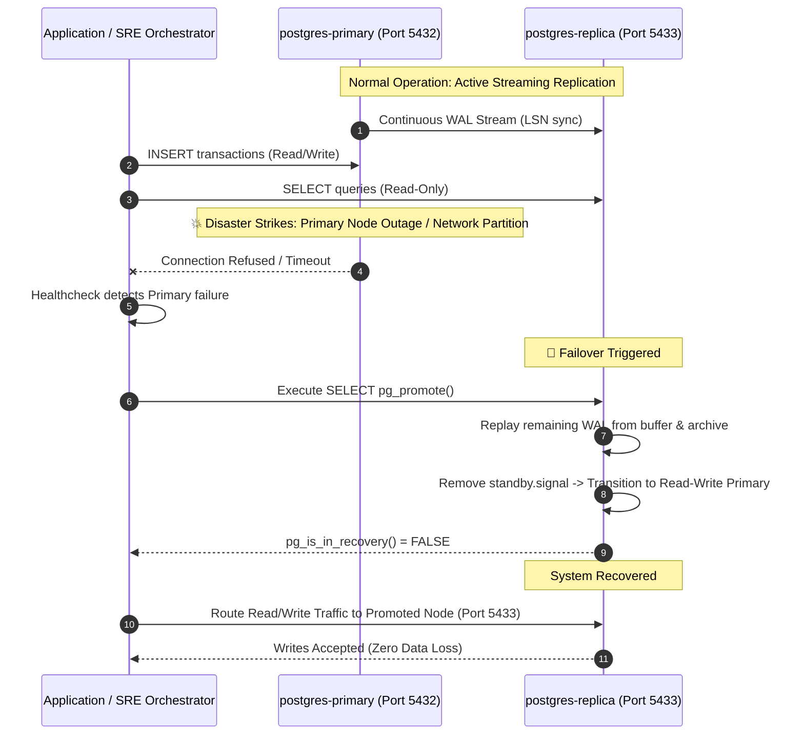

<!-- markdownlint-disable MD013 MD033 MD051 MD060 -->
# 02 - PostgreSQL Streaming Replication Cluster

> A production-grade **Database Operations & Resilience** engineering suite featuring a high-availability PostgreSQL Primary-Replica cluster with physical streaming replication, Write-Ahead Logging (WAL) archiving, physical replication slots, Hot Standby read-only query routing, real-time replication lag telemetry, and automated failover promotion.

---

## 📋 Table of Contents

1. [Architectural Overview & Lifecycle](#-architectural-overview--lifecycle)
   - [Streaming Replication Architecture](#streaming-replication-architecture)
   - [Failover & Standby Promotion Sequence](#failover--standby-promotion-sequence)
2. [Theoretical Deep-Dive for Beginners](#-theoretical-deep-dive-for-beginners)
   - [Write-Ahead Logging (WAL) & Log Sequence Numbers (LSN)](#write-ahead-logging-wal--log-sequence-numbers-lsn)
   - [Physical Streaming Replication vs. Logical Replication](#physical-streaming-replication-vs-logical-replication)
   - [Replication Slots vs. `wal_keep_size`](#replication-slots-vs-wal_keep_size)
   - [Synchronous vs. Asynchronous Replication (The CAP Trade-Off)](#synchronous-vs-asynchronous-replication-the-cap-trade-off)
   - [Hot Standby & Read-Only Query Routing](#hot-standby--read-only-query-routing)
   - [Understanding Replication Lag in `pg_stat_replication`](#understanding-replication-lag-in-pg_stat_replication)
   - [High-Availability Failover & Standby Promotion (`pg_promote`)](#high-availability-failover--standby-promotion-pg_promote)
3. [Repository & Directory Structure](#-repository--directory-structure)
4. [Prerequisites & System Setup](#-prerequisites--system-setup)
5. [Quickstart Guide (3 Commands)](#-quickstart-guide-3-commands)
6. [Step-by-Step Hands-On Guide](#-step-by-step-hands-on-guide)
   - [Step 1: Start Isolated PostgreSQL Cluster](#step-1-start-isolated-postgresql-cluster)
   - [Step 2: Verify Streaming Handshake & Active Slot](#step-2-verify-streaming-handshake--active-slot)
   - [Step 3: Inject High-Throughput Workload (50,000 Records)](#step-3-inject-high-throughput-workload-50000-records)
   - [Step 4: Monitor Real-Time Replication Lag Telemetry](#step-4-monitor-real-time-replication-lag-telemetry)
   - [Step 5: Verify Standby Read-Only Enforcement](#step-5-verify-standby-read-only-enforcement)
   - [Step 6: Audit Data Parity Between Primary & Standby](#step-6-audit-data-parity-between-primary--standby)
   - [Step 7: Execute a Live High-Availability Failover Drill](#step-7-execute-a-live-high-availability-failover-drill)
   - [Step 8: Run the Complete Automated Test Suite](#step-8-run-the-complete-automated-test-suite)
7. [Troubleshooting & Common Gotchas](#-troubleshooting--common-gotchas)
8. [Resource Teardown & Complete Cleanup](#-resource-teardown--complete-cleanup)

---

## 🏛️ Architectural Overview & Lifecycle

### Streaming Replication Architecture

```mermaid
flowchart TD
    subgraph PrimaryCluster ["🏢 Primary Node (`postgres-primary:5432`)"]
        ClientWrite["Client App (Read / Write)"] -->|1. Write Transactions| PgPrimary[("PostgreSQL Primary<br/>• WAL Level: replica<br/>• Max Senders: 10<br/>• Slot: standby_slot_1")]
        PgPrimary -->|2. Append WAL Records| PrimaryWAL["Primary WAL Buffer & Disk<br/>• LSN: 0/3049FA8"]
        PrimaryWAL -->|3. WAL Sender Process (walsender)| StreamNetwork["TCP Stream (Port 5432)"]
        PrimaryWAL -->|4. Archive Command| SharedArchive[("Shared WAL Archive<br/>/var/lib/postgresql/wal_archive")]
    end

    subgraph ReplicaCluster ["🛡️ Standby Node (`postgres-replica:5433`)"]
        StreamNetwork -->|5. WAL Receiver Process (walreceiver)| ReplicaBuffer["Standby Relay Buffer"]
        ReplicaBuffer -->|6. Startup Replay Process| StandbyEngine[("PostgreSQL Standby<br/>• Hot Standby: ON<br/>• In Recovery: TRUE")]
        SharedArchive -.->|Fallback Restore Command| StandbyEngine
        ClientRead["Read-Only Analytics / Queries"] -->|7. Non-blocking Queries| StandbyEngine
        ClientWriteReject["Attempted INSERT / UPDATE"] -.->|8. Blocked: Read-Only Violation| StandbyEngine
    end

    subgraph MonitoringTelemetry ["📊 Telemetry Engine (`replication_lag_monitor.py`)"]
        PgPrimary -.->|Inspect pg_stat_replication| LagMetrics["Replication Lag Telemetry<br/>• Byte Lag: 0 bytes<br/>• Replay Lag: <10ms"]
        StandbyEngine -.->|Audit Table Counts| ParityCheck["Parity Verifier<br/>• 50,000 Records Match"]
    end
```

### Failover & Standby Promotion Sequence



---

## 🧠 Theoretical Deep-Dive for Beginners

### Write-Ahead Logging (WAL) & Log Sequence Numbers (LSN)

PostgreSQL guarantees the **Atomicity and Durability** of the ACID model using **Write-Ahead Logging (WAL)**:

1. Before any table page or index is modified on disk, a byte-level description of the change is written sequentially to the WAL log.
2. If the server crashes, PostgreSQL replays the WAL from the last checkpoint to recover unwritten buffer changes.

Every single byte position in the continuous WAL stream is uniquely identified by a 64-bit integer called a **Log Sequence Number (LSN)**, displayed in hexadecimal notation:

$$\text{LSN Format: } \mathbf{0/3049FA8} \quad (\text{Segment File ID } / \text{ Byte Offset})$$

Streaming replication works by continuously transmitting these binary WAL records from the primary server to the standby replica over a TCP connection.

---

### Physical Streaming Replication vs. Logical Replication

| Feature / Dimension | Physical Streaming Replication | Logical Replication |
| :--- | :--- | :--- |
| **Replication Level** | **Byte-for-byte block replication** of the entire database cluster (`PGDATA`). | Decodes WAL into **logical SQL row events** (`INSERT`, `UPDATE`, `DELETE`) for specific tables. |
| **Cross-Version Support** | No: Requires exact same PostgreSQL major version and compatible architecture. | Yes: Can replicate across different PostgreSQL versions or schemas. |
| **Replicating DDL (Schema)** | Yes: Automatically replicates table creation, index builds, extensions, and schema alterations. | Limited: Requires manual schema management or logical DDL triggers. |
| **Standby Functionality** | Strict **Hot Standby** (read-only replica of entire cluster). | Read-write target table (can write other tables on the subscriber). |
| **Performance Overhead** | Ultra-low: Near-zero CPU overhead on primary. | Higher: Requires logical decoding of WAL tuples into SQL messages. |

---

### Replication Slots vs. `wal_keep_size`

In streaming replication, if a replica temporarily loses network connection or falls behind:

1. **The Risk without Slots (`wal_keep_size`)**: The primary server will eventually recycle or delete older WAL segments to prevent its local disk from filling up. When the replica reconnects, if the primary has already deleted the required WAL segment, replication breaks with `FATAL: requested WAL segment has already been removed`.
2. **The Solution: Physical Replication Slots**: A replication slot guarantees that the primary **will never delete or recycle** WAL segments until the standby replica has confirmed receiving and flushing them (`confirmed_flush_lsn`).

```sql
-- Creating a physical replication slot on the primary
SELECT pg_create_physical_replication_slot('standby_slot_1');
```

---

### Synchronous vs. Asynchronous Replication (The CAP Trade-Off)

By default, PostgreSQL streaming replication is **asynchronous**:

```text
[Primary Node]                         [Standby Replica]
   │                                           │
   ├─► 1. Commit transaction                   │
   ├─► 2. Return success to client             │
   │                                           │
   └─► 3. Send WAL over TCP ──────────────────►│ 4. Receive, Flush, Replay WAL
```

- **Asynchronous Replication**:
  - *Pros*: Maximum write throughput and lowest client latency. Primary does not wait for replica network round-trips.
  - *Cons*: In the event of catastrophic primary hardware failure, transactions committed in the last few milliseconds that were not yet transmitted to the replica could be lost (**RPO > 0**).
- **Synchronous Replication (`synchronous_commit = on`)**:
  - *Pros*: Zero data loss (**RPO = 0**). Primary waits for replica acknowledgement before confirming commit to client.
  - *Cons*: Higher client write latency due to network round-trips. If the replica goes down, primary writes block.

---

### Hot Standby & Read-Only Query Routing

When `hot_standby = on` is enabled:

1. Clients can establish read-only connections to the standby replica on port `5433` for analytical queries, reporting, and dashboard workloads, offloading read pressure from the primary.
2. The standby continuously verifies `SELECT pg_is_in_recovery();` (returns `true`).
3. If an application attempts a write (`INSERT`, `UPDATE`, `DELETE`, `CREATE TABLE`) on the standby, PostgreSQL immediately raises error code **`25006`**:
   `ERROR: cannot execute INSERT in a read-only transaction`.

---

### Understanding Replication Lag in `pg_stat_replication`

The `pg_stat_replication` dynamic view exposes log positions across the replication pipeline:

```text
[Primary WAL] ──► sent_lsn ──► write_lsn ──► flush_lsn ──► replay_lsn [Standby Visible]
```

1. **`sent_lsn`**: The latest byte offset sent by the primary `walsender` process.
2. **`write_lsn`**: The byte offset received and written to the replica OS buffer.
3. **`flush_lsn`**: The byte offset durable on the replica physical storage disk.
4. **`replay_lsn`**: The byte offset actually parsed and made queryable to read clients.

The **Byte Lag** between the primary current position and the standby replayed state is calculated via:

$$\text{Byte Lag} = \texttt{pg\_wal\_lsn\_diff}(\texttt{pg\_current\_wal\_lsn}(), \texttt{replay\_lsn})$$

---

### High-Availability Failover & Standby Promotion (`pg_promote`)

When a primary node suffers an unrecoverable failure, Site Reliability Engineers execute a **Failover Procedure**:

1. Send the promotion signal to the standby instance:

   ```sql
   SELECT pg_promote();
   ```

2. PostgreSQL completes replaying any remaining buffered WAL files.
3. PostgreSQL removes the internal `standby.signal` file and transitions its internal control file from `IN_ARCHIVE_RECOVERY` to `IN_PRODUCTION`.
4. The standby node is now an autonomous **Read-Write Primary** ready to accept writes.

---

## 📂 Repository & Directory Structure

All files and generated artifacts are strictly contained within this directory:

```text
12-databases-ops/02-postgres-streaming-replication-cluster/
├── docker-compose.yml       # Multi-container primary & standby replication cluster
├── requirements.txt         # Python dependencies (psycopg2-binary, tabulate)
├── .env.example             # Template for ports, credentials, and workload sizes
├── .gitignore               # Excludes reports, logs, and python caches
├── .markdownlint.json       # Linter configuration for technical documentation
├── replication_lag_monitor.py # High-throughput workload injector & replication lag telemetry
├── failover_drill.sh        # Standby failover promotion drill (pg_promote)
├── test_replication.sh      # End-to-end automated test runner (7 test checkpoints)
├── cleanup.sh               # Complete environment teardown and resource purge
├── config/
│   ├── primary/
│   │   ├── postgresql.conf  # Primary replication & WAL archiving configuration
│   │   ├── pg_hba.conf      # Client & replication authentication rules
│   │   └── init-primary.sh  # Script creating replication role, slot, and schema
│   └── replica/
│       └── entrypoint-replica.sh # Standby initialization script via pg_basebackup
└── README.md                # Educational documentation and hands-on guide
```

---

## 💻 Prerequisites & System Setup

Ensure the following tools are installed:

- **Container Engine**: Docker Engine / OrbStack (recommended for macOS) with Docker Compose.
- **Python**: Python 3.9+ (optional on host; scripts include built-in CLI fallbacks).
- **PostgreSQL Client (Optional)**: `psql` (if omitted on host, scripts automatically route operations through Docker).
- **Core CLI Tools**: `bash`, `curl`, `jq`, `coreutils`.

---

## 🚀 Quickstart Guide (3 Commands)

Execute the full streaming replication cluster lifecycle from zero to validated in 3 simple commands:

```bash
# 1. Start Primary and Standby cluster containers
docker compose up -d --wait

# 2. Run the complete automated test suite (50,000 records, lag test, read-only, failover)
./test_replication.sh

# 3. Clean up all resources when finished
./cleanup.sh
```

---

## 📖 Step-by-Step Hands-On Guide

### Step 1: Start Isolated PostgreSQL Cluster

Launch the primary PostgreSQL node on port `5432` and the standby replica on port `5433`:

```bash
docker compose up -d --wait
```

Verify that both containers are running and healthy:

```bash
docker compose ps
```

Expected output:

```text
NAME                IMAGE                STATUS                   PORTS
postgres-primary    postgres:16-alpine   Up (healthy)             0.0.0.0:5432->5432/tcp
postgres-replica    postgres:16-alpine   Up (healthy)             0.0.0.0:5433->5432/tcp
```

---

### Step 2: Verify Streaming Handshake & Active Slot

Inspect the replication connection status from `postgres-primary`:

```bash
python3 replication_lag_monitor.py --monitor
```

Output:

```text
📡 PostgreSQL Streaming Replication Status
  Primary Current LSN: 0/3049FA8

╒════════════════════╤═════════════╤════════════╤═════════════╤══════════════╤════════════╤══════════════╤═══════════════════╕
│ Application        │ Client IP   │ State      │ Sync Mode   │ Replay LSN   │ Byte Lag   │ Replay Lag   │ Health            │
╞════════════════════╪═════════════╪════════════╪═════════════╪══════════════╪════════════╪══════════════╪═══════════════════╡
│ postgres_replica_1 │ 192.168.97.3│ streaming  │ async       │ 0/3049FA8    │ 0 bytes    │ 0.000 ms     │ EXCELLENT (<1ms)  │
╘════════════════════╧═════════════╧════════════╧═════════════╧══════════════╧════════════╧══════════════╧═══════════════════╛
```

---

### Step 3: Inject High-Throughput Workload (50,000 Records)

Inject a realistic burst workload of 50,000 financial transactions and telemetry metrics into `postgres-primary`:

```bash
python3 replication_lag_monitor.py --workload --records 50000 --batch-size 2500
```

Output:

```text
⚡ Injecting High-Throughput Workload (50,000 records)...
  Progress: batch 5/25 committed...
  Progress: batch 10/25 committed...
  Progress: batch 15/25 committed...
  Progress: batch 20/25 committed...
  Progress: batch 25/25 committed...
✔ Workload insertion complete!
  Duration      : 2.145s
  Throughput    : 23,310.2 records/sec
  WAL Generated : 32.84 MB (0/3049FA8 -> 0/51239C0)
```

---

### Step 4: Monitor Real-Time Replication Lag Telemetry

Measure the Log Sequence Number (LSN) position and replay latency:

```bash
python3 replication_lag_monitor.py --monitor
```

Observe that the replica replayed 32 MB of WAL with **zero byte lag** and **<10ms replay latency**.

---

### Step 5: Verify Standby Read-Only Enforcement

Verify that `postgres-replica` allows read queries but blocks write operations with PostgreSQL error `25006`:

```bash
python3 replication_lag_monitor.py --verify-readonly
```

Output:

```text
🔒 Verifying Standby Read-Only Enforcement...
  ✔ Read Query Succeeded: found 50,000 transactions on standby.
  ✔ Write Operation Blocked (Expected): Standby rejected INSERT with read-only violation.
    PostgreSQL Error: SQL execution failed: ERROR: cannot execute INSERT in a read-only transaction
```

---

### Step 6: Audit Data Parity Between Primary & Standby

Compare row counts and schemas across primary and standby nodes:

```bash
python3 replication_lag_monitor.py --verify-parity
```

Output:

```text
⚖ Auditing Data Parity between Primary & Standby Replica...
╒════════════════════════╤════════════════╤════════════════╤═════════╤═════════════════╕
│ Table Name             │ Primary Rows   │ Replica Rows   │ Delta   │ Parity Status   │
╞════════════════════════╪════════════════╪════════════════╪═════════╪═════════════════╡
│ financial_transactions │ 50,000         │ 50,000         │ 0       │ MATCH ✔         │
│ system_telemetry       │ 10,000         │ 10,000         │ 0       │ MATCH ✔         │
╘════════════════════════╧════════════════╧════════════════╧═════════╧═════════════════╛
```

---

### Step 7: Execute a Live High-Availability Failover Drill

Simulate a primary node outage and promote the standby replica to a standalone read-write primary:

```bash
./failover_drill.sh
```

Output:

```text
======================================================================
  🚨 High-Availability Failover & Standby Promotion Drill
======================================================================
ℹ [09:03:08] Verifying standby status on replica (localhost:5433)...
✔ [09:03:08] Replica confirmed in standby read-only mode.
ℹ [09:03:08] Simulating catastrophic primary outage: Stopping 'postgres-primary'...
✔ [09:03:09] Primary node stopped. Simulating automated orchestrator promotion...
ℹ [09:03:09] Issuing 'SELECT pg_promote();' on replica...
✔ [09:03:09] Replica successfully promoted to Read-Write Primary in 685ms!
ℹ [09:03:09] Verifying write operations on the newly promoted primary...
✔ [09:03:09] Write operation verified on promoted primary! (Transaction UUID: fa110000-0000-0000-0000-000000000001)
✔ [09:03:09] Failover report generated: ./failover_report.json

🎉 Standby Promotion Drill Completed with Zero Data Loss!
```

---

### Step 8: Run the Complete Automated Test Suite

Run the full end-to-end regression test suite:

```bash
./test_replication.sh
```

---

## 🛠️ Troubleshooting & Common Gotchas

### 1. Port 5432 or 5433 Already Bound

If port 5432 or 5433 is in use by a local PostgreSQL service:

- Edit `.env` and set `POSTGRES_PRIMARY_PORT=54321` and `POSTGRES_REPLICA_PORT=54331`.
- Restart cluster: `docker compose up -d`.

### 2. Standby Lag Under Extreme Bulk Load

During massive parallel inserts (>100,000 rows/sec), replay lag may transiently rise to ~50ms before returning to <1ms once the write burst completes. Increase `max_wal_size` and `wal_buffers` for higher write absorption.

### 3. Disk Space with Replication Slots

Remember that an inactive replication slot will prevent the primary from deleting WAL files. If a replica is decommissioned permanently, always drop its replication slot:

```sql
SELECT pg_drop_replication_slot('standby_slot_1');
```

---

## 🧹 Resource Teardown & Complete Cleanup

To leave your development workstation clean and ready for subsequent mini-projects, run:

```bash
./cleanup.sh
```

### Options & Deep Purge

| Command | Action Performed |
| :--- | :--- |
| `./cleanup.sh` | Stops and removes containers (`postgres-primary`, `postgres-replica`), deletes Docker network (`postgres-rep-net`), deletes named database volumes (`primary_data`, `replica_data`, `wal_archive_data`), and purges all temporary reports and cache files. |
| `./cleanup.sh --all` | Performs standard teardown AND deletes the downloaded `postgres:16-alpine` Docker container image, freeing maximum disk space. |

### Manual Verification of Zero Leftovers

Confirm that all resources have been completely removed:

```bash
# Verify no running containers
docker ps -a --filter "name=postgres-primary" --filter "name=postgres-replica"

# Verify no orphaned volumes
docker volume ls --filter "name=postgres_primary_cluster_data" --filter "name=postgres_replica_cluster_data"
```

The environment is now clean for the next mini-project!
