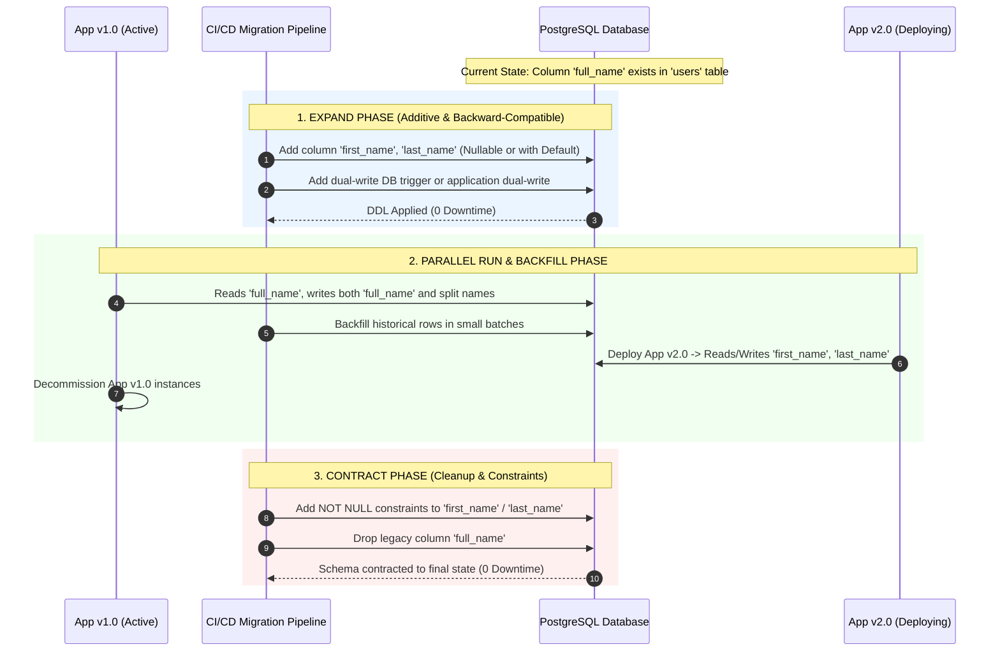

<!-- markdownlint-disable MD013 MD033 MD051 MD060 -->
# 03 - Database Migration Pipeline with Version Locking

> A production-grade **Database Operations & Resilience** engineering suite implementing an automated database schema migration pipeline using `golang-migrate`, transactional forward (`up`) and backward (`down`) SQL migrations, PostgreSQL advisory locking, dirty-state failure recovery, and zero-downtime schema evolution validation.

---

## 📋 Table of Contents

1. [Architectural Overview & Lifecycle](#-architectural-overview--lifecycle)
   - [Migration Execution & State Machine](#migration-execution--state-machine)
   - [Zero-Downtime Expand-and-Contract Pattern](#zero-downtime-expand-and-contract-pattern)
2. [Theoretical Deep-Dive for Beginners](#-theoretical-deep-dive-for-beginners)
   - [Why Database Migrations Belong in Git & CI/CD](#why-database-migrations-belong-in-git--cicd)
   - [Forward (`up`) vs. Inverse Rollback (`down`) Migrations](#forward-up-vs-inverse-rollback-down-migrations)
   - [The `schema_migrations` Table: Versions and the Dirty Flag](#the-schema_migrations-table-versions-and-the-dirty-flag)
   - [Transactional DDL in PostgreSQL (The ACID Advantage)](#transactional-ddl-in-postgresql-the-acid-advantage)
   - [Distributed Concurrency & PostgreSQL Advisory Locks](#distributed-concurrency--postgresql-advisory-locks)
   - [Understanding and Recovering from Dirty States (`migrate force`)](#understanding-and-recovering-from-dirty-states-migrate-force)
   - [Zero-Downtime Migration Patterns (Expand-and-Contract)](#zero-downtime-migration-patterns-expand-and-contract)
3. [Repository & Directory Structure](#-repository--directory-structure)
4. [Prerequisites & System Setup](#-prerequisites--system-setup)
5. [Quickstart Guide (3 Commands)](#-quickstart-guide-3-commands)
6. [Step-by-Step Hands-On Guide](#-step-by-step-hands-on-guide)
   - [Step 1: Start Isolated PostgreSQL Migration Database](#step-1-start-isolated-postgresql-migration-database)
   - [Step 2: Inspect Initial Version State (Version 0)](#step-2-inspect-initial-version-state-version-0)
   - [Step 3: Apply Forward Migrations Stepwise](#step-3-apply-forward-migrations-stepwise)
   - [Step 4: Inspect Schema Evolution & Seed Test Data](#step-4-inspect-schema-evolution--seed-test-data)
   - [Step 5: Execute Stepwise and Full Rollbacks](#step-5-execute-stepwise-and-full-rollbacks)
   - [Step 6: Simulate Failing Migration & Execute Dirty-State Recovery](#step-6-simulate-failing-migration--execute-dirty-state-recovery)
   - [Step 7: Scaffold New Migration Pairs with CLI](#step-7-scaffold-new-migration-pairs-with-cli)
   - [Step 8: Run the Complete Automated Test Suite](#step-8-run-the-complete-automated-test-suite)
7. [Troubleshooting & Common Gotchas](#-troubleshooting--common-gotchas)
8. [Resource Teardown & Complete Cleanup](#-resource-teardown--complete-cleanup)

---

## 🏛️ Architectural Overview & Lifecycle

### Migration Execution & State Machine

```mermaid
stateDiagram-v2
    [*] --> IdleClean: Database at Version N (dirty=false)

    IdleClean --> AdvisoryLockAcquired: migrate up / down / goto
    AdvisoryLockAcquired --> MigrationStarted: Acquire pg_advisory_lock()
    
    MigrationStarted --> DirtyStateSet: Write schema_migrations (version=N+1, dirty=true)
    DirtyStateSet --> ExecutingDDL: Execute SQL in Transaction (BEGIN; DDL; COMMIT;)

    ExecutingDDL --> MigrationSuccess: DDL executes successfully
    ExecutingDDL --> MigrationFailed: Syntax Error / Constraint Violation / Lock Timeout

    MigrationSuccess --> IdleClean: Update schema_migrations (version=N+1, dirty=false) & Release Lock
    
    MigrationFailed --> LockedDirtyState: Transaction Aborted / dirty=true Remains in DB
    LockedDirtyState --> BlockedSubsequentRuns: Future 'migrate up' Blocked with Error
    
    BlockedSubsequentRuns --> ManualIntervention: SRE inspects failure & fixes DDL
    ManualIntervention --> ForceRecovery: Execute migrate force <target_version>
    ForceRecovery --> IdleClean: Database cleared of dirty flag (dirty=false)
```



---

### Zero-Downtime Expand-and-Contract Pattern



---

## 🧠 Theoretical Deep-Dive for Beginners

### Why Database Migrations Belong in Git & CI/CD

In modern Site Reliability Engineering and DevOps:

1. **Schema as Code**: Database schemas are living code artifacts. Every change (table creation, column addition, index build, constraint alteration) must be version-controlled, reviewed in Pull Requests, and applied deterministically across Local, Staging, and Production environments.
2. **Deterministic Reproducibility**: Any developer or CI/CD runner should be able to spin up a blank database container and bring it to the exact production schema state by executing all migrations sequentially from version 1 to version $N$.
3. **Auditability & Traceability**: Each migration file is prefixed with an immutable timestamp or sequential version number, documenting who introduced what change and why.

---

### Forward (`up`) vs. Inverse Rollback (`down`) Migrations

Every database modification must be implemented as a symmetric pair:

- **`*.up.sql` (Forward Migration)**: Transforms the database schema from Version $N-1$ to Version $N$.
  - Example: `CREATE TABLE users (...);` or `CREATE INDEX idx_users_email ON users(email);`.
- **`*.down.sql` (Inverse Rollback Migration)**: Undoes the exact modifications of the corresponding `up.sql` file, restoring the schema from Version $N$ to Version $N-1$.
  - Example: `DROP TABLE IF EXISTS users CASCADE;` or `DROP INDEX IF EXISTS idx_users_email;`.

> [!IMPORTANT]
> A rollback script must **cleanly and completely** reverse the forward script. If `up.sql` created an index and a table, `down.sql` must drop both without leaving orphaned database objects or constraints.

---

### The `schema_migrations` Table: Versions and the Dirty Flag

Tooling like `golang-migrate` maintains an internal state table named `schema_migrations`:

```sql
CREATE TABLE schema_migrations (
    version BIGINT NOT NULL PRIMARY KEY,
    dirty   BOOLEAN NOT NULL
);
```

| Field | Type | Description |
| :--- | :--- | :--- |
| **`version`** | `BIGINT` | The highest migration version number currently applied or attempted. |
| **`dirty`** | `BOOLEAN` | `false` when all migrations finished successfully; `true` if a migration failed mid-execution. |

---

### Transactional DDL in PostgreSQL (The ACID Advantage)

One of PostgreSQL's most powerful enterprise features is **Transactional Data Definition Language (DDL)**:

- In databases like MySQL or Oracle, executing a `CREATE TABLE` or `ALTER TABLE` causes an implicit, irreversible commit. If a script fails on statement 3 of 5, the first 2 changes remain stuck in the database.
- In **PostgreSQL**, DDL statements can run inside a standard transaction:

  ```sql
  BEGIN;
  CREATE TABLE categories (...);
  CREATE TABLE products (...);
  -- If anything fails here, PostgreSQL automatically rolls back the entire batch!
  COMMIT;
  ```

---

### Distributed Concurrency & PostgreSQL Advisory Locks

In cloud environments (such as Kubernetes or auto-scaling container groups), multiple microservice instances might boot simultaneously upon deployment:

1. If 10 container replicas start at once, they might all attempt to run database migrations concurrently.
2. Without locking, multiple runners could simultaneously execute `CREATE TABLE`, resulting in race conditions, corrupted migration tables, and deadlocks.
3. `golang-migrate` prevents this by acquiring a **PostgreSQL Advisory Lock** (`pg_advisory_lock`) before reading the migration state:
   - Only the first runner acquires the lock and executes the DDL.
   - Competing runners wait until the lock is released, observe that the database is already at the target version, and exit cleanly without re-executing migrations.

---

### Understanding and Recovering from Dirty States (`migrate force`)

When a migration script contains invalid SQL syntax, a broken constraint, or runs out of disk space:

1. The migration fails and PostgreSQL rolls back the inner transaction.
2. `golang-migrate` records `dirty = true` in `schema_migrations`.
3. To prevent cascading corruption, `golang-migrate` will **refuse to run any further `up` or `down` commands** while the database is dirty:

   ```text
   error: Dirty database version 5. Fix and force version.
   ```

4. **SRE Recovery Workflow**:
   1. Fix the invalid SQL in the migration file or fix the underlying database issue.
   2. Manually verify what state the database schema is currently in.
   3. Tell `golang-migrate` to clear the dirty flag and reset the version counter using the `force` command:

      ```bash
      ./migrate.sh force 4
      ```

   4. Re-apply the corrected migration:

      ```bash
      ./migrate.sh up
      ```

---

### Zero-Downtime Migration Patterns (Expand-and-Contract)

In high-traffic production databases, schema changes must never cause downtime:

1. **Never rename or delete a column in a single step**: If you rename `full_name` to `name` while the application is running, in-flight queries will instantly fail with `column full_name does not exist`.
2. **Use the Expand-and-Contract (Parallel Run) Pattern**:
   - **Phase 1 (Expand)**: Add the new column `name` (nullable or with default).
   - **Phase 2 (Parallel Run)**: Update application code to read from `name` and dual-write to both `name` and `full_name`. Backfill historical records in batches.
   - **Phase 3 (Contract)**: Deploy code that only reads/writes `name`. Drop the old column `full_name`.

---

## 📂 Repository & Directory Structure

All files and generated artifacts are strictly contained within this directory:

```text
12-databases-ops/03-database-migration-pipeline-version-locking/
├── docker-compose.yml       # PostgreSQL 16 database and shared migration volume
├── requirements.txt         # Python dependencies (psycopg2-binary, tabulate)
├── .env.example             # Template for database connection settings
├── .gitignore               # Excludes logs, reports, and python caches
├── .markdownlint.json       # Linter configuration for technical documentation
├── migrate.sh               # CLI wrapper for golang-migrate (up, down, goto, force, version)
├── db_inspector.py          # Schema analyzer, index inspector, and test data seeder
├── test_pipeline.sh         # End-to-end automated test runner (7 test checkpoints)
├── cleanup.sh               # Complete environment teardown and resource purge
├── migrations/              # Symmetric pairs of forward and rollback SQL DDL files
│   ├── 000001_create_users.up.sql
│   ├── 000001_create_users.down.sql
│   ├── 000002_create_catalog.up.sql
│   ├── 000002_create_catalog.down.sql
│   ├── 000003_create_orders.up.sql
│   ├── 000003_create_orders.down.sql
│   ├── 000004_add_audit_logs.up.sql
│   └── 000004_add_audit_logs.down.sql
└── README.md                # Educational documentation and hands-on guide
```

---

## 💻 Prerequisites & System Setup

Ensure the following tools are installed:

- **Container Engine**: Docker Engine / OrbStack (recommended for macOS) with Docker Compose.
- **Python**: Python 3.9+ (optional on host; scripts include built-in CLI fallbacks).
- **PostgreSQL Client (Optional)**: `psql` (if omitted on host, scripts automatically route operations through Docker).
- **Core CLI Tools**: `bash`, `curl`, `jq`, `coreutils`.

---

## 🚀 Quickstart Guide (3 Commands)

Execute the full database migration pipeline lifecycle from zero to validated in 3 simple commands:

```bash
# 1. Start isolated PostgreSQL database container
docker compose up -d --wait

# 2. Run the complete automated test suite (migrations, rollbacks, dirty recovery, seeder)
./test_pipeline.sh

# 3. Clean up all resources when finished
./cleanup.sh
```

---

## 📖 Step-by-Step Hands-On Guide

### Step 1: Start Isolated PostgreSQL Migration Database

Launch the PostgreSQL 16 container on port `5432`:

```bash
docker compose up -d --wait
```

Verify the container is healthy:

```bash
docker compose ps
```

---

### Step 2: Inspect Initial Version State (Version 0)

Check the database version before applying any migrations:

```bash
./migrate.sh version
```

Output:

```text
▶ Checking current database schema version...
  Current Version : 0 (No migrations applied yet)
```

Inspect the schema with `db_inspector.py`:

```bash
python3 db_inspector.py
```

Output:

```text
🔍 Database Schema & Migration Status
  Applied Migration Version : None
  Dirty State Flag          : None
  Active Application Tables : 0
  Total Data Records        : 0

  (No application tables found in public schema)
```

---

### Step 3: Apply Forward Migrations Stepwise

Apply migrations one step at a time and observe the schema evolve:

```bash
# 1. Apply Migration 1 (Users Table)
./migrate.sh up 1

# 2. Apply Migration 2 (Categories & Products Catalog)
./migrate.sh up 1

# 3. Apply Migration 3 (Orders & Order Items)
./migrate.sh up 1

# 4. Apply Migration 4 (Audit Logs with GIN index on JSONB)
./migrate.sh up 1
```

Check the active schema version:

```bash
./migrate.sh version
```

Output:

```text
▶ Checking current database schema version...
  Current Version : 4
```

---

### Step 4: Inspect Schema Evolution & Seed Test Data

Inspect all 6 created tables, column definitions, and index structures:

```bash
python3 db_inspector.py
```

Output:

```text
🔍 Database Schema & Migration Status
  Applied Migration Version : 4
  Dirty State Flag          : False
  Active Application Tables : 6
  Total Data Records        : 0

╒════════════════════════╤═════════════╤═══════════╤═══════════╕
│ Table Name             │ Row Count   │ Columns   │ Indexes   │
╞════════════════════════╪═════════════╪═══════════╪═══════════╡
│ audit_logs             │ 0           │ 8         │ 5         │
│ categories             │ 0           │ 5         │ 2         │
│ order_items            │ 0           │ 6         │ 3         │
│ orders                 │ 0           │ 7         │ 3         │
│ products               │ 0           │ 9         │ 3         │
│ users                  │ 0           │ 8         │ 3         │
╘════════════════════════╧═════════════╧═══════════╧═══════════╛
```

Seed realistic test data across all tables:

```bash
python3 db_inspector.py --seed
```

---

### Step 5: Execute Stepwise and Full Rollbacks

Test backward migration rollbacks:

```bash
# Rollback 1 step (drops audit_logs table and its GIN indexes)
./migrate.sh down 1

# Check current version (returns to 3)
./migrate.sh version

# Migrate directly to version 1 (drops orders, order_items, products, categories)
./migrate.sh goto 1

# Rollback all remaining migrations to clean slate (version 0)
./migrate.sh down
```

---

### Step 6: Simulate Failing Migration & Execute Dirty-State Recovery

Simulate a production incident where a broken migration fails mid-execution:

1. Create a broken migration file `migrations/000005_broken.up.sql`:

   ```sql
   CREATE TABLE broken_table (
       id SERIAL PRIMARY KEY,
       INVALID_SQL_SYNTAX_ERROR HERE !!!
   );
   ```

2. Re-apply forward migrations:

   ```bash
   ./migrate.sh up
   ```

3. Observe the failure:
   The migration fails with a syntax error, and the database enters the **Dirty State** (`is_dirty = true` at version 5).

4. Attempt to run `./migrate.sh up` again:
   `golang-migrate` **blocks execution**, refusing to proceed while dirty.

5. **Execute SRE Recovery**:

   ```bash
   # Remove the broken file
   rm -f migrations/000005_broken.*

   # Force database version back to clean state (version 4)
   ./migrate.sh force 4
   ```

6. Verify the database is back in a clean state (`dirty = false`):

   ```bash
   python3 db_inspector.py
   ```

---

### Step 7: Scaffold New Migration Pairs with CLI

Generate new timestamped/sequential migration pairs easily:

```bash
./migrate.sh create add_customer_invoices
```

Output:

```text
✔ Created migration pair:
  UP   : ./migrations/000005_add_customer_invoices.up.sql
  DOWN : ./migrations/000005_add_customer_invoices.down.sql
```

---

### Step 8: Run the Complete Automated Test Suite

Run the full end-to-end test suite validating all checkpoints:

```bash
./test_pipeline.sh
```

Output:

```text
======================================================================
  📊 Migration Pipeline Test Execution Summary
======================================================================
  Total Test Checkpoints : 7
  Passed                 : 7
  Failed                 : 0
======================================================================
🎉 All 7 Test Checkpoints Passed Successfully!
```

---

## 🛠️ Troubleshooting & Common Gotchas

### 1. Port 5432 Already Bound

If port 5432 is already used by another local PostgreSQL instance:

- Edit `.env` and set `POSTGRES_PORT=54322`.
- Re-run `docker compose up -d`.

### 2. "Dirty database version N. Fix and force version"

This occurs when a previous migration encountered a runtime error:

- Inspect the error in your SQL DDL.
- Run `./migrate.sh force <valid_version>` to clear the dirty flag.

### 3. PostgreSQL Advisory Lock Timeout

If a migration hangs waiting for an advisory lock:

- Check for long-running open transactions holding table locks:

  ```sql
  SELECT pid, query, state, age(clock_timestamp(), query_start) 
  FROM pg_stat_activity 
  WHERE state != 'idle';
  ```

---

## 🧹 Resource Teardown & Complete Cleanup

To leave your development workstation clean and ready for subsequent mini-projects, run:

```bash
./cleanup.sh
```

### Options & Deep Purge

| Command | Action Performed |
| :--- | :--- |
| `./cleanup.sh` | Stops and removes container (`postgres-migration-db`), deletes Docker network (`postgres-migration-net`), deletes named volumes (`postgres_migration_data`, `postgres_migration_files`), and purges all temporary reports and python cache files. |
| `./cleanup.sh --all` | Performs standard teardown AND deletes downloaded container images (`postgres:16-alpine`, `migrate/migrate:v4.17.0`), freeing maximum disk space. |

### Manual Verification of Zero Leftovers

Confirm that all resources have been completely removed:

```bash
# Verify no running containers
docker ps -a --filter "name=postgres-migration-db"

# Verify no orphaned volumes
docker volume ls --filter "name=postgres_migration_data" --filter "name=postgres_migration_files"
```

The environment is now clean for the next mini-project!
