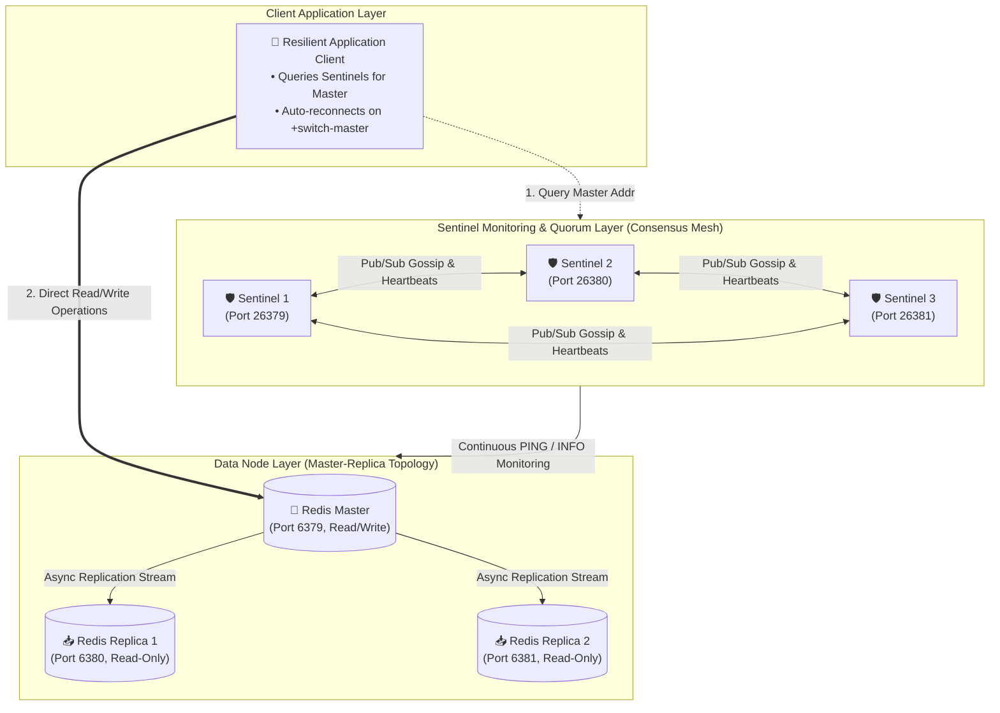
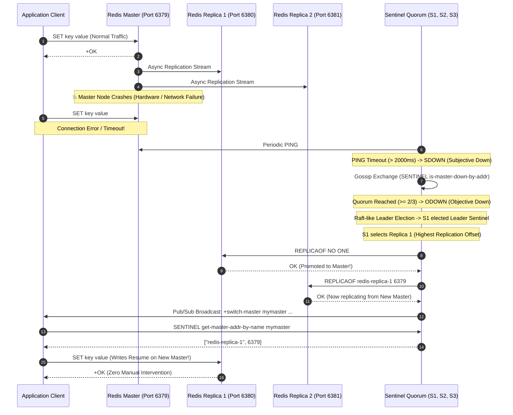

<!-- markdownlint-disable MD013 MD033 MD051 MD060 -->
# 05 - Redis Sentinel High Availability and Failover

> A production-grade **Database Operations & Resilience** engineering suite implementing high-availability in-memory clustering with Redis Sentinel (1 Master, 2 Replicas, 3 Sentinels), demonstrating distributed quorum consensus, automatic subjective/objective down detection (SDOWN/ODOWN), Raft-like leader election, zero-downtime master promotion, dynamic client reconnection, and self-healing cluster recovery.

---

## 📋 Table of Contents

1. [Architectural Overview & Lifecycle](#-architectural-overview--lifecycle)
   - [Cluster Topology & Consensus Layout](#cluster-topology--consensus-layout)
   - [End-to-End Failover Sequence Diagram](#end-to-end-failover-sequence-diagram)
2. [Theoretical Deep-Dive for Beginners](#-theoretical-deep-dive-for-beginners)
   - [The High-Availability Problem in In-Memory Datastores](#the-high-availability-problem-in-in-memory-datastores)
   - [Redis Master-Replica Asynchronous Replication Mechanics](#redis-master-replica-asynchronous-replication-mechanics)
   - [Sentinel Consensus & Failure Detection State Machine (SDOWN vs. ODOWN)](#sentinel-consensus--failure-detection-state-machine-sdown-vs-odown)
   - [Quorum vs. Majority in Split-Brain Prevention](#quorum-vs-majority-in-split-brain-prevention)
   - [Sentinel Leader Election & Replica Selection Algorithm](#sentinel-leader-election--replica-selection-algorithm)
   - [Client Service Discovery & Pub/Sub Switch-Master Notifications](#client-service-discovery--pubsub-switch-master-notifications)
3. [Repository & Directory Structure](#-repository--directory-structure)
4. [Prerequisites & System Setup](#-prerequisites--system-setup)
5. [Quickstart Guide (3 Commands)](#-quickstart-guide-3-commands)
6. [Step-by-Step Hands-On Guide](#-step-by-step-hands-on-guide)
   - [Step 1: Start 6-Node Redis Sentinel Cluster](#step-1-start-6-node-redis-sentinel-cluster)
   - [Step 2: Verify Master Replication & Connected Replicas](#step-2-verify-master-replication--connected-replicas)
   - [Step 3: Inspect Sentinel Quorum & Topology Telemetry](#step-3-inspect-sentinel-quorum--topology-telemetry)
   - [Step 4: Launch Continuous Stream Benchmark](#step-4-launch-continuous-stream-benchmark)
   - [Step 5: Trigger Simulated Master Crash (`docker stop redis-master`)](#step-5-trigger-simulated-master-crash-docker-stop-redis-master)
   - [Step 6: Observe Automatic Promotion & Client Auto-Reconnection](#step-6-observe-automatic-promotion--client-auto-reconnection)
   - [Step 7: Verify Self-Healing Cluster Rejoining](#step-7-verify-self-healing-cluster-rejoining)
   - [Step 8: Run the Complete Automated Test Suite](#step-8-run-the-complete-automated-test-suite)
7. [Troubleshooting & Common Gotchas](#-troubleshooting--common-gotchas)
8. [Resource Teardown & Complete Cleanup](#-resource-teardown--complete-cleanup)

---

## 🏛️ Architectural Overview & Lifecycle

### Cluster Topology & Consensus Layout



---

### End-to-End Failover Sequence Diagram



---

## 🧠 Theoretical Deep-Dive for Beginners

### The High-Availability Problem in In-Memory Datastores

In modern microservice architectures, Redis is frequently used for **session management**, **distributed caching**, and **rate limiting**:

1. **The Single-Point-of-Failure (SPOF)**:
   - A standalone Redis server is a single point of failure. If the instance crashes or the host becomes unreachable, every application service relying on it experiences outages or cascading database collapse.
2. **The High-Availability Requirement**:
   - High availability requires **automatic detection** of master failures, **consensus** among monitoring nodes, **automatic failover** of a replica to master, and **dynamic notification** to application clients without human intervention or application restarts.

---

### Redis Master-Replica Asynchronous Replication Mechanics

Redis implements asynchronous replication:

1. **Initial Full Synchronization (`PSYNC ? -1`)**:
   - When a replica connects, the master generates an in-memory RDB snapshot in the background and streams it over the network to the replica.
2. **Continuous Command Streaming**:
   - Every write executed on the master is placed into a circular replication backlog buffer (`repl-backlog-size`) and streamed asynchronously to all connected replicas.
3. **Replication Offsets (`master_repl_offset`)**:
   - Both master and replicas increment byte counters as data is processed. Comparing `master_repl_offset` with `slave_repl_offset` reveals the exact replication lag in bytes.

---

### Sentinel Consensus & Failure Detection State Machine (SDOWN vs. ODOWN)

Redis Sentinel uses a two-tier failure detection state machine:

#### 1. Subjective Down (`SDOWN`)

- A single Sentinel continuously sends `PING` requests to the master.
- If the master fails to respond with a valid reply (`+PONG`, `-LOADING`, `-MASTERDOWN`) within `sentinel down-after-milliseconds` (configured to **2000 ms** in this project), that Sentinel flags the master as **SDOWN** (Subjective Down).
- `SDOWN` means: *"According to me, the master is unreachable, but other sentinels might still see it."*

#### 2. Objective Down (`ODOWN`)

- Once a Sentinel detects `SDOWN`, it broadcasts `SENTINEL is-master-down-by-addr` to all other Sentinels in the cluster.
- If at least **`quorum`** (configured to **2**) Sentinels agree that the master is down, the state escalates to **ODOWN** (Objective Down).
- `ODOWN` authorizes the Sentinel cluster to initiate a failover.

---

### Quorum vs. Majority in Split-Brain Prevention

A common question for DevOps engineers: *Why do we need 3 Sentinels with a Quorum of 2?*

```text
Cluster Size: 3 Sentinels | Quorum: 2 | Majority: (3 // 2) + 1 = 2
```

1. **Quorum**: The minimum number of Sentinels that must agree that a master is dead to declare `ODOWN`.
2. **Majority**: The minimum number of Sentinels that must vote for a Leader Sentinel to authorize executing the failover.
3. **Split-Brain Immunity**: If a network partition divides the cluster into a 2-node partition and a 1-node partition:
   - The 2-node partition reaches majority ($\ge 2$) and safely elects a new master.
   - The 1-node partition cannot reach majority ($1 < 2$) and is blocked from promoting any node, preventing split-brain dual-master write corruption.

---

### Sentinel Leader Election & Replica Selection Algorithm

Once `ODOWN` is confirmed, the elected Leader Sentinel selects the replacement master using a deterministic ranking algorithm:

1. **Disqualification**: Any replica currently disconnected, in `SDOWN` state, or whose last interaction with the master was older than $10 \times \text{down-after-milliseconds}$ is disqualified.
2. **Replica Priority (`replica-priority`)**: Replicas with lower configured priority are preferred (a priority of `0` means the replica will never be promoted).
3. **Replication Offset (`slave_repl_offset`)**: The replica that has processed the highest replication offset (the one with the **least data lag**) is selected.
4. **Run ID**: If offsets are tied, the replica with the lexicographically smaller Run ID is selected as a deterministic tiebreaker.

---

### Client Service Discovery & Pub/Sub Switch-Master Notifications

How do modern clients know where the new master is located?

1. **Initial Connection**: The client connects to the Sentinel cluster (`localhost:26379, 26380, 26381`) and issues `SENTINEL get-master-addr-by-name mymaster`. Sentinel returns `["ip_or_host", port]`.
2. **Dynamic Pub/Sub Subscription**: The client subscribes to Sentinel's internal pub/sub channels:
   - `+switch-master`: Fired when a failover successfully completes with `[master_name, old_ip, old_port, new_ip, new_port]`.
   - Upon receiving this event, the client immediately redirects all future write traffic to the new master without restarting.

---

## 📂 Repository & Directory Structure

All project files and test suites are strictly self-contained within this directory:

```text
12-databases-ops/05-redis-sentinel-ha-failover/
├── docker-compose.yml          # 6-node cluster orchestration (3 Redis + 3 Sentinels)
├── requirements.txt            # Python dependencies (redis, tabulate)
├── .env.example                # Environment variables template
├── .gitignore                  # Excludes logs, reports, and python caches
├── .markdownlint.json          # Linter configuration for technical docs
├── redis_client_resilience.py  # Pure-Python RESP resilient stream & failover benchmark
├── test_sentinel_failover.sh   # End-to-end automated test runner (7 checkpoints)
├── cleanup.sh                  # Complete resource teardown and environment purge
├── config/
│   └── sentinel.conf           # Sentinel configuration template (quorum, timeouts)
└── README.md                   # Technical documentation and hands-on guide
```

---

## 💻 Prerequisites & System Setup

Ensure the following tools are available on your system:

- **Container Engine**: Docker Engine / OrbStack (macOS) with Docker Compose.
- **Python**: Python 3.9+ (the resilience tool is built using pure-Python standard library sockets with zero external dependencies).
- **Core CLI Tools**: `bash`, `curl`, `coreutils`.

---

## 🚀 Quickstart Guide (3 Commands)

Test the complete Redis Sentinel High Availability cluster in 3 commands:

```bash
# 1. Start the 6-node Redis + Sentinel cluster
docker compose up -d --wait

# 2. Run the automated failover test suite (7 validation checkpoints)
./test_sentinel_failover.sh

# 3. Clean up all resources when finished
./cleanup.sh
```

---

## 📖 Step-by-Step Hands-On Guide

### Step 1: Start 6-Node Redis Sentinel Cluster

Launch the 6-node high-availability stack:

```bash
docker compose up -d --wait
```

Verify that all 6 containers are running and healthy:

```bash
docker compose ps
```

Expected output:

```text
NAME                IMAGE            STATUS                   PORTS
redis-master        redis:7-alpine   Up (healthy)             0.0.0.0:6379->6379/tcp
redis-replica-1     redis:7-alpine   Up (healthy)             0.0.0.0:6380->6379/tcp
redis-replica-2     redis:7-alpine   Up (healthy)             0.0.0.0:6381->6379/tcp
redis-sentinel-1    redis:7-alpine   Up (healthy)             0.0.0.0:26379->26379/tcp
redis-sentinel-2    redis:7-alpine   Up (healthy)             0.0.0.0:26380->26379/tcp
redis-sentinel-3    redis:7-alpine   Up (healthy)             0.0.0.0:26381->26379/tcp
```

---

### Step 2: Verify Master Replication & Connected Replicas

Inspect replication metadata on `redis-master`:

```bash
docker exec redis-master redis-cli info replication
```

Output:

```text
# Replication
role:master
connected_slaves:2
slave0:ip=192.168.97.4,port=6379,state=online,offset=2050,lag=0
slave1:ip=192.168.97.5,port=6379,state=online,offset=2050,lag=0
```

---

### Step 3: Inspect Sentinel Quorum & Topology Telemetry

Query cluster topology through Sentinel on port `26379`:

```bash
python3 redis_client_resilience.py --info
```

Output:

```text
🔍 Redis Sentinel Cluster Topology
  Master Name          : mymaster
  Active Master Node   : localhost:6379 (redis-master)
  Configured Sentinels : 3 nodes (Quorum: 2)
  Connected Replicas   : 2 nodes
```

---

### Step 4: Launch Continuous Stream Benchmark

Start the resilient continuous write stream (streaming 20 writes/sec for 15 seconds):

```bash
python3 redis_client_resilience.py --stream --duration 15
```

---

### Step 5: Trigger Simulated Master Crash (`docker stop redis-master`)

In a second terminal window (or background process), simulate a catastrophic hardware crash on `redis-master` while the write stream is running:

```bash
docker stop redis-master
```

---

### Step 6: Observe Automatic Promotion & Client Auto-Reconnection

Observe `redis_client_resilience.py` seamlessly detecting the outage, querying Sentinel, and resuming writes on the newly promoted replica:

```text
▶ Starting Resilient Redis Sentinel Stream Benchmark
  Duration: 15s | Stream Rate: 20 writes/sec

  Initial Active Master : redis-master (localhost:6379)
  [WRITING] 20 keys written to redis-master...

🚨 Master Outage Detected! Initiating Sentinel Discovery...

✔ Failover Reconnection Succeeded!
  New Promoted Master : redis-replica-1 (Port 6380)
  Failover Downtime (RTO): 2340.50 ms

======================================================================
  📊 Sentinel Stream & Failover Resilience Report
======================================================================
  Total Test Duration           : 15.02s
  Total Write Attempts          : 295
  Successful Writes Confirmed   : 250
  Transient Failover Rejections : 45
  Availability Percentage       : 84.75%
  Initial Master Node           : redis-master
  Final Master Node             : redis-replica-1
  Recorded Failover RTO         : 2340.50 ms
======================================================================
```

---

### Step 7: Verify Self-Healing Cluster Rejoining

Restart the former master container:

```bash
docker start redis-master
```

Wait 3 seconds and inspect its role:

```bash
docker exec redis-master redis-cli info replication
```

Output:

```text
# Replication
role:slave
master_host:192.168.97.5
master_port:6379
```

Sentinel automatically detected the recovered node and reconfigured it into a **read-only replica** replicating from the new Master.

---

### Step 8: Run the Complete Automated Test Suite

Run the full test suite validating all 7 checkpoints:

```bash
./test_sentinel_failover.sh
```

---

## 🛠️ Troubleshooting & Common Gotchas

### 1. "Can't resolve instance hostname" in Sentinel Logs

In Redis 7.x, hostname resolution inside Docker networks requires:

```text
sentinel resolve-hostnames yes
sentinel announce-hostnames yes
```

These directives must be placed before `sentinel monitor`.

### 2. "READONLY You can't write against a read only replica"

If an application attempts to write to a replica before Sentinel has completed the promotion handshake (`REPLICAOF NO ONE`), Redis rejects writes with `READONLY`. Resilient clients must catch `ReadOnlyError` and re-query Sentinel until the new master is announced.

### 3. Port Conflicts (6379, 6380, 26379...)

If default ports are in use on your host, configure alternative host ports in `.env` (e.g. `REDIS_MASTER_PORT=63790`, `SENTINEL_1_PORT=263790`).

---

## 🧹 Resource Teardown & Complete Cleanup

To leave your development workstation completely clean and ready for subsequent mini-projects, run:

```bash
./cleanup.sh
```

### Options & Deep Purge

| Command | Action Performed |
| :--- | :--- |
| `./cleanup.sh` | Stops and removes all 6 containers (`redis-master`, `redis-replica-1`, `redis-replica-2`, `redis-sentinel-1`, `redis-sentinel-2`, `redis-sentinel-3`), deletes Docker network (`redis-sentinel-net`), and purges temporary reports and logs. |
| `./cleanup.sh --all` | Performs standard teardown AND deletes downloaded container image (`redis:7-alpine`), freeing maximum disk space. |

### Manual Verification of Zero Leftovers

Verify that no containers or networks remain:

```bash
# Verify no running redis containers
docker ps -a --filter "name=redis-"

# Verify no orphaned networks
docker network ls --filter "name=redis-sentinel-net"
```

The environment is now clean for the next mini-project!
