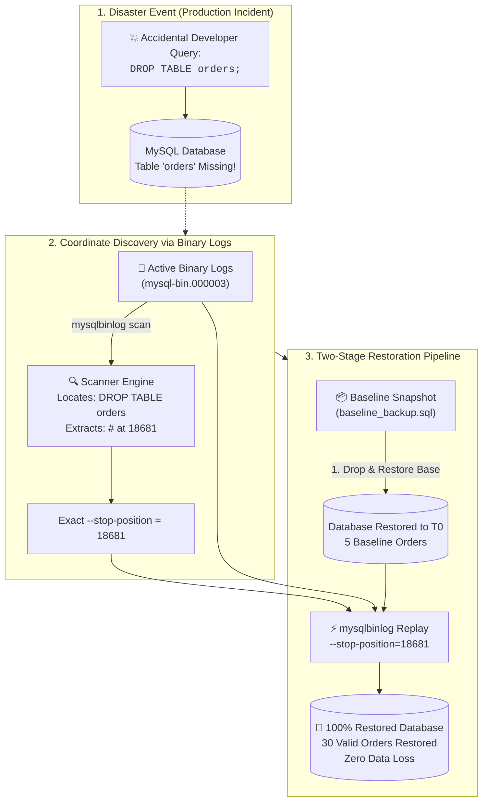

<!-- markdownlint-disable MD013 MD033 MD051 MD060 -->
# 06 - MySQL Point-in-Time Recovery (PITR) Lab

> A production-grade **Database Operations & Resilience** engineering suite mastering disaster recovery on MySQL / MariaDB using full physical snapshots and binary logs (`mysqlbinlog`). Demonstrates sub-second transaction recovery, binary log coordinate discovery, and restoring data to the exact log position before an accidental `DROP TABLE` human error.

---

## 📋 Table of Contents

1. [Architectural Overview & Lifecycle](#-architectural-overview--lifecycle)
   - [Disaster Recovery Timeline & Architecture](#disaster-recovery-timeline--architecture)
   - [Point-in-Time Recovery Execution Flow](#point-in-time-recovery-execution-flow)
2. [Theoretical Deep-Dive for Beginners](#-theoretical-deep-dive-for-beginners)
   - [Why Daily Backups Aren't Enough (The RPO Recovery Gap)](#why-daily-backups-arent-enough-the-rpo-recovery-gap)
   - [The MySQL Binary Log Architecture](#the-mysql-binary-log-architecture)
   - [Statement vs. Row-Based Logging (`binlog_format = ROW`)](#statement-vs-row-based-logging-binlog_format--row)
   - [The PITR Mathematical Equation](#the-pitr-mathematical-equation)
   - [Dissecting Enterprise `mysqldump` Flags](#dissecting-enterprise-mysqldump-flags)
   - [Position-Based vs. Timestamp-Based Recovery](#position-based-vs-timestamp-based-recovery)
   - [Pinpointing Disaster Coordinates with `mysqlbinlog`](#pinpointing-disaster-coordinates-with-mysqlbinlog)
3. [Repository & Directory Structure](#-repository--directory-structure)
4. [Prerequisites & System Setup](#-prerequisites--system-setup)
5. [Quickstart Guide (3 Commands)](#-quickstart-guide-3-commands)
6. [Step-by-Step Hands-On Guide](#-step-by-step-hands-on-guide)
   - [Step 1: Start MySQL Container with Binary Logging](#step-1-start-mysql-container-with-binary-logging)
   - [Step 2: Inspect Initial Baseline E-Commerce Data](#step-2-inspect-initial-baseline-e-commerce-data)
   - [Step 3: Generate Full Baseline Backup with `--flush-logs`](#step-3-generate-full-baseline-backup-with---flush-logs)
   - [Step 4: Stream Live Business Transactions (+25 Orders)](#step-4-stream-live-business-transactions-25-orders)
   - [Step 5: Trigger Catastrophic Accidental `DROP TABLE`](#step-5-trigger-catastrophic-accidental-drop-table)
   - [Step 6: Scan Binary Logs to Pinpoint Disaster Coordinates](#step-6-scan-binary-logs-to-pinpoint-disaster-coordinates)
   - [Step 7: Execute Point-in-Time Recovery & Validate 100% Parity](#step-7-execute-point-in-time-recovery--validate-100-parity)
   - [Step 8: Run the Complete Automated Test Suite](#step-8-run-the-complete-automated-test-suite)
7. [Troubleshooting & Common Gotchas](#-troubleshooting--common-gotchas)
8. [Resource Teardown & Complete Cleanup](#-resource-teardown--complete-cleanup)

---

## 🏛️ Architectural Overview & Lifecycle

### Disaster Recovery Timeline & Architecture

```mermaid
timeline
    title MySQL Point-in-Time Recovery Timeline (T0 to Recovery)
    section T0: Baseline Snapshot
        02:00 AM : Full mysqldump Baseline (5 Orders)
                 : Flush Logs -> mysql-bin.000003 rotated
    section T1 - Tn: Live Traffic
        02:15 AM : Order #6 Placed ($14.99)
        02:30 AM : Order #7 - #30 Placed (Live Transactions)
        02:44 AM : All transactions logged to mysql-bin.000003
    section T_disaster: Human Error
        02:45 AM : 💥 Accidental DROP TABLE orders; executed!
                 : Active table destroyed
    section T_recovery: PITR
        02:50 AM : Restore T0 Full Baseline Backup (5 Orders)
                 : Replay Binlog events up to Pos 18681 (Stop before DROP)
                 : 100% Data Restored (All 30 Orders Recovered!)
```

---

### Point-in-Time Recovery Execution Flow



---

## 🧠 Theoretical Deep-Dive for Beginners

### Why Daily Backups Aren't Enough (The RPO Recovery Gap)

In enterprise production environments, databases change continuously:

1. **The Daily Backup Limit**:
   - If you take a full backup every night at **02:00 AM**, and an accidental `DROP TABLE` or storage corruption occurs at **04:30 PM**, restoring *only* the daily backup loses **14.5 hours of customer orders and financial transactions**!
2. **Recovery Point Objective (RPO)**:
   - RPO represents the maximum acceptable data loss measured in time.
   - For mission-critical banking and e-commerce databases, the target RPO is **0 seconds**.
3. **The Solution**:
   - By combining a **periodic full baseline backup** with continuous **Binary Logging (Write-Ahead Logs)**, you can replay transactions up to any given microsecond or log position, achieving **zero uncommitted data loss**.

---

### The MySQL Binary Log Architecture

The binary log contains record events that describe database modifications:

- **Structure**: Binary logs are split into sequentially numbered files (`mysql-bin.000001`, `mysql-bin.000002`, etc.) tracked by an index file (`mysql-bin.index`).
- **Events**: Every transaction is encapsulated between an `Anonymous_Gtid` / `GTID` event, `BEGIN`, row/query payloads, and a closing `COMMIT` / `Xid` event with a unique log position offset (`# at <position>`).

---

### Statement vs. Row-Based Logging (`binlog_format = ROW`)

MySQL supports three binary logging formats configured via `binlog_format`:

| Format | Mechanics | Pros | Gotchas / PITR Risks |
| :--- | :--- | :--- | :--- |
| **`STATEMENT`** | Logs the literal SQL query strings (e.g. `INSERT INTO orders VALUES (...)`). | Smallest log file size. | **Unsafe for PITR**: Non-deterministic SQL (e.g. `NOW()`, `UUID()`, `RAND()`, `LIMIT` without `ORDER BY`) produces different data when replayed! |
| **`ROW` (Recommended)** | Logs the exact before and after binary images of each modified row. | **100% Deterministic & Safe**: Guaranteed identical replay regardless of system time or server state. | Slightly larger log volume. |
| **`MIXED`** | Uses statement logging by default, switching to row-based only for non-deterministic queries. | Balanced log size. | Harder to debug and audit. |

---

### The PITR Mathematical Equation

Point-in-Time Recovery computes the exact mathematical sum of a baseline state and an incremental transaction stream:

$$\text{Database State}(T_{\text{target}}) = \text{Full Snapshot}(T_0) + \sum_{t=T_0}^{T_{\text{target}}} \text{Replayed Binlog Events}(t)$$

Where $T_{\text{target}}$ is set to the exact event offset preceding the catastrophic event $T_{\text{disaster}}$:

$$T_{\text{target}} = \text{Position}(\text{Disaster Event}) - 1$$

---

### Dissecting Enterprise `mysqldump` Flags

When taking production baseline backups, three specific flags are mandatory:

```bash
mysqldump -u root -p \
  --single-transaction \
  --flush-logs \
  --master-data=2 \
  --databases ecommerce_db > baseline_backup.sql
```

1. **`--single-transaction`**:
   - Sets transaction isolation to `REPEATABLE READ` and issues `START TRANSACTION WITH CONSISTENT SNAPSHOT`.
   - Allows taking a consistent backup of InnoDB tables without locking active reads or writes!
2. **`--flush-logs`**:
   - Closes the active binary log file and opens a brand-new sequentially numbered log file at the exact start of the backup.
   - Simplifies recovery because all post-backup transactions will reside in the new binlog file.
3. **`--master-data=2` (or `--source-data=2`)**:
   - Writes the binary log file name and starting position offset as a SQL comment at the top of the dump (e.g. `-- CHANGE MASTER TO MASTER_LOG_FILE='mysql-bin.000003', MASTER_LOG_POS=385;`).

---

### Position-Based vs. Timestamp-Based Recovery

`mysqlbinlog` provides two recovery filters:

1. **Timestamp Recovery (`--stop-datetime="2026-08-24 10:45:00"`)**:
   - Stops replay at a human-readable clock time.
   - *Risk*: Multiple queries can execute within the same second. If the accidental `DROP TABLE` occurred at the exact same second as 5 legitimate orders, timestamp recovery might either include the drop or miss legitimate orders.
2. **Position-Based Recovery (`--stop-position=18681`) — Recommended Standard**:
   - Uses the deterministic byte offset (`# at <position>`) of the event.
   - Guaranteed sub-transaction precision: replays every event up to byte 18680 and stops before byte 18681.

---

### Pinpointing Disaster Coordinates with `mysqlbinlog`

Inspecting the binary log reveals the exact anatomy of the disaster event:

```text
# at 18650
#260824 13:26:00 server id 1  end_log_pos 18681 CRC32 0x4bfe6dfd   Xid = 235
COMMIT /* Legitimate Order #30 */
# at 18681
#260824 13:26:00 server id 1  end_log_pos 18723 CRC32 0x9fe0fbc9   GTID 0-1-62 ddl
# at 18723
#260824 13:26:00 server id 1  end_log_pos 18852 CRC32 0x9fe0fbc9   Query
use `ecommerce_db`/*!*/;
DROP TABLE `orders` /* generated by server */
```

- Position **`18681`** is the exact start of the destructive DDL transaction.
- Setting `--stop-position=18681` commits Order #30 and halts replay before the `DROP TABLE`.

---

## 📂 Repository & Directory Structure

All files and test suites are strictly self-contained within this directory:

```text
12-databases-ops/06-mysql-point-in-time-recovery-pitr/
├── docker-compose.yml          # Containerized MySQL / MariaDB stack with binary logging
├── requirements.txt            # Python dependencies (tabulate, pymysql)
├── .env.example                # Environment variables template
├── .gitignore                  # Excludes backup dumps, reports, and logs
├── .markdownlint.json          # Linter configuration for technical documentation
├── simulate_disaster.py        # Workload generator, backup engine & disaster simulator
├── pitr_restore_runbook.sh     # Automated Disaster Recovery runbook (scan, restore, replay)
├── test_pitr.sh                # End-to-end automated test runner (7 validation checkpoints)
├── cleanup.sh                  # Resource teardown and backup artifact purge
├── config/
│   ├── my.cnf                  # MySQL binary logging configuration (server_id, ROW format)
│   └── 01-init.sql             # E-commerce baseline schema (customers, orders, audit_log)
└── README.md                   # Technical documentation and hands-on guide
```

---

## 💻 Prerequisites & System Setup

Ensure the following tools are available on your system:

- **Container Engine**: Docker Engine / OrbStack (macOS) with Docker Compose.
- **Python**: Python 3.9+ (optional on host; scripts route operations via Docker).
- **Core CLI Tools**: `bash`, `coreutils`, `grep`, `awk`.

---

## 🚀 Quickstart Guide (3 Commands)

Execute the complete Point-in-Time Recovery lifecycle in 3 simple commands:

```bash
# 1. Start MySQL container with binary logging enabled
docker compose up -d --wait

# 2. Run the automated PITR test suite (backup -> live traffic -> disaster -> recovery)
./test_pitr.sh

# 3. Clean up all resources when finished
./cleanup.sh
```

---

## 📖 Step-by-Step Hands-On Guide

### Step 1: Start MySQL Container with Binary Logging

Launch the database stack:

```bash
docker compose up -d --wait
```

Verify that binary logging is active and operating in `ROW` format:

```bash
docker exec mysql-pitr-db mysql -u root -prootpassword -e "SELECT @@log_bin, @@binlog_format;"
```

Output:

```text
+-----------+-----------------+
| @@log_bin | @@binlog_format |
+-----------+-----------------+
|         1 | ROW             |
+-----------+-----------------+
```

---

### Step 2: Inspect Initial Baseline E-Commerce Data

Check initial seed data in `ecommerce_db`:

```bash
docker exec mysql-pitr-db mysql -u root -prootpassword -D ecommerce_db -e "SELECT COUNT(*) AS customers FROM customers; SELECT COUNT(*) AS orders FROM orders;"
```

Output:

```text
customers: 5
orders   : 5
```

---

### Step 3: Generate Full Baseline Backup with `--flush-logs`

Take a full non-locking baseline backup and rotate the active binary log:

```bash
mkdir -p backups
docker exec mysql-pitr-db mysqldump -u root -prootpassword \
  --single-transaction \
  --flush-logs \
  --master-data=2 \
  --databases ecommerce_db > backups/baseline_backup.sql
```

Inspect the embedded coordinates inside the backup header:

```bash
head -n 30 backups/baseline_backup.sql | grep "CHANGE MASTER"
```

Output:

```sql
-- CHANGE MASTER TO MASTER_LOG_FILE='mysql-bin.000003', MASTER_LOG_POS=385;
```

---

### Step 4: Stream Live Business Transactions (+25 Orders)

Run the simulation engine to generate 25 live customer orders:

```bash
python3 simulate_disaster.py --transactions 25
```

Total valid orders in database: **30 orders** (5 baseline + 25 live orders).

---

### Step 5: Trigger Catastrophic Accidental `DROP TABLE`

Simulate accidental human error:

```bash
docker exec mysql-pitr-db mysql -u root -prootpassword -D ecommerce_db -e "DROP TABLE orders;"
```

Verify that the table is destroyed:

```bash
docker exec mysql-pitr-db mysql -u root -prootpassword -D ecommerce_db -e "SHOW TABLES;"
```

`orders` table is completely missing!

---

### Step 6: Scan Binary Logs to Pinpoint Disaster Coordinates

Scan active binary logs to find the exact byte offset of the `DROP TABLE` query:

```bash
docker exec mysql-pitr-db mysqlbinlog --verbose /var/lib/mysql/mysql-bin.000003 | grep -B 5 -i "DROP TABLE"
```

Extracted stop coordinate: **`18681`**.

---

### Step 7: Execute Point-in-Time Recovery & Validate 100% Parity

Execute the disaster recovery runbook:

```bash
./pitr_restore_runbook.sh
```

Output:

```text
======================================================================
  📊 Point-in-Time Recovery (PITR) Integrity Report
======================================================================
  Table Name       | Baseline Count | Recovered Total | Target / Expected
  ----------------------------------------------------------------------
  customers        | 5              | 5               | 5
  orders           | 5              | 30              | 30
  audit_log        | 1              | 27              | > 1
======================================================================

🎉 SUCCESS: Point-in-Time Recovery completed with 100% data integrity!
  All live business transactions prior to the accidental DROP TABLE were restored.
```

All 30 orders and customer transactions have been recovered with **zero data loss**.

---

### Step 8: Run the Complete Automated Test Suite

Run the full automated test suite validating all 7 checkpoints:

```bash
./test_pitr.sh
```

---

## 🛠️ Troubleshooting & Common Gotchas

### 1. "Table Doesn't Exist" During Replay

Ensure that you restore the full baseline snapshot *before* replaying the incremental binary logs. Replaying `Write_rows` events without existing table schemas causes immediate syntax or schema errors.

### 2. GTID Mode and Replay

When GTID is enabled (`gtid_mode = ON`), use `--skip-gtids` with `mysqlbinlog` if replaying events onto a fresh instance with empty GTID sets to avoid transaction skipping.

### 3. Port 3306 Conflict

If port 3306 is in use on your workstation, configure an alternative port in `.env` (e.g. `MYSQL_PORT=33060`).

---

## 🧹 Resource Teardown & Complete Cleanup

To leave your development workstation completely clean and ready for subsequent mini-projects, run:

```bash
./cleanup.sh
```

### Options & Deep Purge

| Command | Action Performed |
| :--- | :--- |
| `./cleanup.sh` | Stops and removes container (`mysql-pitr-db`), deletes Docker network (`mysql-pitr-net`), deletes named volume (`mysql_pitr_data`), and purges all backup dumps and metadata. |
| `./cleanup.sh --all` | Performs standard teardown AND deletes downloaded container images (`mariadb:10.11`, `mysql:8.0`), freeing maximum disk space. |

### Manual Verification of Zero Leftovers

Confirm that all resources have been completely removed:

```bash
# Verify no running MySQL containers
docker ps -a --filter "name=mysql-pitr-db"

# Verify no orphaned volumes
docker volume ls --filter "name=mysql_pitr_data"
```

The environment is now clean for the next mini-project!
