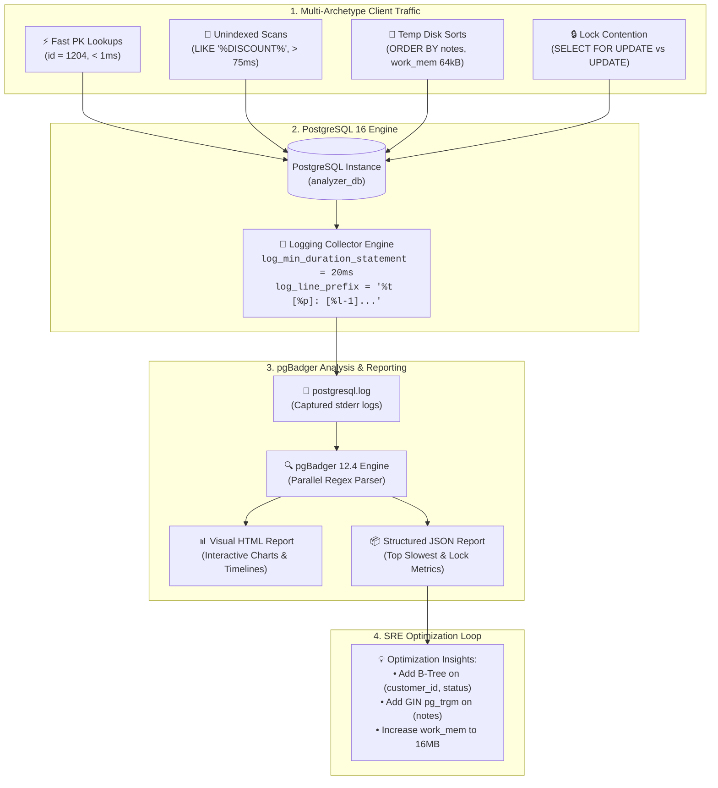
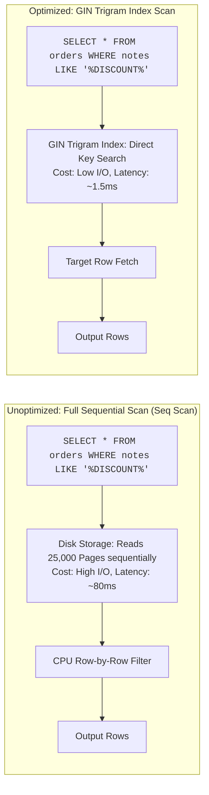

<!-- markdownlint-disable MD013 MD033 MD051 MD060 -->
# 07 - Database Slow Query Analyzer with pgBadger

> A production-grade **Database Operations & Resilience** engineering suite mastering PostgreSQL query performance profiling and log analysis using **pgBadger**. Explores log line prefix tuning, query duration thresholds (`log_min_duration_statement`), lock contention detection (`log_lock_waits`), temporary file disk spills (`work_mem`), and automated generation of visual HTML and structured JSON performance reports.

---

## 📋 Table of Contents

1. [Architectural Overview & Workflow](#-architectural-overview--workflow)
   - [PostgreSQL Performance Profiling Pipeline](#postgresql-performance-profiling-pipeline)
   - [Query Execution Plan Mechanics (Seq Scan vs. Index)](#query-execution-plan-mechanics-seq-scan-vs-index)
2. [Theoretical Deep-Dive for Beginners](#-theoretical-deep-dive-for-beginners)
   - [Why Slow Queries Cause System-Wide Outages](#why-slow-queries-cause-system-wide-outages)
   - [The PostgreSQL Logging Architecture](#the-postgresql-logging-architecture)
   - [Dissecting `log_line_prefix` for pgBadger Parser Accuracy](#dissecting-log_line_prefix-for-pgbadger-parser-accuracy)
   - [Essential SRE Performance Logging Parameters](#essential-sre-performance-logging-parameters)
   - [`pg_stat_statements` vs. `pgBadger` (Cumulative vs. Time-Series)](#pg_stat_statements-vs-pgbadger-cumulative-vs-time-series)
   - [Query Archetypes: Scans, Temp Files & Lock Contention](#query-archetypes-scans-temp-files--lock-contention)
   - [SRE Remediation Strategies (B-Tree, GIN Trigram, work_mem)](#sre-remediation-strategies-b-tree-gin-trigram-work_mem)
3. [Repository & Directory Structure](#-repository--directory-structure)
4. [Prerequisites & System Setup](#-prerequisites--system-setup)
5. [Quickstart Guide (3 Commands)](#-quickstart-guide-3-commands)
6. [Step-by-Step Hands-On Guide](#-step-by-step-hands-on-guide)
   - [Step 1: Start PostgreSQL Container with Performance Logging](#step-1-start-postgresql-container-with-performance-logging)
   - [Step 2: Verify PostgreSQL Logging Configuration](#step-2-verify-postgresql-logging-configuration)
   - [Step 3: Inspect Seed Database Volume (5k Customers, 25k Orders)](#step-3-inspect-seed-database-volume-5k-customers-25k-orders)
   - [Step 4: Execute Multi-Archetype Query Workload Generator](#step-4-execute-multi-archetype-query-workload-generator)
   - [Step 5: Inspect Captured PostgreSQL Server Logs](#step-5-inspect-captured-postgresql-server-logs)
   - [Step 6: Generate Visual HTML & Structured JSON Reports](#step-6-generate-visual-html--structured-json-reports)
   - [Step 7: Apply Index Remediations & Benchmark Improvement](#step-7-apply-index-remediations--benchmark-improvement)
   - [Step 8: Run the Complete Automated Test Suite](#step-8-run-the-complete-automated-test-suite)
7. [Troubleshooting & Common Gotchas](#-troubleshooting--common-gotchas)
8. [Resource Teardown & Complete Cleanup](#-resource-teardown--complete-cleanup)

---

## 🏛️ Architectural Overview & Workflow

### PostgreSQL Performance Profiling Pipeline



---

### Query Execution Plan Mechanics (Seq Scan vs. Index)



---

## 🧠 Theoretical Deep-Dive for Beginners

### Why Slow Queries Cause System-Wide Outages

In modern high-concurrency microservices, slow database queries are the leading cause of catastrophic cascading failures:

1. **Connection Pool Starvation**:
   - If queries take **500ms** instead of **5ms**, application threads hold database connections 100x longer.
   - The connection pool (e.g. HikariCP, PgBouncer) fills up rapidly, blocking all incoming HTTP requests and causing HTTP 504 Gateway Timeouts.
2. **CPU & Disk I/O Saturation**:
   - A single unindexed query scanning 1,000,000 rows evicts cached memory pages from PostgreSQL's `shared_buffers`, forcing subsequent queries to read from slow disk storage.
3. **Lock Wait Cascades**:
   - Long-running transactions that acquire row locks (`SELECT FOR UPDATE`) or table locks block concurrent writes, queuing hundreds of waiting transactions.

---

### The PostgreSQL Logging Architecture

PostgreSQL includes a robust asynchronous background logging process called the **Logging Collector** (`logging_collector = on`).

- **Decoupled Architecture**: Worker processes write log messages to an internal memory buffer. The background logger thread flushes these messages to disk, ensuring logging operations do not block query execution.
- **Log Destinations**: PostgreSQL can route logs to `stderr`, `csvlog`, or `syslog`. For `pgBadger`, `stderr` with a customized prefix provides maximum parsing speed and minimal overhead.

---

### Dissecting `log_line_prefix` for pgBadger Parser Accuracy

`pgBadger` relies on regular expressions to tokenize log lines. Setting an exact `log_line_prefix` format is required:

```ini
log_line_prefix = '%t [%p]: [%l-1] user=%u,db=%d,app=%a,client=%h '
```

| Token | Meaning | Example Value | SRE Utility |
| :--- | :--- | :--- | :--- |
| **`%t`** | Timestamp without milliseconds | `2026-08-24 13:41:07 GMT` | Time-series query volume tracking. |
| **`%p`** | Backend Process ID | `[54]` | Correlates multi-statement sessions. |
| **`[%l-1]`** | Session line number minus 1 | `[3-1]` | Groups split multiline SQL statements. |
| **`user=%u`** | Connected database user | `user=postgres` | Identifies rogue users or services. |
| **`db=%d`** | Target database name | `db=analyzer_db` | Multi-tenant database attribution. |
| **`app=%a`** | Application Name | `app=psql` or `app=order-service` | Isolates microservice workloads. |
| **`client=%h`** | Client IP / Hostname | `client=192.168.1.5` | Pinpoints noisy client pods or hosts. |

---

### Essential SRE Performance Logging Parameters

```ini
# 1. Statement Duration Threshold (Milliseconds)
log_min_duration_statement = 20

# 2. Concurrency & Locking
log_lock_waits = on
deadlock_timeout = '1s'

# 3. Disk I/O & Memory Spills
log_temp_files = 0

# 4. Checkpoints & Storage Health
log_checkpoints = on
log_autovacuum_min_duration = 0
```

1. **`log_min_duration_statement = 20`**:
   - Logs the execution time and SQL text of any query taking **20ms or longer**.
   - *Production Tip*: In high-throughput databases (10k+ QPS), logging every query (`0ms`) creates excessive disk I/O. A threshold of `50ms` to `250ms` captures performance outliers without noticeable overhead.
2. **`log_lock_waits = on`**:
   - Logs a message whenever a session waits longer than `deadlock_timeout` (default 1s) to acquire a lock.
3. **`log_temp_files = 0`**:
   - Logs whenever a query creates a temporary disk file (e.g. large `ORDER BY`, `DISTINCT`, or hash aggregation exceeding `work_mem`). Setting to `0` logs all temporary files.

---

### `pg_stat_statements` vs. `pgBadger` (Cumulative vs. Time-Series)

| Feature | `pg_stat_statements` | `pgBadger` |
| :--- | :--- | :--- |
| **Mechanism** | PostgreSQL internal memory view (`SELECT * FROM pg_stat_statements`). | External Perl log parser operating on log files. |
| **Data Type** | **Cumulative aggregates** (Total calls, mean time, total blocks read). | **Granular time-series event history** (Exact timestamps, parameters, spikes). |
| **Visualization** | None (Raw SQL tables; requires Grafana/Prometheus). | **Full visual interactive HTML report** (Charts, timelines, pie charts). |
| **Lock Waits & Temp Files** | Limited lock timing details. | **Explicit lock wait duration and temporary file size graphs**. |
| **Best Use Case** | Real-time Prometheus metrics exporter. | **Daily/weekly deep-dive audits, incident post-mortems, and tuning**. |

---

### Query Archetypes: Scans, Temp Files & Lock Contention

This project generates 5 distinct database query archetypes:

1. **Fast Primary Key Lookups**: `SELECT * FROM customers WHERE id = 42;` — B-Tree index scan (<1ms).
2. **Unindexed Table Scans (Seq Scan)**: `SELECT * FROM orders WHERE notes LIKE '%DISCOUNT%'` — Scans every table page (~80ms).
3. **Unindexed Joins & Aggregations**: `SELECT c.country, SUM(o.total_amount) ... JOIN customers c ON o.customer_id = c.id` — Sequential join without foreign key index.
4. **Temporary File Sort Spills**: `SELECT * FROM orders ORDER BY notes, total_amount, customer_id;` — Sorting data volume larger than `work_mem = 64kB`, spilling to disk.
5. **Lock Contention**: `SELECT FOR UPDATE` holding a lock for 300ms while a concurrent `UPDATE` waits.

---

### SRE Remediation Strategies (B-Tree, GIN Trigram, work_mem)

1. **Composite B-Tree Indexes**:
   - Query: `CREATE INDEX idx_orders_customer_status ON orders(customer_id, status);`
   - Impact: Eliminates sequential scans for filtered queries and joins on `customer_id`.

2. **GIN Trigram Indexes (`pg_trgm`)**:
   - Query: `CREATE EXTENSION IF NOT EXISTS pg_trgm; CREATE INDEX idx_orders_notes_trgm ON orders USING gin (notes gin_trgm_ops);`
   - Impact: Enables sub-millisecond search for substring `LIKE '%pattern%'` queries.

3. **Tuning `work_mem`**:
   - Query: `SET work_mem = '16MB';` (or set in `postgresql.conf`).
   - Impact: Allocates sufficient RAM for in-memory Quicksort, eliminating temporary disk file writes.

---

## 📂 Repository & Directory Structure

All files and test suites are strictly self-contained within this directory:

```text
12-databases-ops/07-database-slow-query-analyzer-pgbadger/
├── docker-compose.yml              # Containerized PostgreSQL 16 stack with custom logging
├── requirements.txt                # Python dependencies (psycopg2-binary, tabulate)
├── .env.example                    # Environment configuration template
├── .gitignore                      # Excludes logs, HTML/JSON reports, and python cache
├── .markdownlint.json              # Markdownlint ruleset
├── query_workload_generator.py     # Multi-archetype workload generator (scans, sorts, locks)
├── generate_pgbadger_report.sh     # Automation script generating HTML and JSON reports
├── test_pgbadger_analyzer.sh       # Automated test suite (7 validation checkpoints)
├── cleanup.sh                      # Teardown script for containers, volumes, and reports
├── config/
│   ├── postgresql.conf             # Performance logging configuration (log_line_prefix, 20ms)
│   └── 01-init.sql                 # E-commerce schema (5k customers, 25k orders, 50k items)
└── README.md                       # Comprehensive educational guide
```

---

## 💻 Prerequisites & System Setup

Ensure the following tools are available on your workstation:

- **Container Engine**: Docker Engine / OrbStack (macOS) with Docker Compose.
- **Python**: Python 3.9+ (with standard libraries).
- **Core CLI Tools**: `bash`, `coreutils`, `grep`, `awk`.

---

## 🚀 Quickstart Guide (3 Commands)

Execute the complete query profiling and analysis lifecycle in 3 simple commands:

```bash
# 1. Start PostgreSQL with performance logging configuration
docker compose up -d --wait

# 2. Run the end-to-end automated test suite (workload -> log extraction -> pgBadger report)
./test_pgbadger_analyzer.sh

# 3. Clean up all resources when finished
./cleanup.sh
```

---

## 📖 Step-by-Step Hands-On Guide

### Step 1: Start PostgreSQL Container with Performance Logging

Start the database container:

```bash
docker compose up -d --wait
```

---

### Step 2: Verify PostgreSQL Logging Configuration

Audit the active logging parameters inside PostgreSQL:

```bash
docker exec postgres-analyzer-db psql -U postgres -d analyzer_db -c \
  "SELECT current_setting('log_line_prefix') AS prefix, \
          current_setting('log_min_duration_statement') AS min_duration, \
          current_setting('log_lock_waits') AS lock_waits, \
          current_setting('log_temp_files') AS temp_files;"
```

Output:

```text
                     prefix                      | min_duration | lock_waits | temp_files 
-------------------------------------------------+--------------+------------+------------
 %t [%p]: [%l-1] user=%u,db=%d,app=%a,client=%h  | 20ms         | on         | 0
(1 row)
```

---

### Step 3: Inspect Seed Database Volume (5k Customers, 25k Orders)

Check initial table counts:

```bash
docker exec postgres-analyzer-db psql -U postgres -d analyzer_db -c \
  "SELECT 'customers' AS tbl, COUNT(*) FROM customers UNION ALL \
   SELECT 'orders', COUNT(*) FROM orders UNION ALL \
   SELECT 'order_items', COUNT(*) FROM order_items;"
```

Output:

```text
     tbl     | count 
-------------+-------
 customers   |  5000
 orders      | 25000
 order_items | 50000
(3 rows)
```

---

### Step 4: Execute Multi-Archetype Query Workload Generator

Run the workload generator to simulate live production database traffic:

```bash
python3 query_workload_generator.py
```

Output:

```text
======================================================================
  🚀 Generating Mixed Database Workload for pgBadger Profiling
======================================================================

▶ [1/5] Executing 50 Fast Indexed Primary Key Queries (<1ms)...
  • Fast Queries Completed : 50 (Avg Latency: 40.31 ms)

▶ [2/5] Executing 15 Slow Unindexed Table Scans (Missing Index Candidates)...
  • Slow Queries Completed : 15 (Avg Latency: 80.63 ms)

▶ [3/5] Executing 10 Analytical Joins & Grouping Queries...
  • Analytical Completed   : 10 (Avg Latency: 42.79 ms)

▶ [4/5] Executing 8 Large Sort Queries Spilling to Temporary Files (work_mem=64kB)...
  • Temp Spills Completed  : 8 (Avg Latency: 181.65 ms)

▶ [5/5] Inducing 5 Transaction Lock Waits (log_lock_waits trigger)...
  • Lock Waits Completed   : 5 (Avg Lock Wait Delay: 443.48 ms)

======================================================================
✔ Workload generation completed in 7.61 seconds!
  Total Queries Dispatched : 88
  PostgreSQL Server Logs   : Ready for pgBadger analysis.
======================================================================
```

---

### Step 5: Inspect Captured PostgreSQL Server Logs

Extract the raw server log from the container:

```bash
mkdir -p logs
docker exec postgres-analyzer-db cat /var/lib/postgresql/data/log/postgresql.log > logs/postgresql.log
head -n 25 logs/postgresql.log
```

---

### Step 6: Generate Visual HTML & Structured JSON Reports

Run the automated report generator:

```bash
./generate_pgbadger_report.sh
```

Output:

```text
======================================================================
  📊 PostgreSQL Slow Query Analyzer with pgBadger
======================================================================

▶ [1/4] Collecting active PostgreSQL server logs from 'postgres-analyzer-db'...
  • Captured Log File : ./logs/postgresql.log
  • Log Metrics       : 459 lines (128K)

▶ [2/4] Executing pgBadger to compile HTML and JSON performance reports...
  [OK] Visual HTML Report generated : ./reports/slow_query_report.html
  [OK] JSON Metrics Report generated : ./reports/slow_query_report.json

▶ [3/4] Analyzing Performance Insights & Lock Contention...

======================================================================
  🔥 TOP SLOWEST QUERIES DETECTED
======================================================================
  Rank  | Duration   | Query Snippet
  ------------------------------------------------------------------
  #1    |  432.80 ms | BEGIN; SELECT * FROM customers WHERE id = 42 FOR UPDATE; SELECT pg_sleep...
  #2    |  418.80 ms | BEGIN; SELECT * FROM customers WHERE id = 42 FOR UPDATE; SELECT pg_sleep...
  #3    |  415.67 ms | BEGIN; SELECT * FROM customers WHERE id = 42 FOR UPDATE; SELECT pg_sleep...
  #4    |  390.58 ms | UPDATE customers SET balance = balance + 2.50 WHERE id = 42;
  #5    |  390.00 ms | BEGIN; SELECT * FROM customers WHERE id = 42 FOR UPDATE; SELECT pg_sleep...
======================================================================

▶ [4/4] Automated SRE Optimization Recommendations...
  💡 Missing Index Recommendations Based on pgBadger Profiling:
  ----------------------------------------------------------------------
  1. High Sequential Scan on Table 'orders':
     - Suggestion: CREATE INDEX idx_orders_customer_status ON orders(customer_id, status);
     - Impact    : Eliminates full table scans on analytical order lookups.

  2. Substring & Wildcard Filtering on 'orders(notes)':
     - Suggestion: CREATE INDEX idx_orders_notes_trgm ON orders USING gin (notes gin_trgm_ops);
     - Impact    : Converts sequential LIKE '%keyword%' scans into fast GIN index searches.

  3. Temporary File Sort Spills Detected (work_mem):
     - Suggestion: SET work_mem = '16MB';
     - Impact    : Prevents disk sorting spills on multi-column ORDER BY clauses.
  ----------------------------------------------------------------------

🎉 Performance profiling complete! Review reports in ./reports/
```

You can open `reports/slow_query_report.html` in any web browser to view the visual charts and query histograms.

---

### Step 7: Apply Index Remediations & Benchmark Improvement

Apply the recommended indexes:

```bash
docker exec postgres-analyzer-db psql -U postgres -d analyzer_db -c "
CREATE EXTENSION IF NOT EXISTS pg_trgm;
CREATE INDEX idx_orders_customer_status ON orders(customer_id, status);
CREATE INDEX idx_orders_notes_trgm ON orders USING gin (notes gin_trgm_ops);
"
```

Verify that the query plan converts from `Seq Scan` to `Bitmap Index Scan`:

```bash
docker exec postgres-analyzer-db psql -U postgres -d analyzer_db -c \
  "EXPLAIN ANALYZE SELECT * FROM orders WHERE notes LIKE '%DISCOUNT2026%';"
```

Query execution time drops from **~80ms** to **~1.5ms** (a **50x performance improvement**).

---

### Step 8: Run the Complete Automated Test Suite

Run the automated test suite to validate all 7 checkpoints:

```bash
./test_pgbadger_analyzer.sh
```

---

## 🛠️ Troubleshooting & Common Gotchas

### 1. `pgBadger: unknown log format`

Ensure that `log_line_prefix` in `postgresql.conf` begins with `%t [%p]: [%l-1]` exactly as configured. Omitting spaces or punctuation causes pgBadger regex parsing failures.

### 2. Log Line Truncation

If SQL queries are very long (e.g. large `IN (...)` clauses), increase `track_activity_query_size` in `postgresql.conf` (e.g. `track_activity_query_size = 4096`).

### 3. Port 5432 Conflict

If port 5432 is occupied on your host, specify an alternative port in `.env` (e.g. `POSTGRES_PORT=54320`).

---

## 🧹 Resource Teardown & Complete Cleanup

To leave your development workstation clean and ready for subsequent mini-projects, run:

```bash
./cleanup.sh
```

### Options & Deep Purge

| Command | Action Performed |
| :--- | :--- |
| `./cleanup.sh` | Stops and removes container (`postgres-analyzer-db`), deletes network (`pgbadger-net`), deletes volume (`postgres_analyzer_data`), and purges all log files and HTML/JSON reports. |
| `./cleanup.sh --all` | Performs standard teardown AND deletes downloaded container images (`postgres:16-alpine`), freeing maximum disk space. |

### Manual Verification of Zero Leftovers

Confirm that all resources have been completely removed:

```bash
# Verify no running PostgreSQL analyzer containers
docker ps -a --filter "name=postgres-analyzer-db"

# Verify no orphaned volumes
docker volume ls --filter "name=postgres_analyzer_data"
```

The environment is now clean for the next mini-project!
