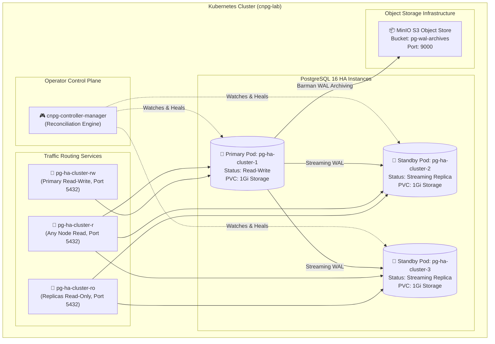
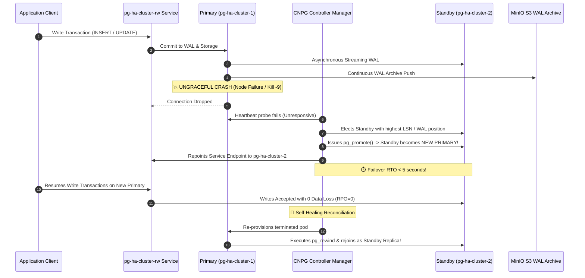

<!-- markdownlint-disable MD013 MD033 MD051 MD060 -->
# 08 - CloudNative-PG Operator on Kubernetes

> A production-grade **Database Operations & Resilience** engineering suite mastering declarative, self-healing PostgreSQL high-availability clusters on Kubernetes using the **CloudNative-PG Operator**. Demonstrates 3-instance streaming replication, continuous S3-compatible WAL archiving (MinIO), sub-10s automated failover ($RTO < 10\text{s}$), and zero uncommitted data loss ($RPO = 0$).

---

## 📋 Table of Contents

1. [Architectural Overview & Cluster Topology](#-architectural-overview--cluster-topology)
   - [CloudNative-PG High-Availability Architecture](#cloudnative-pg-high-availability-architecture)
   - [Automated Failover & Self-Healing Sequence](#automated-failover--self-healing-sequence)
2. [Theoretical Deep-Dive for Beginners](#-theoretical-deep-dive-for-beginners)
   - [The Kubernetes Operator Pattern for Stateful Databases](#the-kubernetes-operator-pattern-for-stateful-databases)
   - [Custom Resource Definitions (CRDs) & Reconciliation Loops](#custom-resource-definitions-crds--reconciliation-loops)
   - [PostgreSQL Streaming Replication on Kubernetes](#postgresql-streaming-replication-on-kubernetes)
   - [High-Availability Quorum & Sub-10s Failovers](#high-availability-quorum--sub-10s-failovers)
   - [Continuous WAL Archiving & Object Storage (Barman S3)](#continuous-wal-archiving--object-storage-barman-s3)
   - [Kubernetes Service Traffic Routing (`-rw`, `-ro`, `-r`)](#kubernetes-service-traffic-routing--rw--ro--r)
   - [Self-Healing & Node Resynchronization (`pg_rewind`)](#self-healing--node-resynchronization-pg_rewind)
3. [Repository & Directory Structure](#-repository--directory-structure)
4. [Prerequisites & System Setup](#-prerequisites--system-setup)
5. [Quickstart Guide (3 Commands)](#-quickstart-guide-3-commands)
6. [Step-by-Step Hands-On Guide](#-step-by-step-hands-on-guide)
   - [Step 1: Spin Up Isolated Local Kubernetes Cluster (`k3d`)](#step-1-spin-up-isolated-local-kubernetes-cluster-k3d)
   - [Step 2: Install CloudNative-PG Operator](#step-2-install-cloudnative-pg-operator)
   - [Step 3: Deploy MinIO S3 Object Storage for WAL Archiving](#step-3-deploy-minio-s3-object-storage-for-wal-archiving)
   - [Step 4: Deploy Database & S3 Storage Credentials](#step-4-deploy-database--s3-storage-credentials)
   - [Step 5: Apply 3-Instance PostgreSQL Cluster CRD](#step-5-apply-3-instance-postgresql-cluster-crd)
   - [Step 6: Verify Streaming Replication & Service Endpoints](#step-6-verify-streaming-replication--service-endpoints)
   - [Step 7: Execute Automated Failover Benchmark (`operator_failover_test.sh`)](#step-7-execute-automated-failover-benchmark-operator_failover_testsh)
   - [Step 8: Trigger & Audit On-Demand S3 Physical Backup](#step-8-trigger--audit-on-demand-s3-physical-backup)
   - [Step 9: Run the Complete Automated Test Suite](#step-9-run-the-complete-automated-test-suite)
7. [Troubleshooting & Common Gotchas](#-troubleshooting--common-gotchas)
8. [Resource Teardown & Complete Cleanup](#-resource-teardown--complete-cleanup)

---

## 🏛️ Architectural Overview & Cluster Topology

### CloudNative-PG High-Availability Architecture



---

### Automated Failover & Self-Healing Sequence



---

## 🧠 Theoretical Deep-Dive for Beginners

### The Kubernetes Operator Pattern for Stateful Databases

Kubernetes was originally designed for **stateless microservices** (e.g. web frontends, REST APIs) where terminating and recreating a pod is trivial.

However, relational databases like PostgreSQL are **stateful systems** with complex operational requirements:

1. **State Preservation**: Data files inside the database cannot be lost when a pod restarts.
2. **Topology Awareness**: Exactly **one** instance must act as Primary (accepting writes), while standby instances act as Read-Only replicas.
3. **Failover Decisioning**: If the primary crashes, a standby must be elected, promoted via `pg_promote()`, and client connection endpoints re-routed without split-brain anomalies.
4. **The Operator Pattern**: Encodes the domain knowledge of human PostgreSQL Database Administrators (DBAs) into automated Kubernetes controller code.

---

### Custom Resource Definitions (CRDs) & Reconciliation Loops

CloudNative-PG introduces declarative Custom Resources:

- **`Cluster`**: Defines the desired state of the database cluster (number of instances, memory limits, PostgreSQL configuration, storage classes, backup policies).
- **`Backup`**: Triggers on-demand physical cluster snapshots.
- **`ScheduledBackup`**: Manages automated cron-based backups.
- **Reconciliation Loop**:
  $$\text{Observed State} \xrightarrow{\text{Compare with Desired State}} \text{Action Plan} \xrightarrow{\text{Apply Changes}} \text{Converged Healthy State}$$
  If a pod is deleted, the operator detects the drift and automatically spins up a replacement replica.

---

### PostgreSQL Streaming Replication on Kubernetes

CloudNative-PG provisions PostgreSQL instances in a streaming replication cluster:

- **Primary Node**: Accepts read-write transactions and writes Write-Ahead Logs (WAL).
- **Standby Nodes**: Connect to the primary over TCP and stream WAL records directly into memory using PostgreSQL's native streaming protocol (`walsender` and `walreceiver`).
- **Inspection**: Query `SELECT client_addr, application_name, state, sync_state FROM pg_stat_replication;` to audit active replication links.

---

### High-Availability Quorum & Sub-10s Failovers

When the active primary crashes:

1. **Liveness Detection**: The operator detects pod unresponsiveness within 2 to 3 seconds.
2. **Election**: The operator queries the remaining standbys to determine which node holds the most up-to-date **Log Sequence Number (LSN)**.
3. **Promotion ($RTO < 10\text{s}$)**: The elected replica executes `pg_promote()` and exits recovery mode (`pg_is_in_recovery() = false`).
4. **Zero Data Loss ($RPO = 0$)**: All streaming WAL records committed prior to the crash are applied, ensuring zero transaction loss.

---

### Continuous WAL Archiving & Object Storage (Barman S3)

CloudNative-PG natively integrates **Barman Cloud** for WAL archiving and backup management:

- **Continuous Archiving**: Every time a 16MB WAL segment is closed, it is compressed (`gzip`) and uploaded asynchronously to S3 object storage (MinIO).
- **Point-in-Time Recovery (PITR)**: Enables rolling back the database cluster to any past second using physical base backups and the continuous WAL archive.

---

### Kubernetes Service Traffic Routing (`-rw`, `-ro`, `-r`)

The operator automatically maintains 3 distinct Kubernetes Services:

| Service Name | Target Role | Port | Use Case |
| :--- | :--- | :--- | :--- |
| **`pg-ha-cluster-rw`** | **Primary Only** | `5432` | Application writes (`INSERT`, `UPDATE`, `DELETE`) and transactional business logic. |
| **`pg-ha-cluster-ro`** | **Standby Replicas Only** | `5432` | Read-only reporting queries, analytical dashboards, and read scaling. |
| **`pg-ha-cluster-r`** | **Any Instance (Primary + Replicas)** | `5432` | General read queries distributed across the entire cluster. |

---

### Self-Healing & Node Resynchronization (`pg_rewind`)

When a failed primary node is re-provisioned:

1. The operator uses `pg_rewind` to rewind any uncommitted local WAL records back to the point where the timeline diverged.
2. The node synchronizes with the new primary using streaming replication.
3. The node joins the cluster as a healthy standby replica without requiring a full storage re-clone.

---

## 📂 Repository & Directory Structure

All files and manifests are strictly self-contained within this directory:

```text
12-databases-ops/08-cloudnative-pg-operator-k8s/
├── manifests/
│   ├── 01-minio-s3.yaml            # MinIO S3 object storage & bucket setup job
│   ├── 02-secrets.yaml             # Database user and S3 backup credentials
│   ├── 03-cluster.yaml             # 3-instance CloudNative-PG Cluster CRD manifest
│   └── 04-backup.yaml              # On-demand S3 physical backup CRD
├── operator_failover_test.sh       # Standalone Primary failover & RTO benchmark script
├── test_cnpg_operator.sh           # End-to-end automated test runner (7 checkpoints)
├── cleanup.sh                      # Teardown script for manifests, k3d cluster, and images
├── requirements.txt                # Python dependencies (tabulate)
├── .env.example                    # Environment configuration template
├── .gitignore                      # Git ignore rules
├── .markdownlint.json              # Markdownlint ruleset
└── README.md                       # Comprehensive educational guide
```

---

## 💻 Prerequisites & System Setup

Ensure the following CLI utilities are installed on your workstation:

- **`k3d`**: v5.0+ (Lightweight local Kubernetes cluster manager running in Docker).
- **`kubectl`**: Kubernetes command-line tool.
- **`docker`**: Docker Engine / OrbStack.
- **`bash` & `python3`**: Standard command execution.

---

## 🚀 Quickstart Guide (3 Commands)

Execute the complete CloudNative-PG deployment, failover test, and verification in 3 simple commands:

```bash
# 1. Run the end-to-end automated test suite (k3d cluster -> operator -> 3-node HA -> failover -> S3 backup)
./test_cnpg_operator.sh

# 2. Benchmark automatic Primary failover independently
./operator_failover_test.sh

# 3. Clean up all Kubernetes resources and destroy the local cluster
./cleanup.sh
```

---

## 📖 Step-by-Step Hands-On Guide

### Step 1: Spin Up Isolated Local Kubernetes Cluster (`k3d`)

Create a dedicated, isolated `k3d` cluster:

```bash
k3d cluster create cnpg-lab --servers 1 --agents 0 --wait
```

Verify cluster connectivity:

```bash
kubectl get nodes
```

---

### Step 2: Install CloudNative-PG Operator

Apply the official CloudNative-PG Operator release manifests:

```bash
kubectl apply --server-side -f https://raw.githubusercontent.com/cloudnative-pg/cloudnative-pg/main/releases/cnpg-1.25.0.yaml
kubectl rollout status deployment/cnpg-controller-manager -n cnpg-system --timeout=90s
```

---

### Step 3: Deploy MinIO S3 Object Storage for WAL Archiving

Deploy MinIO and initialize the S3 backup bucket:

```bash
kubectl apply -f manifests/01-minio-s3.yaml
kubectl rollout status deployment/minio -n default --timeout=60s
kubectl wait --for=condition=complete job/minio-bucket-creator -n default --timeout=60s
```

---

### Step 4: Deploy Database & S3 Storage Credentials

Create database authentication secrets:

```bash
kubectl apply -f manifests/02-secrets.yaml
```

---

### Step 5: Apply 3-Instance PostgreSQL Cluster CRD

Deploy the self-healing 3-instance PostgreSQL HA cluster:

```bash
kubectl apply -f manifests/03-cluster.yaml
```

Wait for the cluster to reach healthy status (3 ready instances):

```bash
kubectl wait --for=condition=Ready cluster.postgresql.cnpg.io/pg-ha-cluster -n default --timeout=150s
kubectl get cluster.postgresql.cnpg.io pg-ha-cluster -o wide
```

Output:

```text
NAME            AGE     INSTANCES   READY   STATUS                     PRIMARY
pg-ha-cluster   2m28s   3           3       Cluster in healthy state   pg-ha-cluster-1
```

---

### Step 6: Verify Streaming Replication & Service Endpoints

Check active streaming replication on the primary pod:

```bash
kubectl exec pg-ha-cluster-1 -c postgres -- psql -U postgres -d ecommerce_db -c \
  "SELECT client_addr, application_name, state, sync_state FROM pg_stat_replication;"
```

Output:

```text
 client_addr | application_name |   state   | sync_state 
-------------+------------------+-----------+------------
 10.42.0.17  | pg-ha-cluster-2  | streaming | async
 10.42.0.20  | pg-ha-cluster-3  | streaming | async
(2 rows)
```

Inspect generated Kubernetes Services:

```bash
kubectl get svc -l cnpg.io/cluster=pg-ha-cluster
```

---

### Step 7: Execute Automated Failover Benchmark (`operator_failover_test.sh`)

Simulate an ungraceful primary pod failure and measure failover latency:

```bash
./operator_failover_test.sh
```

Output:

```text
======================================================================
  💥 CloudNative-PG Operator - Automated Failover & RTO Test
======================================================================

▶ [1/5] Inspecting Cluster Health & Identifying Active Primary...
  • Cluster Name   : pg-ha-cluster
  • Active Primary : pg-ha-cluster-1

▶ [2/5] Writing pre-failover transaction to Primary...
  [OK] Canary record written: TX-1787579804853 on pg-ha-cluster-1

▶ [3/5] Simulating ungraceful Primary crash (force deleting pg-ha-cluster-1)...
  [TERMINATED] Primary pod pg-ha-cluster-1 killed at 10:56:45.

▶ [4/5] Monitoring operator failover election & replica promotion...
  • Previous Primary     : pg-ha-cluster-1
  • Newly Elected Primary: pg-ha-cluster-2
  • Measured Failover RTO: 4.94 seconds (Target < 10.0s)

▶ [5/5] Verifying 0 data loss and post-failover write capability...
  [OK] Pre-failover transaction confirmed on new primary (Zero Data Loss).
  [OK] Post-failover transaction written: TX-POST-1787579810175
  Waiting for terminated pod to rejoin as a standby replica...

======================================================================
  📊 CloudNative-PG Operator Failover Benchmark Summary
======================================================================
  Initial Primary Pod    : pg-ha-cluster-1
  New Primary Pod        : pg-ha-cluster-2
  Failover Duration (RTO): 4.94s
  Data Loss (RPO)        : 0 transactions (0.00s)
  Cluster Health State   : 3/3 instances Ready
======================================================================

🎉 SUCCESS: Automatic failover succeeded in 4.94s with 100% data integrity!
```

---

### Step 8: Trigger & Audit On-Demand S3 Physical Backup

Create an on-demand physical backup CRD:

```bash
kubectl apply -f manifests/04-backup.yaml
kubectl get backup.postgresql.cnpg.io pg-ha-cluster-backup
```

Output:

```text
NAME                   AGE   CLUSTER         METHOD              PHASE       ERROR
pg-ha-cluster-backup   8s    pg-ha-cluster   barmanObjectStore   completed   
```

---

### Step 9: Run the Complete Automated Test Suite

Run the end-to-end automated test runner:

```bash
./test_cnpg_operator.sh
```

---

## 🛠️ Troubleshooting & Common Gotchas

### 1. Pods Stuck in `Init:0/1` During Initial Join

Standby instances initialize by running `pg_basebackup` from the primary. Ensure the primary pod is fully healthy and accepting streaming replication before troubleshooting replicas.

### 2. S3 WAL Archiving Failures

Ensure the MinIO deployment is healthy and the `pg-wal-archives` bucket exists before applying the `Cluster` CRD.

### 3. Local Cluster Isolation

Always use the dedicated `k3d-cnpg-lab` cluster created by the scripts to prevent modifying any external or production Kubernetes contexts.

---

## 🧹 Resource Teardown & Complete Cleanup

To clean up all Kubernetes objects and destroy the local `k3d` cluster:

```bash
./cleanup.sh
```

### Options & Deep Purge

| Command | Action Performed |
| :--- | :--- |
| `./cleanup.sh` | Deletes Kubernetes database manifests, deletes the dedicated `cnpg-lab` k3d cluster, and purges all local temporary files. |
| `./cleanup.sh --keep-cluster` | Deletes only the CNPG database objects and manifests while keeping the `k3d` cluster running. |
| `./cleanup.sh --all` | Deletes Kubernetes manifests, destroys the `k3d` cluster, AND deletes all downloaded Docker container images (`postgresql:16.4`, `cloudnative-pg:v1.25.0`, `minio:latest`). |

### Manual Verification of Zero Leftovers

Confirm that all resources have been completely removed:

```bash
# Verify no leftover k3d clusters
k3d cluster list

# Verify no running database containers
docker ps -a --filter "name=k3d-cnpg-lab"
```

The environment is now clean for the next mini-project!
