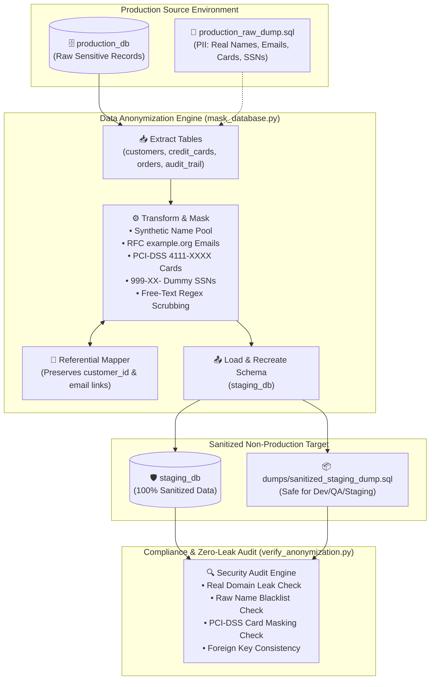
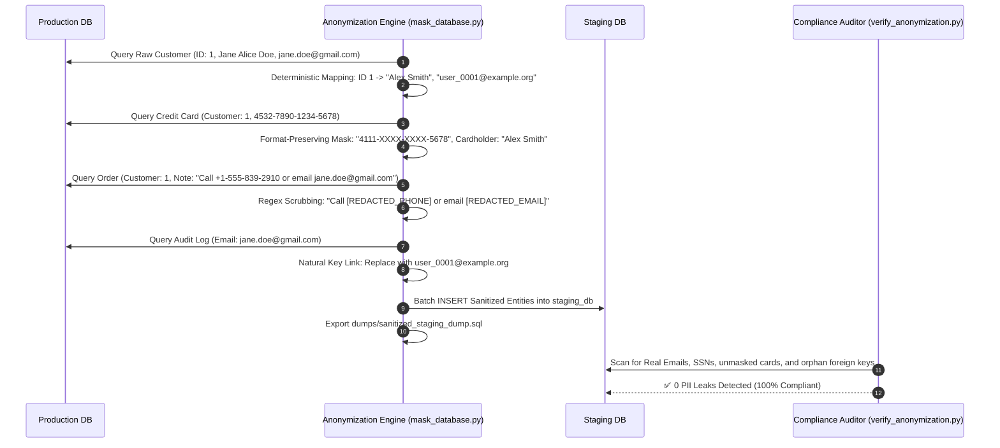

<!-- markdownlint-disable MD013 MD033 MD051 MD060 -->
# 09 - Data Anonymization and PII Masking Pipeline

> A production-grade **Database Operations & Resilience** engineering lab implementing an automated ETL data sanitization pipeline. Extracts sensitive production database dumps, masks Personally Identifiable Information (PII) like names, emails, credit cards, SSNs, and physical addresses while preserving strict relational referential integrity and realistic data distributions, and verifies zero PII leakage for staging/development environments.

---

## 📋 Table of Contents

1. [Architectural Overview & Pipeline Flow](#-architectural-overview--pipeline-flow)
   - [ETL Sanitization Pipeline Architecture](#etl-sanitization-pipeline-architecture)
   - [Cross-Table Referential Integrity & Pseudonymization Sequence](#cross-table-referential-integrity--pseudonymization-sequence)
2. [Theoretical Deep-Dive for Beginners](#-theoretical-deep-dive-for-beginners)
   - [Why Sanitize Production Data? (GDPR, HIPAA, PCI-DSS)](#why-sanitize-production-data-gdpr-hipaa-pci-dss)
   - [Anonymization vs Pseudonymization vs Tokenization](#anonymization-vs-pseudonymization-vs-tokenization)
   - [PII Masking Archetypes & Algorithms](#pii-masking-archetypes--algorithms)
   - [Preserving Referential Integrity & Natural Keys](#preserving-referential-integrity--natural-keys)
   - [Scrubbing Unstructured Free-Text Notes](#scrubbing-unstructured-free-text-notes)
   - [Compliance & Security Verification Auditing](#compliance--security-verification-auditing)
3. [Repository & Directory Structure](#-repository--directory-structure)
4. [Prerequisites & System Setup](#-prerequisites--system-setup)
5. [Quickstart Guide (3 Commands)](#-quickstart-guide-3-commands)
6. [Step-by-Step Hands-On Guide](#-step-by-step-hands-on-guide)
   - [Step 1: Start PostgreSQL Container Stack](#step-1-start-postgresql-container-stack)
   - [Step 2: Inspect Raw Sensitive Production Records](#step-2-inspect-raw-sensitive-production-records)
   - [Step 3: Run Baseline Pre-Sanitization PII Leak Audit](#step-3-run-baseline-pre-sanitization-pii-leak-audit)
   - [Step 4: Execute ETL Data Anonymization Pipeline (`mask_database.py`)](#step-4-execute-etl-data-anonymization-pipeline-mask_databasepy)
   - [Step 5: Run Post-Sanitization Security Audit (`verify_anonymization.py`)](#step-5-run-post-sanitization-security-audit-verify_anonymizationpy)
   - [Step 6: Validate Referential Integrity in Staging](#step-6-validate-referential-integrity-in-staging)
   - [Step 7: Test Sanitized SQL Dump Portability & Restore](#step-7-test-sanitized-sql-dump-portability--restore)
   - [Step 8: Run the Complete Automated Test Suite](#step-8-run-the-complete-automated-test-suite)
7. [Troubleshooting & Common Gotchas](#-troubleshooting--common-gotchas)
8. [Resource Teardown & Complete Cleanup](#-resource-teardown--complete-cleanup)

---

## 🏛️ Architectural Overview & Pipeline Flow

### ETL Sanitization Pipeline Architecture



---

### Cross-Table Referential Integrity & Pseudonymization Sequence



---

## 🧠 Theoretical Deep-Dive for Beginners

### Why Sanitize Production Data? (GDPR, HIPAA, PCI-DSS)

Modern engineering teams require realistic test datasets in **Staging, Development, and CI/CD** environments to reproduce customer bugs, validate performance, and benchmark query execution.

However, copying raw production databases into non-production environments introduces severe security and compliance liabilities:

1. **GDPR (General Data Protection Regulation - Art. 4 & 32)**: Fines up to €20M or 4% of annual global turnover for exposing personal data to unauthorized developers or third-party contractors.
2. **PCI-DSS (Payment Card Industry Data Security Standard - Req. 3 & 6.4.3)**: Storing raw primary account numbers (PAN) in non-production environments is strictly prohibited.
3. **HIPAA (Health Insurance Portability and Accountability Act)**: Requires the complete removal of 18 specific identifiers (Safe Harbor Method) before data can be used outside clinical systems.

---

### Anonymization vs Pseudonymization vs Tokenization

| Method | Definition | Reversibility | Regulatory Status |
| :--- | :--- | :--- | :--- |
| **Anonymization** | Irreversibly altering data such that the data subject can no longer be identified directly or indirectly. | **Irreversible** | Exempt from GDPR requirements. |
| **Pseudonymization** | Replacing private identifiers with artificial pseudonyms (e.g. `user_0001@example.org`). | Reversible only with a separate secure key. | Protected personal data under GDPR. |
| **Tokenization** | Replacing sensitive values (e.g. credit card numbers) with non-sensitive surrogate tokens of the same format. | Reversible via a centralized token vault. | Compliant for PCI-DSS scope reduction. |

---

### PII Masking Archetypes & Algorithms

Our sanitization pipeline implements specialized masking techniques tailored for each data archetype:

1. **Deterministic Pseudonymization**:
   - Customer IDs map to reproducible synthetic names (e.g. `generate_synthetic_name(seed_id)`).
   - If User ID `42` appears in billing, shipping, and credit card records, they are assigned the exact same pseudonym across all tables.
2. **Format-Preserving Card Masking (PCI-DSS)**:
   - Transforms `4532-7890-1234-5678` $\rightarrow$ `4111-XXXX-XXXX-5678`.
   - Preserves the payment network BIN prefix category and last 4 digits for UI validation while destroying the actual account number.
3. **Safe RFC Domain Redaction**:
   - Transforms all personal and corporate email domains to `user_XXXX@example.org` (reserved by IANA under RFC 2606 / RFC 6761 for testing).
4. **Dummy SSN / Tax ID Generation**:
   - Formats SSNs as `999-XX-XXXX` (the `999` prefix is never issued by the Social Security Administration).
5. **IP Address Anonymization**:
   - Replaces live IP addresses with RFC 5737 TEST-NET documentation addresses (`198.51.100.X`).

---

### Preserving Referential Integrity & Natural Keys

A major failure mode in naive data masking scripts is breaking foreign keys:

- **Primary / Foreign Keys (`customers.id` $\leftrightarrow$ `orders.customer_id`)**: The pipeline preserves surrogate integer primary keys so foreign key constraints (`REFERENCES customers(id)`) never break.
- **Natural Keys (`customers.email` $\leftrightarrow$ `audit_trail.customer_email`)**: When masking `customers.email` from `jane.doe@gmail.com` to `user_0001@example.org`, the pipeline maintains a state dictionary:
  $$\text{email\_map} = \{\text{"jane.doe@gmail.com"}: \text{"user\_0001@example.org"}\}$$
  This ensures that audit logs remain joined to the correct customer pseudonym.

---

### Scrubbing Unstructured Free-Text Notes

Customer support notes and order instructions frequently contain accidental PII (e.g., *"Please call +1-555-839-2910 upon arrival or email `jane.doe@gmail.com`"*).

The sanitization engine applies multi-pass regular expression scanners:

- Email Pattern: `[a-zA-Z0-9_.+-]+@[a-zA-Z0-9-]+\.[a-zA-Z0-9-.]+` $\rightarrow$ `[REDACTED_EMAIL]`
- Phone Pattern: `(\+?\d{1,3}[-.\s]?)?\(?\d{3}\)?[-.\s]?\d{3}[-.\s]?\d{4}` $\rightarrow$ `[REDACTED_PHONE]`
- Credit Card Pattern: `\b(?:\d[ -]*?){13,16}\b` $\rightarrow$ `[REDACTED_CARD]`
- Known Name Replacer: Scans for customer names and replaces them with their assigned pseudonyms.

---

### Compliance & Security Verification Auditing

The `verify_anonymization.py` auditor acts as an automated security gate in CI/CD pipelines, performing 8 rigorous checks:

1. **Row Count Parity**: Confirms 100% row preservation across all tables.
2. **Email RFC Compliance**: Verifies zero non-example domains in staging.
3. **PCI-DSS Card Masking**: Verifies all card numbers contain `XXXX` masking.
4. **SSN Redaction**: Verifies all SSNs begin with dummy prefix `999-XX-`.
5. **Free-Text Scrubbing**: Verifies zero raw emails or phone numbers in notes.
6. **Blacklist Cross-Check**: Compares staging against raw production records; confirms 0 matching customer names.
7. **Referential Integrity**: Verifies zero orphan orders or audit records.
8. **SQL Dump Security Scan**: Scans the physical exported `.sql` dump file for plaintext PII keywords.

---

## 📂 Repository & Directory Structure

All files and scripts are strictly self-contained within this directory:

```text
12-databases-ops/09-data-anonymization-pii-masking-pipeline/
├── config/
│   └── 01-init.sql                     # Production database schema and sensitive seed records
├── docker-compose.yml                  # PostgreSQL service hosting production_db & staging_db
├── mask_database.py                    # Automated ETL data extraction, masking, & loading engine
├── verify_anonymization.py             # Security audit & zero-leak compliance verification script
├── test_anonymization_pipeline.sh      # End-to-end automated test runner (7 checkpoints)
├── cleanup.sh                          # Resource teardown script for containers, volumes, & dumps
├── requirements.txt                    # Python dependencies (faker, psycopg2-binary, tabulate)
├── .env.example                        # Environment variables template
├── .gitignore                          # Git ignore rules
├── .markdownlint.json                  # Markdownlint ruleset
└── README.md                           # Comprehensive educational guide
```

---

## 💻 Prerequisites & System Setup

Ensure the following tools are installed:

- **`docker` & `docker compose`**: Container runtime.
- **`python3`** (3.9+): Python interpreter.
- **`pnpm`**: Package runner for markdownlint validation.

---

## 🚀 Quickstart Guide (3 Commands)

Run the full pipeline, verify compliance, and clean up in 3 simple commands:

```bash
# 1. Run the end-to-end automated test suite
./test_anonymization_pipeline.sh

# 2. Run the security compliance auditor independently
python3 verify_anonymization.py

# 3. Clean up all Docker resources, dumps, and temporary files
./cleanup.sh
```

---

## 📖 Step-by-Step Hands-On Guide

### Step 1: Start PostgreSQL Container Stack

Start the PostgreSQL service hosting both `production_db` (sensitive source) and `staging_db` (clean target):

```bash
docker compose up -d --wait
```

---

### Step 2: Inspect Raw Sensitive Production Records

Query raw sensitive customer records from `production_db`:

```bash
docker exec postgres-anonymizer-db psql -U postgres -d production_db -c \
  "SELECT id, full_name, email, phone_number, ssn FROM customers;"
```

Output:

```text
 id |       full_name        |              email               |   phone_number   |     ssn     
----+------------------------+----------------------------------+------------------+-------------
  1 | Jane Alice Doe         | jane.doe@gmail.com               | +1-555-839-2910  | 123-45-6789
  2 | Michael Robert Clark   | michael.clark@corporate-bank.com | +1-555-192-8374  | 234-56-7890
  3 | Sophia Marie Rodriguez | sophia.rodriguez@techfirm.io     | +1-555-482-9102  | 345-67-8901
  4 | David Alexander Wright | david.wright@global-finance.net  | +1-555-738-1920  | 456-78-9012
  5 | Elena Victoria Gomez   | elena.gomez@health-systems.org   | +1-555-920-1847  | 567-89-0123
(5 rows)
```

---

### Step 3: Run Baseline Pre-Sanitization PII Leak Audit

Verify that `production_db` contains unmasked credit cards and personal emails:

```bash
docker exec postgres-anonymizer-db psql -U postgres -d production_db -c \
  "SELECT customer_id, card_number, card_holder, expiration FROM credit_cards;"
```

---

### Step 4: Execute ETL Data Anonymization Pipeline (`mask_database.py`)

Run the automated ETL masking engine:

```bash
python3 mask_database.py
```

Output:

```text
======================================================================
  🛡️  Automated ETL Data Anonymization & PII Masking Pipeline
======================================================================

▶ [1/5] Recreating clean relational schema in target 'staging_db'...
  [OK] Target schema initialized.

▶ [2/5] Extracting raw records from 'production_db'...
  • Raw Customers   : 5
  • Raw Cards       : 5
  • Raw Orders      : 6
  • Raw Order Items : 6
  • Raw Audit Events: 7

▶ [3/5] Executing PII Masking & Referential Mapping Transformations...
  [OK] PII masking complete. Referential mappings preserved for all 5 customer identities.

▶ [4/5] Loading sanitized dataset into 'staging_db'...

▶ [5/5] Exporting sanitized SQL dump & verification metadata...
  • Sanitized SQL Dump : dumps/sanitized_staging_dump.sql (10838 bytes)
  • Audit Metadata     : reports/anonymization_report.json

======================================================================
🎉 SUCCESS: Data Anonymization ETL pipeline completed in 0.387s!
======================================================================
```

---

### Step 5: Run Post-Sanitization Security Audit (`verify_anonymization.py`)

Run the compliance audit scanner against `staging_db`:

```bash
python3 verify_anonymization.py
```

Output:

```text
======================================================================
  🔍 Security Compliance & Data Anonymization Audit Report
======================================================================

--------------------------------------------------------------------------------
Compliance Checkpoint               | Status   | Audit Details
--------------------------------------------------------------------------------
Row Count Parity (customers)        | PASS     | 5 rows matched
Row Count Parity (credit_cards)     | PASS     | 5 rows matched
Row Count Parity (orders)           | PASS     | 6 rows matched
Row Count Parity (order_items)      | PASS     | 6 rows matched
Row Count Parity (audit_trail)      | PASS     | 7 rows matched
Email RFC Domain Compliance         | PASS     | 100% emails end in @example.org (5 checked)
PCI-DSS Card Masking                | PASS     | 100% cards masked with XXXX (5 checked)
SSN Redaction Compliance            | PASS     | 100% SSNs safely redacted (5 checked)
Free-Text PII Scrubbing             | PASS     | 0 raw emails or phones found in free-text notes
Production Name Blacklist           | PASS     | 0 real production customer names remain in staging
Referential Integrity               | PASS     | 100% foreign keys & natural keys valid
SQL Dump Security Scan              | PASS     | Exported SQL dump completely free of raw PII
--------------------------------------------------------------------------------

======================================================================
  Total Compliance Checks : 8
  Passed                  : 8
  Failed                  : 0
======================================================================

🎉 100% COMPLIANT: All GDPR/PCI-DSS anonymization standards verified!
```

---

### Step 6: Validate Referential Integrity in Staging

Inspect the sanitized records in `staging_db` and confirm that all customer names, emails, and notes have been masked while maintaining intact foreign key relationships:

```bash
docker exec postgres-anonymizer-db psql -U postgres -d staging_db -c \
  "SELECT o.id, c.full_name, c.email, cc.card_number, o.customer_notes FROM orders o JOIN customers c ON o.customer_id = c.id JOIN credit_cards cc ON cc.customer_id = c.id LIMIT 3;"
```

---

### Step 7: Test Sanitized SQL Dump Portability & Restore

Verify that `dumps/sanitized_staging_dump.sql` can be restored into a clean test database:

```bash
docker exec postgres-anonymizer-db psql -U postgres -d postgres -c "CREATE DATABASE restore_test_db;"
docker exec -i postgres-anonymizer-db psql -U postgres -d restore_test_db < dumps/sanitized_staging_dump.sql
docker exec postgres-anonymizer-db psql -U postgres -d restore_test_db -c "SELECT COUNT(*) FROM customers;"
docker exec postgres-anonymizer-db psql -U postgres -d postgres -c "DROP DATABASE restore_test_db;"
```

---

### Step 8: Run the Complete Automated Test Suite

Execute the automated test runner:

```bash
./test_anonymization_pipeline.sh
```

---

## 🛠️ Troubleshooting & Common Gotchas

### 1. Foreign Key Violation During Staging Insertion

Always insert records in dependency order (`customers` $\rightarrow$ `credit_cards` $\rightarrow$ `orders` $\rightarrow$ `order_items`).

### 2. PII Embedded in Unstructured Free-Text

Always apply multi-pass regex scrubbing on free-text columns like `customer_notes` and `comments` before exporting database dumps.

### 3. Natural Key Desynchronization

When masking email addresses that serve as foreign or natural keys in audit tables (`audit_trail.customer_email`), maintain a lookup map to ensure consistent pseudonym assignment across all tables.

---

## 🧹 Resource Teardown & Complete Cleanup

To remove all Docker containers, networks, volumes, and generated dumps:

```bash
./cleanup.sh
```

### Options & Deep Purge

| Command | Action Performed |
| :--- | :--- |
| `./cleanup.sh` | Removes containers, networks, volumes, generated SQL dumps, reports, and caches. |
| `./cleanup.sh --keep-dumps` | Removes Docker containers and volumes while preserving `dumps/` and `reports/`. |
| `./cleanup.sh --all` | Removes all containers, volumes, dumps, AND deletes the `postgres:16-alpine` Docker image. |

### Manual Verification of Zero Leftovers

Confirm that all resources have been completely removed:

```bash
# Verify no running containers
docker ps -a --filter "name=postgres-anonymizer-db"

# Verify no leftover volumes
docker volume ls --filter "name=postgres_anonymizer_data"
```

The environment is now clean for the next mini-project!
