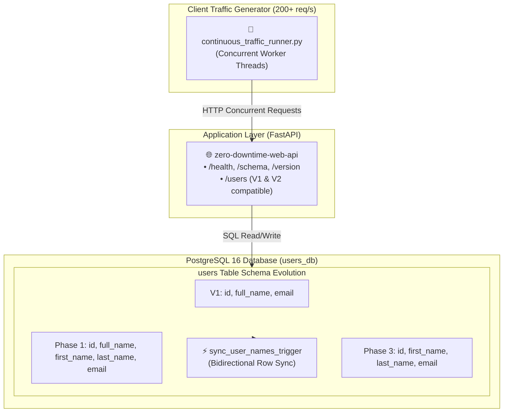
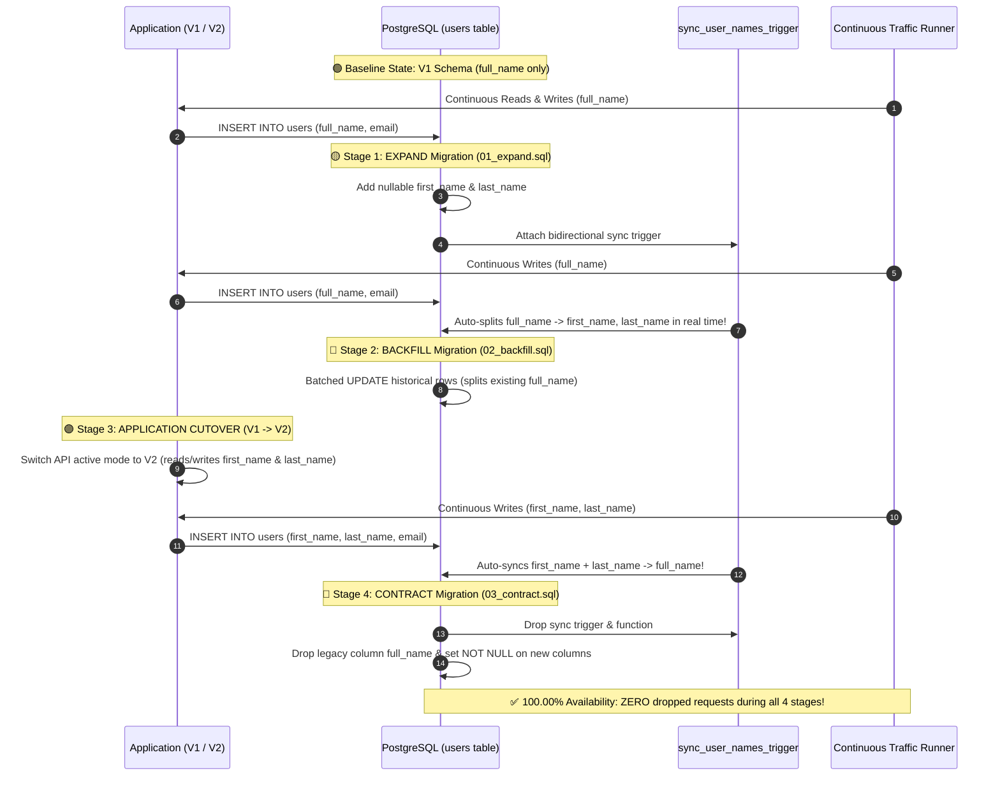

<!-- markdownlint-disable MD013 MD033 MD051 MD060 -->
# 10 - Zero-Downtime Expand and Contract Schema Refactoring

> A production-grade **Database Operations & Resilience** engineering lab mastering zero-downtime relational database refactoring. Demonstrates how to refactor a live PostgreSQL column (`full_name` $\rightarrow$ `first_name` + `last_name`) under heavy concurrent production traffic using the **Expand-and-Contract (Parallel Run)** migration pattern, guaranteeing $100.00\%$ availability, zero dropped transactions, and zero lock contention.

---

## 📋 Table of Contents

1. [Architectural Overview & Lifecycle Flow](#-architectural-overview--lifecycle-flow)
   - [Expand and Contract Architecture](#expand-and-contract-architecture)
   - [Step-by-Step Migration Lifecycle Sequence](#step-by-step-migration-lifecycle-sequence)
2. [Theoretical Deep-Dive for Beginners](#-theoretical-deep-dive-for-beginners)
   - [Why Traditional Database Migrations Cause Downtime](#why-traditional-database-migrations-cause-downtime)
   - [The Expand and Contract (Parallel Run) Pattern](#the-expand-and-contract-parallel-run-pattern)
   - [Phase 1: Expand (Non-Breaking Additions & Triggers)](#phase-1-expand-non-breaking-additions--triggers)
   - [Phase 2: Historical Data Backfilling](#phase-2-historical-data-backfilling)
   - [Phase 3: Application Code Cutover (Rolling Deployments)](#phase-3-application-code-cutover-rolling-deployments)
   - [Phase 4: Contract (Dropping Triggers & Legacy Columns)](#phase-4-contract-dropping-triggers--legacy-columns)
   - [Database Triggers vs Application Dual-Writing](#database-triggers-vs-application-dual-writing)
   - [PostgreSQL Lock Avoidance Strategies](#postgresql-lock-avoidance-strategies)
3. [Repository & Directory Structure](#-repository--directory-structure)
4. [Prerequisites & System Setup](#-prerequisites--system-setup)
5. [Quickstart Guide (3 Commands)](#-quickstart-guide-3-commands)
6. [Step-by-Step Hands-On Guide](#-step-by-step-hands-on-guide)
   - [Step 1: Start PostgreSQL and Web API Stack](#step-1-start-postgresql-and-web-api-stack)
   - [Step 2: Inspect Baseline V1 Schema & Seed Records](#step-2-inspect-baseline-v1-schema--seed-records)
   - [Step 3: Execute Phase 1 (Expand) Migration](#step-3-execute-phase-1-expand-migration)
   - [Step 4: Execute Phase 2 (Backfill) Migration](#step-4-execute-phase-2-backfill-migration)
   - [Step 5: Start Continuous Live Concurrent Traffic Generator](#step-5-start-continuous-live-concurrent-traffic-generator)
   - [Step 6: Execute Application Cutover to V2](#step-6-execute-application-cutover-to-v2)
   - [Step 7: Execute Phase 3 (Contract) Migration](#step-7-execute-phase-3-contract-migration)
   - [Step 8: Verify Final Schema & Traffic Benchmark Results](#step-8-verify-final-schema--traffic-benchmark-results)
   - [Step 9: Run the Complete Automated Test Suite](#step-9-run-the-complete-automated-test-suite)
7. [Troubleshooting & Common Gotchas](#-troubleshooting--common-gotchas)
8. [Resource Teardown & Complete Cleanup](#-resource-teardown--complete-cleanup)

---

## 🏛️ Architectural Overview & Lifecycle Flow

### Expand and Contract Architecture



---

### Step-by-Step Migration Lifecycle Sequence



---

## 🧠 Theoretical Deep-Dive for Beginners

### Why Traditional Database Migrations Cause Downtime

In naive monolithic deployments, modifying a database schema often causes catastrophic service outages:

1. **Breaking Client Queries**: Running `ALTER TABLE users RENAME COLUMN full_name TO ...` or `ALTER TABLE users DROP COLUMN ...` immediately causes all existing running application servers to crash with `column "full_name" does not exist` errors.
2. **Rolling Deployment Incompatibility**: During a canary or rolling deployment in Kubernetes, old version pods (V1) and new version pods (V2) must run **simultaneously** for several minutes. The database schema must be simultaneously backward-compatible and forward-compatible.
3. **Table Lock Contention**: Running long-running DDL operations or adding columns with non-constant defaults acquires an `ACCESS EXCLUSIVE` lock on PostgreSQL, blocking all read and write queries until the operation finishes.

---

### The Expand and Contract (Parallel Run) Pattern

The **Expand and Contract** pattern (also known as the **Parallel Run** or **Tolerant Reader** pattern) decomposes a breaking schema refactoring into four safe, non-breaking phases:

$$\text{Baseline (V1)} \longrightarrow \text{Phase 1 (Expand)} \longrightarrow \text{Phase 2 (Backfill)} \longrightarrow \text{Cutover (V2)} \longrightarrow \text{Phase 3 (Contract)}$$

---

### Phase 1: Expand (Non-Breaking Additions & Triggers)

- Add new columns (`first_name`, `last_name`) as **`NULLABLE`**.
- In PostgreSQL 11+, adding a nullable column without a complex default is instantaneous ($<1\text{ms}$) because it only updates the system catalog (`pg_attribute`) without rewriting the table data on disk.
- Deploy a bidirectional PostgreSQL database trigger (`sync_user_names_trigger`):
  - When a legacy V1 app writes `full_name`, the trigger automatically splits it into `first_name` and `last_name`.
  - When a modern V2 app writes `first_name` and `last_name`, the trigger automatically concatenates them into `full_name`.

---

### Phase 2: Historical Data Backfilling

While new rows are kept synchronized by the trigger, historical records created before the Expand phase still have `NULL` values in the new columns.

- Run a non-blocking backfill query:
  Query `UPDATE users SET first_name = split_part(full_name, ' ', 1), last_name = substring(full_name from position(' ' in full_name) + 1) WHERE first_name IS NULL;`
- In massive production tables (millions of rows), backfills are executed in batches (e.g. 5,000 rows per transaction) to prevent table bloat and lock escalation.

---

### Phase 3: Application Code Cutover (Rolling Deployments)

- Deploy the V2 application codebase.
- V2 queries exclusively read from and write to `first_name` and `last_name`.
- Because the bidirectional trigger is still active in the database, any remaining V1 application instances continue to function normally without seeing data divergence.

---

### Phase 4: Contract (Dropping Triggers & Legacy Columns)

Once 100% of traffic is confirmed to be on V2:

1. Drop the synchronization trigger and trigger function:
   Query `DROP TRIGGER IF EXISTS sync_user_names_trigger ON users; DROP FUNCTION IF EXISTS sync_user_names();`
2. Drop the legacy column:
   Query `ALTER TABLE users DROP COLUMN IF EXISTS full_name;`
3. Enforce strict schema constraints on new columns:
   Query `ALTER TABLE users ALTER COLUMN first_name SET NOT NULL; ALTER TABLE users ALTER COLUMN last_name SET NOT NULL;`

---

### Database Triggers vs Application Dual-Writing

| Strategy | Advantages | Disadvantages | Best Used For |
| :--- | :--- | :--- | :--- |
| **Database Triggers (Used Here)** | • Guaranteed transactional atomicity (ACID).<br/>• Zero extra network round-trips.<br/>• Works across multiple heterogeneous microservices. | • Logic lives in SQL/PLpgSQL.<br/>• Consumes database CPU cycles. | Monolithic tables, microservice shared databases, strict zero-data-loss requirements. |
| **Application Dual-Writing** | • Logic is written in familiar language (Python/Go/TS).<br/>• Keeps database schema simple. | • Vulnerable to partial failures (dual-write race conditions).<br/>• Doubles network write latency. | Multi-database migrations (e.g. Postgres $\rightarrow$ DynamoDB). |

---

### PostgreSQL Lock Avoidance Strategies

- **Never add columns with `NOT NULL` without a default in a single step**: Always add as `NULLABLE`, backfill historical data, and only add `SET NOT NULL` in the Contract phase.
- **Statement Timeouts**: Set `SET lock_timeout = '2s';` during migration scripts to prevent DDL statements from queuing behind long-running analytical queries and causing a cascading connection spike.

---

## 📂 Repository & Directory Structure

All files and scripts are strictly self-contained within this directory:

```text
12-databases-ops/10-zero-downtime-schema-refactoring/
├── config/
│   └── 01-init.sql                     # Baseline database schema (V1) & seed records
├── migrations/
│   ├── 01_expand.sql                   # Phase 1: Add nullable columns & sync trigger
│   ├── 02_backfill.sql                 # Phase 2: Historical data backfill
│   └── 03_contract.sql                 # Phase 3: Drop trigger, drop legacy column, set NOT NULL
├── app/
│   ├── main.py                         # Dynamic FastAPI app supporting V1, V2, and cutover
│   └── requirements.txt                # Python dependencies for the containerized API
├── Dockerfile                          # Optimized container build for web-api service
├── docker-compose.yml                  # PostgreSQL and FastAPI service orchestration
├── continuous_traffic_runner.py        # Multi-threaded traffic simulator & availability monitor
├── execute_migration_phases.sh         # Standalone migration orchestrator script
├── test_zero_downtime_refactoring.sh   # End-to-end automated test runner (7 checkpoints)
├── cleanup.sh                          # Teardown script for containers, volumes, & reports
├── requirements.txt                    # Python dependencies
├── .env.example                        # Environment variables template
├── .gitignore                          # Git ignore rules
├── .markdownlint.json                  # Markdownlint ruleset
└── README.md                           # Comprehensive educational guide
```

---

## 💻 Prerequisites & System Setup

Ensure the following tools are installed:

- **`docker` & `docker compose`**: Container runtime.
- **`python3`** (3.9+): Python interpreter.
- **`curl`**: HTTP client.
- **`pnpm`**: Package runner for markdownlint validation.

---

## 🚀 Quickstart Guide (3 Commands)

Execute the complete zero-downtime refactoring pipeline, run continuous traffic benchmarks, and clean up in 3 commands:

```bash
# 1. Run the end-to-end automated test suite
./test_zero_downtime_refactoring.sh

# 2. Run continuous traffic generator independently (e.g. 5 seconds)
python3 continuous_traffic_runner.py --duration 5 --concurrency 6

# 3. Clean up all Docker resources, volumes, and temporary files
./cleanup.sh
```

---

## 📖 Step-by-Step Hands-On Guide

### Step 1: Start PostgreSQL and Web API Stack

Start the database and FastAPI web application:

```bash
docker compose up -d --build --wait
```

Verify service health:

```bash
curl -s http://localhost:8000/health
```

Output:

```json
{"status":"ok","app_version":"v1","database":"connected"}
```

---

### Step 2: Inspect Baseline V1 Schema & Seed Records

Inspect current schema columns:

```bash
curl -s http://localhost:8000/schema
```

Output:

```json
{
  "phase": "V1 Baseline",
  "columns": [
    {"column": "id", "nullable": "NO", "type": "integer"},
    {"column": "full_name", "nullable": "NO", "type": "character varying"},
    {"column": "email", "nullable": "NO", "type": "character varying"},
    {"column": "created_at", "nullable": "YES", "type": "timestamp with time zone"}
  ]
}
```

---

### Step 3: Execute Phase 1 (Expand) Migration

Apply `migrations/01_expand.sql` to add `first_name` and `last_name` with real-time synchronization triggers:

```bash
docker exec -i postgres-refactoring-db psql -U postgres -d users_db < migrations/01_expand.sql
```

Verify that writing a legacy V1 record automatically populates the new columns:

```bash
curl -s -X POST http://localhost:8000/users \
  -H "Content-Type: application/json" \
  -d '{"full_name": "Ada Lovelace", "email": "ada@example.com"}'
```

Query the database directly:

```bash
docker exec postgres-refactoring-db psql -U postgres -d users_db -c \
  "SELECT id, full_name, first_name, last_name, email FROM users WHERE email = 'ada@example.com';"
```

Output:

```text
 id |  full_name   | first_name | last_name |      email      
----+--------------+------------+-----------+-----------------
 11 | Ada Lovelace | Ada        | Lovelace  | ada@example.com
(1 row)
```

---

### Step 4: Execute Phase 2 (Backfill) Migration

Populate historical rows created before Phase 1:

```bash
docker exec -i postgres-refactoring-db psql -U postgres -d users_db < migrations/02_backfill.sql
```

Confirm that 0 rows have `NULL` values in the new columns:

```bash
docker exec postgres-refactoring-db psql -U postgres -d users_db -c \
  "SELECT COUNT(*) FROM users WHERE first_name IS NULL OR last_name IS NULL;"
```

---

### Step 5: Start Continuous Live Concurrent Traffic Generator

In a separate terminal or in the background, run the multi-threaded traffic generator to simulate live production load:

```bash
python3 continuous_traffic_runner.py --duration 10 --concurrency 6
```

---

### Step 6: Execute Application Cutover to V2

Switch the application to modern V2 mode (reading and writing `first_name` and `last_name`):

```bash
curl -s -X POST http://localhost:8000/version/v2
```

---

### Step 7: Execute Phase 3 (Contract) Migration

Once all traffic uses V2, remove the triggers and drop the legacy `full_name` column:

```bash
docker exec -i postgres-refactoring-db psql -U postgres -d users_db < migrations/03_contract.sql
```

---

### Step 8: Verify Final Schema & Traffic Benchmark Results

Inspect the contracted schema:

```bash
curl -s http://localhost:8000/schema
```

Output:

```json
{
  "phase": "Phase 3 (Contracted)",
  "columns": [
    {"column": "id", "nullable": "NO", "type": "integer"},
    {"column": "created_at", "nullable": "YES", "type": "timestamp with time zone"},
    {"column": "email", "nullable": "NO", "type": "character varying"},
    {"column": "first_name", "nullable": "NO", "type": "character varying"},
    {"column": "last_name", "nullable": "NO", "type": "character varying"}
  ]
}
```

Check the traffic runner output:

```text
-----------------------------------------------------------------
Benchmark Metric                    | Measured Value
-----------------------------------------------------------------
Total Requests Executed             | 1772
Successful Reads (200 OK)           | 1251
Successful Writes (201 Created)     | 521
Failed / Dropped Requests           | 0
System Availability Rate            | 100.00%
Average Throughput                  | 219.3 req/s
Latency (Avg / P95 / Max)           | 4.77ms / 11.20ms / 46.97ms
Audit Report Artifact               | reports/traffic_benchmark_report.json
-----------------------------------------------------------------

======================================================================
🎉 SUCCESS: 100.00% Availability Achieved with ZERO Dropped Transactions!
======================================================================
```

---

### Step 9: Run the Complete Automated Test Suite

Run the end-to-end automated test runner:

```bash
./test_zero_downtime_refactoring.sh
```

---

## 🛠️ Troubleshooting & Common Gotchas

### 1. `column "full_name" does not exist` Error During Cutover

This happens if Phase 3 (Contract) is executed before all application servers have been updated to V2. Never drop legacy columns until 100% of active client instances are running V2.

### 2. Lock Contention on High-Traffic Tables

Always add new columns as `NULLABLE` first. Adding `NOT NULL` constraints without a default requires an exclusive scan of every table row, blocking incoming traffic.

### 3. Backfill Transaction Timeouts

For tables with millions of rows, execute backfills in batches with `WHERE id BETWEEN X AND Y` rather than a single massive `UPDATE` query.

---

## 🧹 Resource Teardown & Complete Cleanup

To remove all Docker containers, networks, volumes, and reports:

```bash
./cleanup.sh
```

### Options & Deep Purge

| Command | Action Performed |
| :--- | :--- |
| `./cleanup.sh` | Removes containers, networks, volumes, benchmark reports, and temporary Python caches. |
| `./cleanup.sh --all` | Removes all containers, volumes, reports, AND deletes the built container images (`zero-downtime-web-api:latest`, `postgres:16-alpine`). |

### Manual Verification of Zero Leftovers

Confirm that all resources have been completely removed:

```bash
# Verify no running containers
docker ps -a --filter "name=postgres-refactoring-db"
docker ps -a --filter "name=zero-downtime-web-api"

# Verify no leftover volumes
docker volume ls --filter "name=postgres_refactoring_data"
```

The environment is now clean for subsequent projects!
